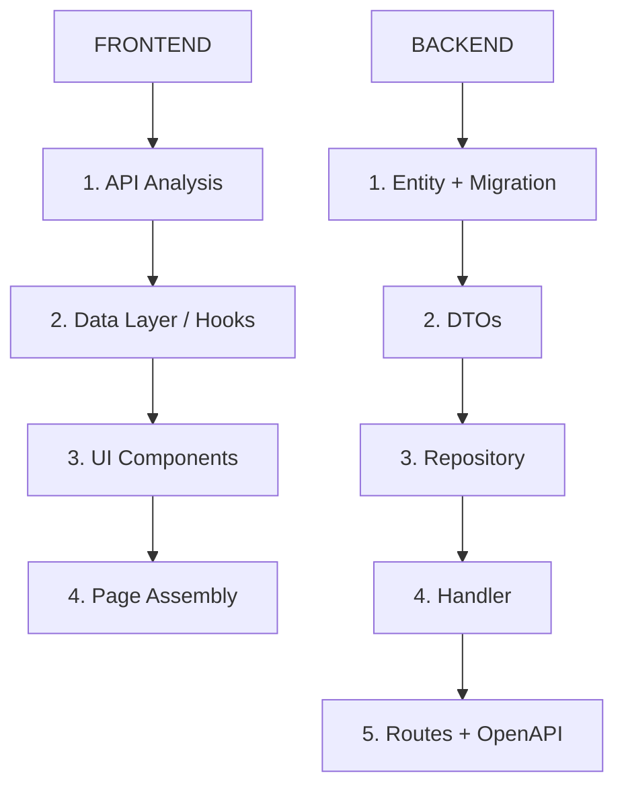

# Full-Stack Master Guide – The One and Only Source of Truth

> **CRITICAL INSTRUCTION FOR AI AGENTS:**
> **YOU MUST READ THIS FILE BEFORE DOING ANYTHING ELSE.**
> This is the absolute source of truth. Do not hallucinate a workflow. Follow this one.
> **IF A PATTERN IS NOT DOCUMENTED HERE, DO NOT USE IT.**
> {: .important }

> **METHODOLOGY & PERSONALITY:**
> This guide establishes a standardized methodology for BOTH frontend and backend development.
> **ALWAYS**:
>
> 1. Start with a **minimal viable prototype**.
> 2. **Document designs** at a high level before coding.
> 3. Frequently **seek feedback** or iterate on edge cases.
> 4. **Fix all errors** (linting, TypeScript, Rust clippy) in the current file before moving to the next feature.
>    {: .warning }

> **STOP AND ASK TRIGGERS:**
>
> 1. **Missing Design**: If `docs/design.md` is missing or incomplete for the requested feature.
> 2. **Ambiguity**: If the user prompt is vague (e.g., "Fix the bug" without details).
> 3. **Manual API Calls (Frontend)**: If you find yourself writing `fetch` or `axios` instead of using `openapi-client`.
> 4. **Missing Rust Pattern**: If you need to create a handler, repository, entity, or service and don't find the pattern here.
>
> **ACTION**: Stop immediately. Ask the user for clarification or permission.
> {: .warning }

> **STEP 0: DESIGN FIRST**
> If `docs/design.md` does not exist, or if the user prompt implies a new feature/page, **YOU MUST STOP** and ask the user for the necessary information to fill out the `docs/templates/design.md` template.
> **DO NOT WRITE CODE** until `docs/design.md` is approved.
> {: .warning }

> **SKILLS DIRECTORY LOOKUP**
> If you need a skill to do a particular task, look in these three directories (in order):
>
> 1. `/home/ariel/.agents/skills/`
> 2. `/home/ariel/.claude/skills/`
> 3. `/home/ariel/.config/opencode/skills/`
>    {: .important }

# coop data

## Tech Stack

- **Languages:** typescript,rust
- **Frameworks:** react,axum
- **Package Managers:** npm,cargo
- **Test Frameworks:** vitest,mocha,playwright,cargotest

## Repository Structure

```
monorepo
```

## Core Principles

- Write clean, readable code. Favor clarity over cleverness.
- Every change must leave the codebase better than you found it.
- Security is non-negotiable. Follow OWASP guidelines for all user-facing code.
- Never commit secrets, API keys, tokens, or credentials. Use environment variables and secret managers.
- All public APIs must have input validation and proper error handling.
- Prefer composition over inheritance. Favor small, focused functions.

---

## Feature Implementation Flow (The Hierarchy)

**You must build features in this exact order (Bottom-Up):**



### Frontend Flow

1. **API Analysis** - Open `frontend/src/openapi-client/services.gen.ts`. Find the exact method.
2. **Data Layer** - Create custom hook `use[Feature].ts`. Wrap API call in `useQuery`/`useMutation`. **NEVER** call API directly in component.
3. **UI Components** - Create dumb components using `shadcn/ui`. Use `docs/ui-design.md` for styling.
4. **Page Assembly** - Create Page component. Call Hook → Pass data to Components.

### Backend Flow

1. **Entity + Migration** - Define SeaORM entity in `src/entities/`. Create migration.
2. **DTOs** - Create request/response types in `src/api/dto/`. Add validation. Implement `From<Entity> for Response`.
3. **Repository** - Create CRUD methods in `src/repositories/`. Return `AppResult<T>`.
4. **Handler** - Create handler in `src/api/handlers/`. Add `#[utoipa::path]` annotation. Validate input, call repo, return DTO.
5. **Routes + OpenAPI** - Wire handler to URL in `src/api/routes/`. Register in `api.rs`. Add schemas to OpenAPI.

---

## Implementation Steps Table

| Steps                     |   Human    |     AI     | Comment                                                                 |
| :------------------------ | :--------: | :--------: | :---------------------------------------------------------------------- |
| 1. Requirements           |  ★★★ High  |  ★☆☆ Low   | Humans define scope, users, and business context                        |
| 2. Design Documentation   | ★★☆ Medium | ★★☆ Medium | **MANDATORY**: AI fills `docs/design.md` based on user prompt           |
| 3. **Roadmap & Phasing**  |  ★☆☆ Low   |  ★★★ High  | **CRITICAL**: AI creates `docs/progress.md` to track state across chats |
| 4. Backend Entity/DB      |  ★☆☆ Low   |  ★★★ High  | AI creates entity + migration → humans verify                           |
| 5. Backend DTOs           |  ★☆☆ Low   |  ★★★ High  | AI creates request/response types with validation                       |
| 6. Backend Repository     |  ★☆☆ Low   |  ★★★ High  | AI creates CRUD methods with error handling                             |
| 7. Backend Handler        |  ★☆☆ Low   |  ★★★ High  | AI creates handler with utoipa docs + validation                        |
| 8. Backend Routes/OpenAPI |  ★☆☆ Low   |  ★★★ High  | AI wires routes + registers schemas                                     |
| 9. frontend Types         |  ★☆☆ Low   |  ★★★ High  | AI creates types, constants → humans verify                             |
| 10. Components & Hooks    |  ★☆☆ Low   |  ★★★ High  | AI generates all reusable pieces based on design                        |
| 11. Pages Implementation  |  ★☆☆ Low   |  ★★★ High  | AI builds the full app following `docs/progress.md` checklist           |
| 12. Optimization          | ★★☆ Medium | ★★☆ Medium | Humans test usability → AI refines performance                          |
| 13. Reliability           |  ★☆☆ Low   |  ★★★ High  | AI writes tests, error boundaries, edge cases                           |

### Detailed Breakdown (follow this order every single time)

1. **Requirements** – Clarify project goals and confirm scope.
2. **Design Documentation** → **MANDATORY STEP**
   - **Action**: Check if `docs/design.md` exists.
   - **If NO**: Use `docs/templates/design.md` to ask the user for details. Create `docs/design.md`.
   - **If YES**: Update it with new feature details.
3. **Roadmap & Progress Tracking** → **TOKEN MANAGEMENT SAVER**
   - **Action**: Check if `docs/progress.md` exists.
   - **If NO**: Create it. Break the project into Phases.
   - **If YES**: Read it to see what is next.
4. **Backend: Entity + Migration** → see `docs/knowledge/rust/rust-entities.md`
5. **Backend: DTOs** → see `docs/knowledge/rust/rust-dto.md`
6. **Backend: Repository** → see `docs/knowledge/rust/rust-repositories.md`
7. **Backend: Handler** → see `docs/knowledge/rust/rust-api-handlers.md`
8. **Backend: Routes + OpenAPI** → see `docs/knowledge/rust/rust-routes.md` and `docs/knowledge/rust/rust-openapi.md`
9. **Frontend: Data Schema & Constants** → see `docs/knowledge/frontend/data-types.md`
10. **Frontend: Components & Hooks** → see `docs/knowledge/frontend/components.md`, `docs/knowledge/frontend/hooks.md`, and `docs/knowledge/frontend/ui-design.md`
11. **Frontend: Pages Implementation** → see `docs/knowledge/frontend/pages.md`
12. **Authentication** → see `docs/knowledge/frontend/authentication.md`
13. **Internationalization** → see `docs/knowledge/frontend/internationalization.md`

---

## Official Folder Structure (never deviate)

```
my_crud_app/
├── backend/ (src/)
│   ├── api/
│   │   ├── handlers/      → HTTP request handlers
│   │   │   ├── mod.rs          → Re-exports all handlers
│   │   │   ├── assessment.rs   → Assessment handlers
│   │   │   ├── organization.rs → Organization handlers
│   │   │   └── ...
│   │   ├── dto/           → Request/Response types
│   │   │   ├── mod.rs
│   │   │   ├── assessment.rs
│   │   │   └── common.rs      → PaginatedResponse, ErrorResponse
│   │   ├── routes/         → URL to handler mapping
│   │   │   ├── mod.rs
│   │   │   ├── api.rs          → Main router assembly
│   │   │   └── ...
│   │   ├── middleware.rs   → Auth, CORS, logging
│   │   └── openapi.rs      → Swagger/OpenAPI spec config
│   ├── auth/
│   │   ├── jwt_validator.rs
│   │   └── middleware.rs
│   ├── config.rs           → App configuration from env
│   ├── database.rs          → DB connection & migrations
│   ├── entities/            → SeaORM entity definitions
│   │   ├── mod.rs              → Re-exports all entities
│   │   ├── assessments.rs
│   │   └── ...
│   ├── error.rs             → AppError enum + IntoResponse
│   ├── lib.rs               → AppState, run(), create_app()
│   ├── models/              → Non-DB models (Keycloak types)
│   ├── repositories/        → Database query layer
│   │   ├── mod.rs              → Re-exports all repos
│   │   ├── assessments.rs
│   │   └── ...
│   ├── services/            → External APIs & complex logic
│   │   ├── mod.rs
│   │   ├── keycloak.rs
│   │   ├── cache.rs           → Caching service
│   │   └── report_service.rs
│   └── main.rs
├── frontend/
│   └── src/
│       ├── components/       → Reusable UI
│       │   ├── ui/             → Atomic (shadcn/ui)
│       │   └── shared/         → App-specific shared
│       ├── constants/         → Enums, roles
│       ├── context/           → React Contexts
│       ├── hooks/             → Custom hooks (by feature)
│       ├── layouts/           → MainLayout, AuthLayout
│       ├── openapi-client/    → Generated API client
│       ├── pages/             → Full pages
│       ├── router/            → Router config
│       ├── services/          → Business logic & API + offline DB
│       ├── types/             → TypeScript interfaces
│       ├── App.tsx
│       └── main.tsx
├── docs/
│   ├── design.md            ← Project design (MANDATORY)
│   ├── progress.md          ← Phase tracking
│   ├── templates/           ← Template files for setup
│   ├── rust/                ← BACKEND DOCUMENTATION
│   │   ├── rust-architecture.md      ← System flow & layers
│   │   ├── rust-api-handlers.md      ← How to write handlers
│   │   ├── rust-dto.md               ← Request/response DTOs
│   │   ├── rust-entities.md          ← SeaORM entities
│   │   ├── rust-repositories.md      ← Database queries
│   │   ├── rust-services.md          ← External services
│   │   ├── rust-routes.md           ← Route wiring
│   │   ├── rust-error-handling.md    ← Error patterns
│   │   ├── rust-testing.md           ← Testing strategy
│   │   ├── rust-openapi.md           ← Swagger/utoipa docs
│   │   ├── rust-caching.md           ← Caching strategy
│   │   └── rust-best-practices.md    ← Code style & conventions
│   ├── components.md        ← Frontend components
│   ├── hooks.md              ← Frontend hooks
│   ├── pages.md              ← CRUD page patterns
│   ├── forms.md              ← Form patterns
│   ├── tables.md             ← Table patterns
│   ├── authentication.md     ← Keycloak auth
│   ├── internationalization.md ← i18n
│   ├── api-integration.md    ← OpenAPI & TanStack Query
│   ├── security.md           ← Security guide
│   ├── data-types.md         ← Type patterns
│   ├── layout.md             ← Layout patterns
│   ├── routing.md            ← Router setup
│   ├── testing.md            ← Frontend testing
│   └── ui-design.md          ← UI design gold standard
└── migration/               → Database migrations
```

---

## Where to Find the Answer to Literally Anything

### Frontend

| You want to…                                | → Open this exact file                                         | Path                                              |
| ------------------------------------------- | -------------------------------------------------------------- | ------------------------------------------------- |
| Create a new CRUD page (list + form)        | → **docs/knowledge/frontend/pages.md** (start here every time) | `docs/knowledge/frontend/pages.md`                |
| **Design a Beautiful UI**                   | → **docs/knowledge/frontend/ui-design.md** (Prompt Refinement) | `docs/knowledge/frontend/ui-design.md`            |
| Build a Form (Zod + React Hook Form)        | → **docs/knowledge/frontend/forms.md**                         | `docs/knowledge/frontend/forms.md`                |
| Build a Table (TanStack Table)              | → **docs/knowledge/frontend/tables.md**                        | `docs/knowledge/frontend/tables.md`               |
| Implement login / logout / protected routes | → Authentication guide                                         | `docs/knowledge/frontend/authentication.md`       |
| Add a new language                          | → Internationalization guide                                   | `docs/knowledge/frontend/internationalization.md` |
| Call the backend API                        | → API client & error handling                                  | `docs/knowledge/frontend/api-integration.md`      |
| Create a reusable component                 | → Component standards                                          | `docs/knowledge/frontend/components.md`           |
| Write a custom hook                         | → Hook standards                                               | `docs/knowledge/frontend/hooks.md`                |
| Set up routing & lazy loading               | → Routing & guards                                             | `docs/knowledge/frontend/routing.md`              |
| Change theme / layout                       | → Layout & UI theme                                            | `docs/knowledge/frontend/layout.md`               |
| Add frontend tests                          | → Testing strategy                                             | `docs/knowledge/frontend/testing.md`              |
| Follow security best practices              | → Security guide (XSS, Auth, OWASP)                            | `docs/knowledge/frontend/security.md`             |

### Backend (Rust)

| You want to…                           | → Open this exact file                | Path                                         |
| -------------------------------------- | ------------------------------------- | -------------------------------------------- |
| Understand how the whole system flows  | → **Architecture & Flow guide**       | `docs/knowledge/rust/rust-architecture.md`   |
| Create a new API endpoint (handler)    | → **Handler patterns & step-by-step** | `docs/knowledge/rust/rust-api-handlers.md`   |
| Create request/response types          | → **DTO guide**                       | `docs/knowledge/rust/rust-dto.md`            |
| Define a database table / entity       | → **Entity guide**                    | `docs/knowledge/rust/rust-entities.md`       |
| Write database queries                 | → **Repository guide**                | `docs/knowledge/rust/rust-repositories.md`   |
| Integrate with external APIs           | → **Service guide**                   | `docs/knowledge/rust/rust-services.md`       |
| Wire routes to handlers                | → **Routes guide**                    | `docs/knowledge/rust/rust-routes.md`         |
| Handle errors properly                 | → **Error handling guide**            | `docs/knowledge/rust/rust-error-handling.md` |
| Add caching to an endpoint             | → **Caching strategy**                | `docs/knowledge/rust/rust-caching.md`        |
| Document API endpoints for Swagger     | → **OpenAPI/Swagger guide**           | `docs/knowledge/rust/rust-openapi.md`        |
| Write tests for handlers/repos         | → **Testing guide**                   | `docs/knowledge/rust/rust-testing.md`        |
| Check naming, imports, response format | → **Best practices & conventions**    | `docs/knowledge/rust/rust-best-practices.md` |

---

## Backend Rules (MANDATORY)

### Architecture Rules

1. **AZIMUTH LAYER SEPARATION**: Route → Handler → Service/Repository → Database. **NEVER skip layers**.
2. **Handlers are thin**: Validate input, call repository/service, return DTO. No SQL in handlers.
3. **Repositories are thin**: Database queries only. No HTTP response formatting.
4. **Services for external APIs**: Keycloak, S3, email. Use Arc<Service> in AppState.
5. **AppState is God**: All shared state (DB, services, cache) lives in `AppState`. Access via `State(state): State<AppState>`.

### Error Handling Rules

1. **ALWAYS return `AppResult<T>`** from fallible functions. Never unwrap in production.
2. **USE `?` operator** with `.map_err()` for context.
3. **NEVER expose internals**: `AppError::InternalServerError("DB pool exhausted")` → BAD. `AppError::InternalServerError("Failed to retrieve data")` → GOOD.
4. **LOG errors with context**: `tracing::error!(assessment_id = %id, error = %e, "Failed to fetch");`
5. **VALIDATE early**: Check input at start of handler. Return `AppError::BadRequest` immediately.

### Code Style Rules

1. **snake_case** for files and functions: `assessment_repository.rs`, `find_by_id()`
2. **PascalCase** for types and structs: `AssessmentStatus`, `CreateAssessmentRequest`
3. **SCREAMING_SNAKE** for constants: `MAX_PAGE_SIZE`, `DEFAULT_TTL`
4. **Imports order**: std → external crates → internal modules (alphabetical within groups)
5. **Import grouping**: One block per source with blank lines between groups
6. **NO comments unless asked** – code should be self-documenting

### Handler Template (MUST follow)

```
Every handler MUST:
1. Have #[utoipa::path(...)] annotation with all params, request body, and responses
2. Return AppResult<impl IntoResponse>
3. Validate input at the start
4. Use tracing::info! or tracing::error! for business events
5. Invalidate cache on mutations
6. Convert entity to DTO before returning
7. Use proper HTTP status codes (201 CREATE, 204 DELETE, 200 OK, 404 NOT FOUND)
```

### Cache Rules

1. **Cache read-heavy data**: Dimensions, levels, organizations (TTL: 5 min)
2. **NEVER cache mutable data without invalidation**
3. **Invalidate on**: CREATE, UPDATE, DELETE of related entity
4. **Use cache key pattern**: `"{entity}:{id}"` for single, `"{entity}:all"` for lists
5. **Fire-and-forget writes**: Use `tokio::spawn` for cache writes to avoid blocking

### Offline-First Backend Support Rules

1. **Accept sync queue items** at `POST /api/sync/push`
2. **Validate each item** individually, not the whole batch
3. **Return conflict data** when server version differs from client version
4. **Provide full snapshots** at `GET /api/sync/pull` for initial sync
5. **Use `updated_at` timestamps** for incremental sync comparisons
6. **Handle duplicate submissions** idempotently (use UUIDs as dedup keys)

### Twelve-Factor App Rules (MANDATORY)

This project follows the [Twelve-Factor App](https://12factor.net) methodology. Every decision MUST align with these 12 principles:

| #    | Factor                  | Rule                                                                                    | How We Enforce It                                                                                                                                                                    |
| ---- | ----------------------- | --------------------------------------------------------------------------------------- | ------------------------------------------------------------------------------------------------------------------------------------------------------------------------------------ |
| I    | **Codebase**            | One codebase in Git, many deploys (dev, staging, prod). Never fork for environments.    | Single repo. Environment differences via config only.                                                                                                                                |
| II   | **Dependencies**        | Explicitly declare and isolate all dependencies. No implicit system-level deps.         | Backend: `Cargo.toml` + `Cargo.lock`. Frontend: `package.json` + `package-lock.json`. Never rely on system packages.                                                                 |
| III  | **Config**              | Store ALL config in environment variables. No secrets or env-specific values in code.   | Backend: `Config` struct reads from env vars (see `src/config.rs`). Frontend: `VITE_*` env vars. `.env.example` documents required vars. `.env` is NEVER committed.                  |
| IV   | **Backing Services**    | Treat databases, caches, S3, Keycloak as attached resources. Swap via config, not code. | `AppState` holds `Arc<DbConn>`, `Arc<KeycloakService>`, `Arc<CacheService>`. Swap Postgres for SQLite by changing `DATABASE_URL`. Swap in-memory cache for Redis by changing config. |
| V    | **Build, Release, Run** | Strictly separate build, release, and run stages.                                       | Build: `cargo build --release`. Release: Docker image tagged with git SHA. Run: `docker run` with env vars. Never build at runtime.                                                  |
| VI   | **Processes**           | App runs as stateless processes. No sticky sessions. Persistent data goes to DB.        | No server-side sessions. Auth via JWT (stateless). All state in Postgres or IndexedDB (client).                                                                                      |
| VII  | **Port Binding**        | App exports itself via port binding. No external web server dependency.                 | Axum listens on configured `HOST:PORT`. No Nginx/Apache required in front. Docker exposes the port.                                                                                  |
| VIII | **Concurrency**         | Scale out by adding more processes. Scale independently by workload type.               | Each deploy runs multiple instances behind a load balancer. CPU-bound work scaled via replicas. Async I/O via Tokio runtime.                                                         |
| IX   | **Disposability**       | Fast startup and graceful shutdown. Processes are disposable.                           | Axum graceful shutdown on SIGTERM. No in-flight request loss. Stateless design means any instance can be killed/replaced instantly.                                                  |
| X    | **Dev/Prod Parity**     | Keep dev, staging, and prod as similar as possible. Same stack, same data shapes.       | Same Docker image across environments. Same database engine (Postgres). Same Keycloak realm config. `docker-compose.yml` mirrors prod.                                               |
| XI   | **Logs**                | Treat logs as event streams. Write to stdout/stderr. Never manage log files.            | Backend: `tracing` crate writes to stdout. No file logging. Docker/infrastructure collects and routes logs. Frontend: browser console only in dev.                                   |
| XII  | **Admin Processes**     | Run admin/one-off tasks (migrations, scripts) as one-off processes.                     | DB migrations: `sqlx migrate run` at startup (see `src/database.rs`). Seed scripts: separate binary or CLI command. Never embed admin tasks in the web server process.               |

#### Twelve-Factor Enforcement Checklist

Before merging any PR, verify:

- [ ] No secrets or config hardcoded — all values from env vars
- [ ] `Cargo.toml` and `package.json` are the single source of truth for dependencies
- [ ] New backing services (DB, cache, external API) are injected via `AppState`, not global singletons
- [ ] App starts fast (< 5s) and shuts down gracefully on SIGTERM
- [ ] Logs go to stdout via `tracing` — no file loggers
- [ ] Database migrations run as a separate step at startup, not embedded in application code
- [ ] Docker images are identical across dev/staging/prod — only env vars differ
- [ ] No server-side session state — JWT only for auth

---

## Frontend Rules (MANDATORY)

1. **Strict Types**: No `any`. Use `unknown` if absolutely necessary.
2. **Named Exports**: Always use `export const Component = ...`. No `export default`.
3. **Functional Components**: Use `React.FC<Props>` or `({ prop }: Props)`.
4. **Imports**: Use absolute imports `@/components/...`.
5. **NEVER call API directly in components** – always use custom hooks.
6. **NEVER write fetch/axios** – use generated openapi-client.
7. **Offline-first**: Use DexieDB (IndexedDB) for local storage + sync queue.

---

## Modularity & Best Practices (The "Anti-Monolith" Rule)

> **CRITICAL**: We build **maintainable**, **scalable** software.
> **NEVER** create massive files (e.g., > 200 lines frontend, > 300 lines backend) if it can be avoided.

1. **Single Responsibility Principle (SRP)**:
   - Frontend: A file should do **ONE thing**. Split hooks from components.
   - Backend: One handler = one endpoint. One repository = one entity. One service = one external system.

2. **One Component/Handler Per File**:
   - Frontend: One component per file. Exception: tiny sub-components.
   - Backend: Group related handlers in one file (e.g., `assessment.rs` has all CRUD handlers for assessments).

3. **DRY (Don't Repeat Yourself)**:
   - Frontend: If you copy-paste twice, refactor into utility or hook.
   - Backend: If you write the same query twice, add a repository method.

4. **Feature Folders** (Frontend):
   - Group by feature: `components/users/UserTable.tsx`, `hooks/users/useUsers.ts`.

---

## AI Chain of Thought (Follow this for every prompt)

1. **Analyze Request**: What is the user asking for? (New Page? New Endpoint? Bug Fix? Refactor?)
2. **Is it Backend or Frontend?**
   - **Backend**: Follow `docs/knowledge/rust/rust-architecture.md` flow
   - **Frontend**: Follow `docs/knowledge/frontend/pages.md` flow
3. **Check Design**: Does `docs/design.md` cover this? If not, ask user.
4. **Check Roadmap**: Open `docs/progress.md`. What is the next unchecked item? **DO THAT ONLY.**
5. **Plan Files**:
   - Backend: Entity → DTO → Repository → Handler → Routes → OpenAPI
   - Frontend: Type → Hook → Component → Page
6. **Execute**: Write code following the patterns in the docs EXACTLY.
7. **Verify**:
   - Backend: Run `cargo clippy` and `cargo test`
   - Frontend: Run `npm run lint` and `npm run typecheck`

---

**Your very first action when starting any new feature:**

1. Frontend → Open `docs/knowledge/frontend/pages.md` and follow it step by step.
2. Backend → Open `docs/knowledge/rust/rust-architecture.md` and follow the flow diagram.

## Git Conventions

### Commits

- Use Conventional Commits: `type(scope): description`
- Types: `feat`, `fix`, `docs`, `style`, `refactor`, `perf`, `test`, `build`, `ci`, `chore`
- Scope is optional but encouraged (e.g., `feat(auth): add OAuth2 flow`)
- Subject line: imperative mood, lowercase, no period, max 72 characters
- Body: explain _why_ the change was made, not _what_ changed (the diff shows that)

### Branches

- Feature: `feat/short-description` or `feat/TICKET-123-short-description`
- Bugfix: `fix/short-description`
- Hotfix: `hotfix/short-description`
- Release: `release/vX.Y.Z`

### Pull Requests

- PRs must have a clear description of changes and motivation
- All CI checks must pass before merge
- Require at least one approving review
- Keep PRs small and focused; split large changes into stacked PRs
- Link related issues using `Closes #123` or `Fixes #123`

## Code Review Standards

- Review for correctness, security, performance, and readability in that order
- Check for proper error handling and edge cases
- Verify test coverage for new and changed code
- Flag any hardcoded values that should be configurable
- Ensure naming is clear and consistent with the codebase
- Look for potential race conditions in concurrent code

## Error Handling Philosophy

- Fail fast and fail loudly in development; fail gracefully in production
- Use typed/structured errors, not raw strings
- Always log errors with sufficient context for debugging (timestamp, request ID, stack trace)
- Never swallow exceptions silently
- Distinguish between recoverable and unrecoverable errors
- Return meaningful error messages to API consumers (without leaking internals)

## Documentation Expectations

- Public functions and APIs must have doc comments explaining purpose, parameters, return values, and thrown errors
- Complex business logic must have inline comments explaining _why_, not _what_
- Keep README up to date when adding features, changing setup steps, or modifying architecture
- Document breaking changes prominently in changelogs
- Architecture decisions should be recorded in ADRs (Architecture Decision Records) when significant

## TypeScript Conventions

### Naming

- Variables and functions: `camelCase`
- Classes, interfaces, types, enums: `PascalCase`
- Constants: `SCREAMING_SNAKE_CASE` for true constants, `camelCase` for derived values
- Files: `kebab-case.ts` for modules, `PascalCase.ts` for classes/components
- Interfaces: do NOT prefix with `I` (use `UserService`, not `IUserService`)
- Type parameters: single uppercase letter (`T`, `K`, `V`) or descriptive (`TResult`, `TInput`)

### Type Safety

- Enable `strict: true` in tsconfig.json — never disable it per-file
- Avoid `any`; use `unknown` when the type is truly unknown, then narrow with type guards
- Prefer `interface` for object shapes that may be extended; use `type` for unions, intersections, and mapped types
- Use discriminated unions over optional fields for state modeling
- Leverage `as const` for literal types and `satisfies` for type-checked assignments
- Never use non-null assertions (`!`) unless you have a provable guarantee; prefer optional chaining (`?.`) and nullish coalescing (`??`)

### Imports and Modules

- Use ES module syntax (`import`/`export`), never CommonJS (`require`) in `.ts` files
- Order imports: (1) node built-ins, (2) external packages, (3) internal aliases, (4) relative imports — separated by blank lines
- Use path aliases (e.g., `@/`) instead of deep relative imports (`../../../`)
- Prefer named exports over default exports for better refactoring and tree-shaking
- Co-locate types with the module that owns them; shared types go in a `types/` directory

### Error Handling

- Use custom error classes that extend `Error` with a `code` property for programmatic handling
- Prefer `Result<T, E>` patterns or discriminated unions for expected failure paths
- Use try/catch only for truly exceptional situations
- Always type catch variables as `unknown` and narrow before use

### Patterns and Idioms

- Use `readonly` for properties and arrays that should not be mutated
- Prefer `Map`/`Set` over plain objects for dynamic key collections
- Use `enum` sparingly; prefer `as const` objects with derived union types
- Leverage template literal types for string validation where applicable
- Use generics to avoid code duplication, but keep them simple — no more than 2-3 type parameters

### Common Pitfalls

- Do not use `==`; always use `===`
- Avoid floating promises — always `await` or explicitly handle with `.catch()`
- Never mutate function parameters; return new values
- Avoid `Object.assign` for cloning; use spread or `structuredClone`
- Beware of `this` context loss in callbacks — use arrow functions or explicit binding
- Do not use `@ts-ignore`; use `@ts-expect-error` with a comment explaining why

## Rust Conventions

### Naming

- Variables, functions, methods, modules: `snake_case`
- Types, traits, enums: `PascalCase`
- Constants and statics: `SCREAMING_SNAKE_CASE`
- Lifetime parameters: short lowercase (`'a`, `'b`); use descriptive names for clarity (`'conn`, `'ctx`)
- Crate names: `kebab-case` in Cargo.toml, `snake_case` in code (auto-converted)
- Files: `snake_case.rs`; module directories with `mod.rs` or `module_name.rs` + `module_name/`
- Type conversions: `from_*`, `to_*`, `into_*`, `as_*` following std conventions

### Ownership and Borrowing

- Default to borrowing (`&T`); only take ownership when the function needs to consume or store the value
- Prefer `&str` over `&String`, `&[T]` over `&Vec<T>` in function parameters
- Use `Clone` explicitly rather than implicit copies; annotate why a clone is necessary if non-obvious
- Return owned types from constructors and factory functions
- Minimize lifetime annotations — let the compiler infer where possible
- Use `Cow<'_, str>` when a function may or may not need to allocate

### Error Handling

- Use `Result<T, E>` for all fallible operations; never panic in library code
- Define a crate-level error enum using `thiserror` for libraries or `anyhow` for applications
- Use the `?` operator for error propagation; add context with `.context()` (anyhow) or `.map_err()`
- Reserve `unwrap()` and `expect()` for cases with compile-time or logical guarantees; always add a message to `expect()`
- Use `panic!` only for programming errors (invariant violations), never for expected failures

### Module Organization

- Keep `lib.rs`/`main.rs` thin — re-export public API and delegate to submodules
- Use `pub(crate)` for internal visibility; minimize the public surface area
- Group related types, traits, and functions into modules by domain concept
- Place integration tests in `tests/` directory; unit tests in `#[cfg(test)]` modules within source files

### Patterns and Idioms

- Use `enum` with variants for state machines and discriminated unions
- Implement `Display` and `Debug` for all public types
- Use `impl Into<T>` / `impl AsRef<T>` for flexible function parameters
- Prefer iterators and combinators (`.map()`, `.filter()`, `.collect()`) over manual loops
- Use `derive` macros for `Debug`, `Clone`, `PartialEq`, `Eq`, `Hash`, `Serialize`, `Deserialize` as appropriate
- Prefer `Option` methods (`.map()`, `.and_then()`, `.unwrap_or_default()`) over `match` for simple cases
- Use newtype pattern (`struct UserId(u64)`) for type safety on primitive wrappers

### Common Pitfalls

- Avoid `String::from` / `.to_string()` in hot loops; reuse buffers
- Beware of holding `MutexGuard` across `.await` points — use `tokio::sync::Mutex` in async code
- Do not use `Rc`/`Arc` unless shared ownership is truly needed
- Avoid `unsafe` unless absolutely necessary; document safety invariants in `// SAFETY:` comments
- Run `cargo clippy` in CI and fix all warnings; do not suppress without justification
- Use `#[must_use]` on functions whose return values should not be ignored

## React Conventions

### Project Structure

- Group by feature: `features/auth/`, `features/dashboard/` — each containing components, hooks, utils, and tests
- Shared UI primitives go in `components/ui/`; shared hooks in `hooks/`
- Co-locate tests, styles, and types with their component

### Component Patterns

- Use functional components exclusively; no class components in new code
- Prefer named exports: `export function UserCard()` over `export default`
- Keep components under 150 lines; extract sub-components when complexity grows
- Use `React.memo()` only when profiling shows unnecessary re-renders, not preemptively
- Props interfaces: define with `interface Props` in the same file, not inline

### State Management

- Local state: `useState` for simple values, `useReducer` for complex state logic
- Server state: use React Query / TanStack Query — never store API responses in global state
- Global client state: use Zustand or Context for truly global UI state (theme, auth, toasts)
- Avoid prop drilling beyond 2 levels; extract a context or use composition instead

### Hooks

- Custom hooks must start with `use` and handle one concern
- Never call hooks conditionally or inside loops
- Use `useCallback` for functions passed as props to memoized children; `useMemo` for expensive computations
- Clean up effects: return a cleanup function from `useEffect` for subscriptions, timers, and listeners

### Performance

- Lazy-load routes and heavy components with `React.lazy()` and `Suspense`
- Use virtualization (react-window, tanstack-virtual) for lists over 100 items
- Avoid creating new objects/arrays in render — hoist them or memoize
- Use the React DevTools Profiler to identify bottlenecks before optimizing

### Anti-Patterns to Avoid

- Do not use `useEffect` for state derivation — compute derived values during render
- Do not sync state between components with `useEffect` — lift state up or use a shared store
- Do not put API calls in `useEffect` directly — use a data fetching library
- Avoid index as key in lists where items can be reordered, added, or removed

## Axum Conventions

### Project Structure

- Entry point: `src/main.rs` with `tokio::main` async runtime and `axum::Router`
- Handlers: `src/handlers/{resource}.rs` with async handler functions
- Services: `src/services/{resource}.rs` for business logic
- Models: `src/models/` for domain types and DTOs (with `serde::Serialize`/`Deserialize`)
- State: `src/state.rs` for shared application state (`AppState`)
- Error: `src/error.rs` for custom error types implementing `IntoResponse`
- Routes: `src/routes.rs` composing the router from sub-routers

### Route and Handler Patterns

- Build routers: `Router::new().route("/users", get(list_users).post(create_user))`
- Nest routers: `Router::new().nest("/api/v1", api_routes())`
- Handlers are async functions with extractors as parameters
- Extractors: `Path(id): Path<Uuid>`, `Json(body): Json<CreateUser>`, `Query(params): Query<ListParams>`
- Return `impl IntoResponse` or specific types: `Json<T>`, `(StatusCode, Json<T>)`

### State and Dependency Injection

- Define `AppState` struct with `Arc`: `#[derive(Clone)] struct AppState { db: PgPool, config: Arc<Config> }`
- Pass state to router: `Router::new().with_state(state)` and extract with `State(state): State<AppState>`
- Use `FromRef` derive for substates: extractors can pull specific fields from `AppState`
- Prefer `Extension<T>` only for middleware-injected per-request values

### Extractors

- Axum extracts handler parameters in order; the last extractor can consume the request body
- Body extractors (`Json`, `Form`, `Bytes`) must be the last parameter
- Custom extractors: implement `FromRequestParts<S>` (non-body) or `FromRequest<S>` (body)
- Rejection handling: implement `From<JsonRejection>` on your error type for custom error responses
- Use `Option<T>` for optional extractors; `Result<T, E>` to handle extraction failures manually

### Error Handling

- Define `AppError` enum implementing `IntoResponse` for all handler errors
- Use `thiserror` for error definitions; map to `(StatusCode, Json<ErrorBody>)` in `IntoResponse`
- Use the `?` operator in handlers by returning `Result<impl IntoResponse, AppError>`
- Log errors in the `IntoResponse` implementation; return sanitized messages to clients

### Middleware

- Use `tower` middleware: `ServiceBuilder::new().layer(TraceLayer::new(...)).layer(CorsLayer::new(...))`
- Apply per-route: `Router::new().route("/", get(handler)).layer(middleware)`
- Use `axum::middleware::from_fn` for custom async middleware functions
- Use `tower-http` crate for common middleware: CORS, compression, request tracing, timeout

### Anti-Patterns to Avoid

- Do not use `unwrap()` in handlers — return `Result` with a proper error type
- Do not hold `MutexGuard` across `.await` points — use `tokio::sync::Mutex` if needed
- Do not block the async runtime — use `tokio::task::spawn_blocking` for CPU-intensive work
- Do not forget to add `#[derive(Deserialize)]` on request types and `#[derive(Serialize)]` on response types
- Do not create a new database pool per request — share via `AppState`

## Testing Conventions

**Test Frameworks:** vitest,mocha,playwright,cargotest

### Test File Naming and Location

- Test files live alongside source files or in a parallel `tests/`/`__tests__` directory — follow the established project convention
- Name test files to match the module they test: `user-service.test.ts`, `test_user_service.py`, `UserServiceTest.java`
- Group integration tests separately from unit tests (e.g., `tests/integration/`, `tests/unit/`)

### Test Structure (AAA Pattern)

- Every test follows **Arrange / Act / Assert**:
  - **Arrange**: Set up test data, mocks, and preconditions
  - **Act**: Execute the single operation under test
  - **Assert**: Verify the expected outcome
- Separate the three sections with blank lines for readability
- Each test should have exactly one reason to fail — test one behavior per test function

### What to Test

- All public API methods and functions
- Business logic and domain rules
- Edge cases: empty inputs, boundary values, null/undefined, max/min values
- Error paths: invalid input, missing data, network failures, permission denied
- State transitions and side effects

### What NOT to Test

- Framework internals or third-party library behavior
- Private methods directly (test through the public interface)
- Trivial getters/setters with no logic
- Auto-generated code (ORM models, protobuf stubs)
- Implementation details that may change without affecting behavior

### Mocking Philosophy

- Mock external dependencies (HTTP clients, databases, file system, third-party APIs)
- Do NOT mock the unit under test or its direct collaborators (prefer real objects)
- Use dependency injection to make mocking straightforward
- Prefer fakes/stubs over complex mock frameworks when possible
- Assert on behavior (was the method called with correct args?) not implementation
- Reset mocks between tests to prevent state leakage

### Coverage Expectations

- Aim for 80%+ line coverage on business logic and domain code
- 100% coverage on critical paths (authentication, authorization, payment, data validation)
- Do not chase 100% coverage everywhere — diminishing returns on glue code and configuration
- Coverage gates in CI should block PRs that reduce coverage on changed files

### Integration vs Unit Test Boundaries

- **Unit tests**: fast, isolated, no I/O, no network, no database — run in milliseconds
- **Integration tests**: test real interactions between components (API routes, database queries, message queues)
- Integration tests use dedicated test databases/containers, not production-like data
- Run unit tests on every commit; run integration tests in CI pipeline
- Use test containers (Testcontainers, Docker Compose) for integration test infrastructure

### Test Quality

- Tests must be deterministic — no flaky tests; fix or quarantine immediately
- Tests must be independent — no reliance on execution order or shared mutable state
- Use descriptive test names that read as specifications: `should return 404 when user not found`
- Use test data builders or factories to reduce boilerplate setup
- Clean up test resources in teardown/afterEach hooks

## Workflow: CI/CD

Use this section when planning, updating, or debugging continuous integration and delivery pipelines.

- Pipelines should be idempotent, fast, and cache-aware; aim for < 10 min CI on main branches.
- Enforce branch protections and required checks. Block merges on red pipelines or low test coverage.
- Separate stages: lint → build → unit tests → integration/e2e → security scans → package → deploy.
- Artifacts must be immutable and traceable to commits; include SBOM where possible.
- Prefer declarative pipeline definitions (YAML) stored in-repo. Review for secrets exposure.
- Add rollback strategies and health checks for every deploy job.
- For GitHub Actions: pin actions by commit SHA, use OIDC to cloud, avoid long‑lived secrets.

Checklist

- Linting and type checks run early and fail fast
- Test matrix covers supported OS/versions/runtimes
- Caches scoped correctly; cache keys include lockfiles
- Build artifacts signed or checksummed
- Environments (dev/stage/prod) use the same artifact
- Deployment is atomic and reversible (blue/green, canary, or rolling)

## Workflow: Infrastructure as Code (IaC)

Principles

- Declarative definitions, versioned in Git; changes via pull requests with review.
- Immutable infrastructure where possible; avoid snowflake servers.
- Idempotent plans and applies; no drift. Run `plan` on every PR, `apply` on protected branches.
- Separate state per environment; lock state and enable remote backends with encryption.
- Tag and document all resources with owner, environment, and purpose.

Guidance

- Terraform: pin provider versions, use modules, validate and format. Run `terraform validate` and `terraform fmt -check` in CI.
- Helm: keep values minimal per env, prefer charts over imperative `kubectl` manifests; lint charts.
- Ansible: roles > playbooks; no secrets in vars; idempotent tasks; `--check` friendly.
- Policy-as-code: use OPA/Conftest/Checkov where possible; fail builds on violations.

Checklist

- Plans are attached to PRs as artifacts/comments
- State backends are configured with locking and encryption
- Secrets are referenced via secure stores (e.g., Vault, SSM, Secrets Manager)
- Resource names and tags follow conventions
- Rollback documented (e.g., previous module version, Helm rollback)

## Workflow: Observability

Goals

- Ensure systems are observable across metrics, logs, traces, and events.
- Enable fast, low‑MTTR incident resolution and proactive SLO tracking.

Guidance

- Define SLOs/SLIs for critical user journeys; alert on error budget burn rates.
- Metrics: RED/USE methods; standard labels (service, env, version, region).
- Logs: structured JSON, no secrets; consistent correlation IDs propagated end‑to‑end.
- Traces: sample intelligently; instrument with OpenTelemetry where possible.
- Dashboards: owner, purpose, and runbook links; avoid noisy, unactionable panels.
- Alerts: page only on actionable signals; include links to runbooks and dashboards.

Checklist

- OpenTelemetry enabled for services where feasible
- Golden dashboards exist for each service with owner set
- Alerts tied to SLOs and include runbook links
- Log PII scrubbing enabled; retention policy documented
- On-call rotation documented; escalation policy defined

## Workflow: Incident Response

Principles

- Prioritize user impact and safety; communicate early and often.
- Separate mitigation (stop the bleeding) from remediation (fix the cause).
- Keep timelines and actions in a shared channel; assign clear roles (IC, comms, ops).

Guidance

- Create/attach to an incident ticket with severity and impact assessment.
- Use standard runbooks for common failure modes; link dashboards and logs.
- Record all changes; prefer reversible changes; avoid speculative restarts without hypothesis.
- Perform post‑incident review within 48 hours; identify action items with owners and due dates.

Checklist

- Severity and stakeholders identified; user comms sent if needed
- Mitigation in place and validated by SLOs/metrics
- Root cause hypothesis tested; contributing factors captured
- PIR written and shared; follow‑ups tracked to completion

## Workflow: Containerization

Guidance

- Minimal base images; prefer distroless/ubi-micro; run as non-root; drop capabilities.
- One process per container; health checks; graceful shutdown (SIGTERM handling).
- Use multi-stage builds; cache dependencies; pin versions and verify checksums.
- Scan images for vulnerabilities in CI; fail on critical CVEs; track SBOM.
- Resource limits/requests set appropriately; avoid hostPath mounts in prod.

Checklist

- Dockerfile is multi-stage and reproducible
- User set to non-root; no hardcoded secrets
- Healthcheck defined; exposes correct ports
- Image tag follows immutable strategy (commit SHA or semver)
- Image passes vulnerability scan thresholds
