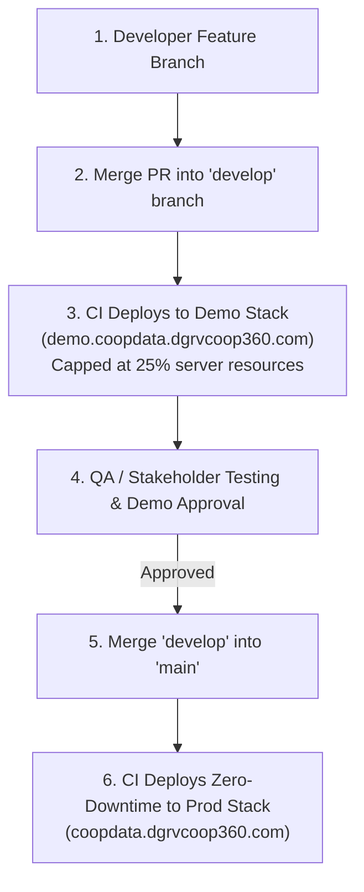

# CoopData — Single-Host Multi-Environment Architecture Guide (Production + Demo)

This document defines how to run **Production** and an isolated **Demo/Staging Environment** on the **same physical server** without risking Production performance or uptime.

---

## 🎯 1. Architectural Overview & Feasibility

### Is it Feasible?
**Yes, 100% Feasible and Cost-Effective.**

Instead of paying for two separate EC2 hosts or cloud clusters, you can run Production and Demo on the same Linux host by leveraging:
1. **Docker Compose Project Names**: `coopdata` (Prod) vs `coopdata-demo` (Demo) isolate container names, volumes, and networks completely.
2. **Subdomain Nginx Routing**:
   - `coopdata.dgrvcoop360.com` $\rightarrow$ Production Stack
   - `demo.coopdata.dgrvcoop360.com` $\rightarrow$ Demo Stack
3. **Cgroup Hard Resource Limits**: Demo containers are strictly capped at **~25% of total server CPU & RAM**. Even if Demo is overloaded or experiences a crash, it **can NEVER starve or disrupt Production**.

---

## 🏗️ 2. Environment Comparison Matrix

| Component | Production Environment (`coopdata`) | Demo / Staging Environment (`coopdata-demo`) |
|---|---|---|
| **Compose File** | [`docker-compose.ghcr.yaml`](file:///home/ariel/Desktop/CoopData/docker-compose.ghcr.yaml) | [`docker-compose.demo.yaml`](file:///home/ariel/Desktop/CoopData/docker-compose.demo.yaml) |
| **Env Secret File** | `.env` (from [`.env.example`](file:///home/ariel/Desktop/CoopData/.env.example)) | `.env.demo` (from [`.env.demo.example`](file:///home/ariel/Desktop/CoopData/.env.demo.example)) |
| **Domain** | `coopdata.dgrvcoop360.com` | `demo.coopdata.dgrvcoop360.com` |
| **Resource Allocation** | **75% Host CPU & RAM** | **25% Host CPU & RAM (Capped)** |
| **Max RAM Limit** | ~10 GB | ~2 GB |
| **PostgreSQL Volume** | `postgres_data` | `demo_postgres_data` |
| **MinIO Storage Volume** | `minio_data` | `demo_minio_data` |
| **Backend Internal Port** | `127.0.0.1:3000` | `127.0.0.1:3005` |
| **Frontend Internal Port** | `127.0.0.1:5174` | `127.0.0.1:5175` |
| **Keycloak Internal Port** | `127.0.0.1:8180` | `127.0.0.1:8185` |
| **Deployment Script** | [`./scripts/deploy.sh`](file:///home/ariel/Desktop/CoopData/scripts/deploy.sh) | [`./scripts/deploy-demo.sh`](file:///home/ariel/Desktop/CoopData/scripts/deploy-demo.sh) |

---

## 🔐 3. Environment Secret File Isolation (`.env` vs `.env.demo`)

To prevent any environment variable bleed or secret collision on the same host machine, the two stacks read **two separate environment files**:

- **Production Stack** reads `/opt/coopdata/.env` (Configured via `docker-compose.ghcr.yaml`).
- **Demo Stack** reads `/opt/coopdata/.env.demo` (Configured via `docker-compose.demo.yaml`).

> **Safety Benefit**: Changing passwords, database URLs, or S3 bucket names in `.env.demo` will **NEVER affect Production** because Production exclusively reads `.env`.

---

## 🛡️ 3. Resource Capping (25% Safety Isolation)

Demo containers are enforced with low cgroup CPU and RAM limits in `docker-compose.demo.yaml`:

```yaml
# Example: Demo PostgreSQL strictly capped at 0.5 CPU / 512MB RAM
demo-postgres:
  deploy:
    resources:
      limits:
        cpus: "0.50"
        memory: 512M

# Example: Demo Keycloak capped at 0.5 CPU / 512MB RAM
demo-keycloak:
  deploy:
    resources:
      limits:
        cpus: "0.50"
        memory: 512M

# Example: Demo Backend API capped at 0.5 CPU / 384MB RAM
demo-backend:
  deploy:
    resources:
      limits:
        cpus: "0.50"
        memory: 384M
```

---

## 🔄 4. Dev $\rightarrow$ Demo $\rightarrow$ Prod Promotion Workflow



---

## 🔒 5. TLS / SSL Certificate Management

### Dual-Domain SAN (Subject Alternative Name) Certificate
Both Production and Demo run under a single, unified Let's Encrypt X.509 TLS certificate covering both SAN domains:

- **Primary Domain**: `coopdata.dgrvcoop360.com`
- **SAN Subdomain**: `demo.coopdata.dgrvcoop360.com`

### 1. Automated Certificate Issuance (`setup-ec2.sh`)
During host setup, `setup-ec2.sh` executes Certbot requesting both SAN domains in a single certificate:

```bash
certbot certonly \
    --webroot \
    --webroot-path=/var/www/certbot \
    --email "$EMAIL" \
    --agree-tos \
    --no-eff-email \
    -d "coopdata.dgrvcoop360.com" \
    -d "demo.coopdata.dgrvcoop360.com"
```

The resulting certificate files are stored at:
- Certificate: `/etc/letsencrypt/live/coopdata.dgrvcoop360.com/fullchain.pem`
- Private Key: `/etc/letsencrypt/live/coopdata.dgrvcoop360.com/privkey.pem`

Both Production and Demo Nginx server blocks share this single certificate file!

### 2. Zero-Downtime Auto-Renewal Cron Job
Certbot automatically renews certificates 30 days before expiration. The installer configures `/etc/cron.d/certbot-renew` running twice daily (at 00:00 and 12:00 AM):

```bash
0 0,12 * * * root certbot renew --quiet --post-hook 'systemctl reload nginx'
```

> **Zero Downtime Renewal**: When Let's Encrypt issues a renewed cert every 60 days, `systemctl reload nginx` reloads Nginx workers in-memory without dropping a single active HTTP request or user connection.

---

## 🌐 6. Nginx Subdomain Configuration for Demo

Add the demo server block in `/etc/nginx/sites-available/coopdata`:

```nginx
# ── DEMO / STAGING SUBDOMAIN (demo.coopdata.example.com) ───────────────────
server {
    listen 443 ssl http2;
    server_name demo.coopdata.example.com;

    ssl_certificate     /etc/letsencrypt/live/demo.coopdata.example.com/fullchain.pem;
    ssl_certificate_key /etc/letsencrypt/live/demo.coopdata.example.com/privkey.pem;

    # Demo Frontend (React SPA)
    location / {
        proxy_pass http://127.0.0.1:5175;
        proxy_set_header Host $host;
        proxy_set_header X-Real-IP $remote_addr;
        proxy_set_header X-Forwarded-Proto $scheme;
    }

    # Demo Backend API
    location /api/ {
        proxy_pass http://127.0.0.1:3005;
        proxy_set_header Host $host;
        proxy_set_header X-Real-IP $remote_addr;
        proxy_set_header X-Forwarded-Proto $scheme;
    }

    # Demo Keycloak IAM
    location /auth/ {
        proxy_pass http://127.0.0.1:8185/;
        proxy_set_header Host $host;
        proxy_set_header X-Forwarded-Proto $scheme;
    }
}
```

---

## 🚀 6. Operational Commands for Demo Stack

- **Start Demo Environment**:
  ```bash
  docker compose -p coopdata-demo -f docker-compose.demo.yaml up -d
  ```
- **Update Demo Environment**:
  ```bash
  ./scripts/deploy-demo.sh
  ```
- **Stop Demo Environment**:
  ```bash
  docker compose -p coopdata-demo -f docker-compose.demo.yaml down
  ```
- **Check Demo Status & Resource Usage**:
  ```bash
  docker compose -p coopdata-demo -f docker-compose.demo.yaml ps
  docker stats
  ```
