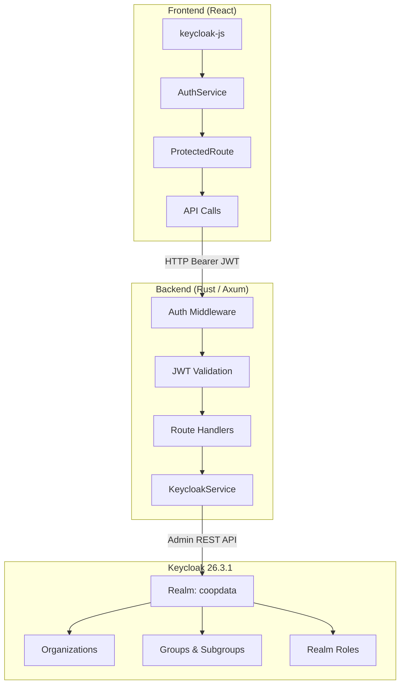
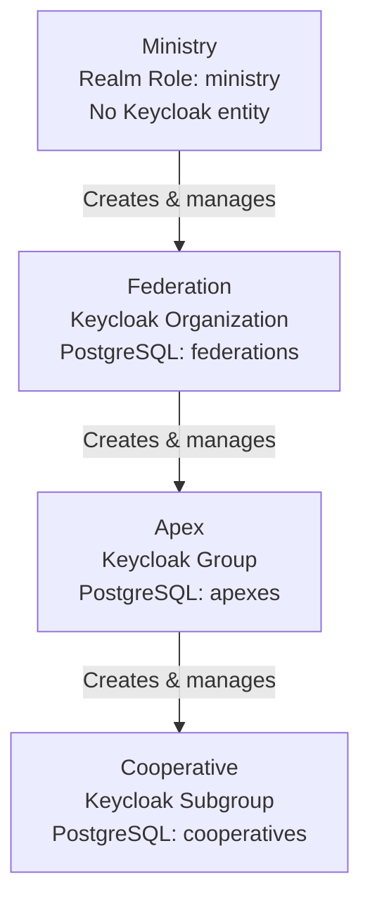
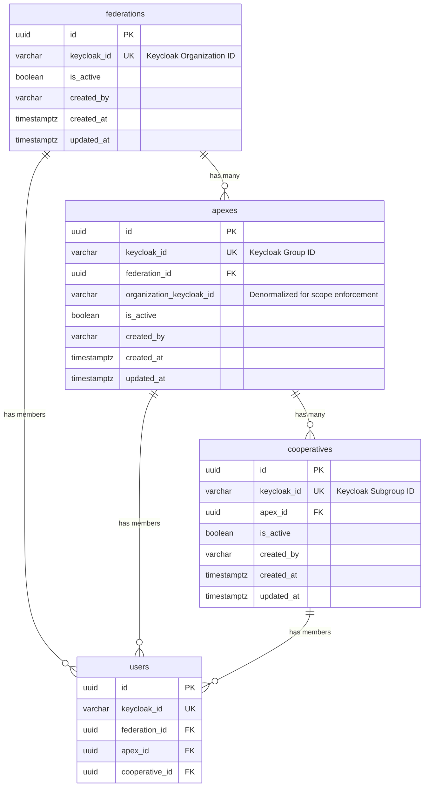
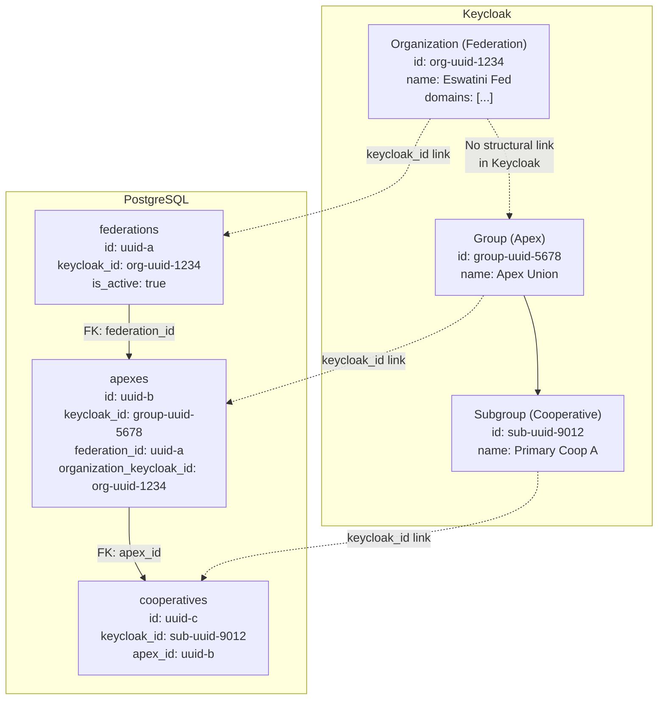
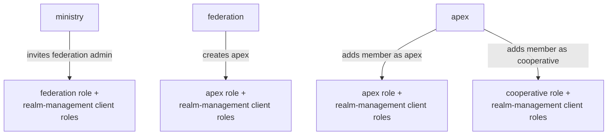
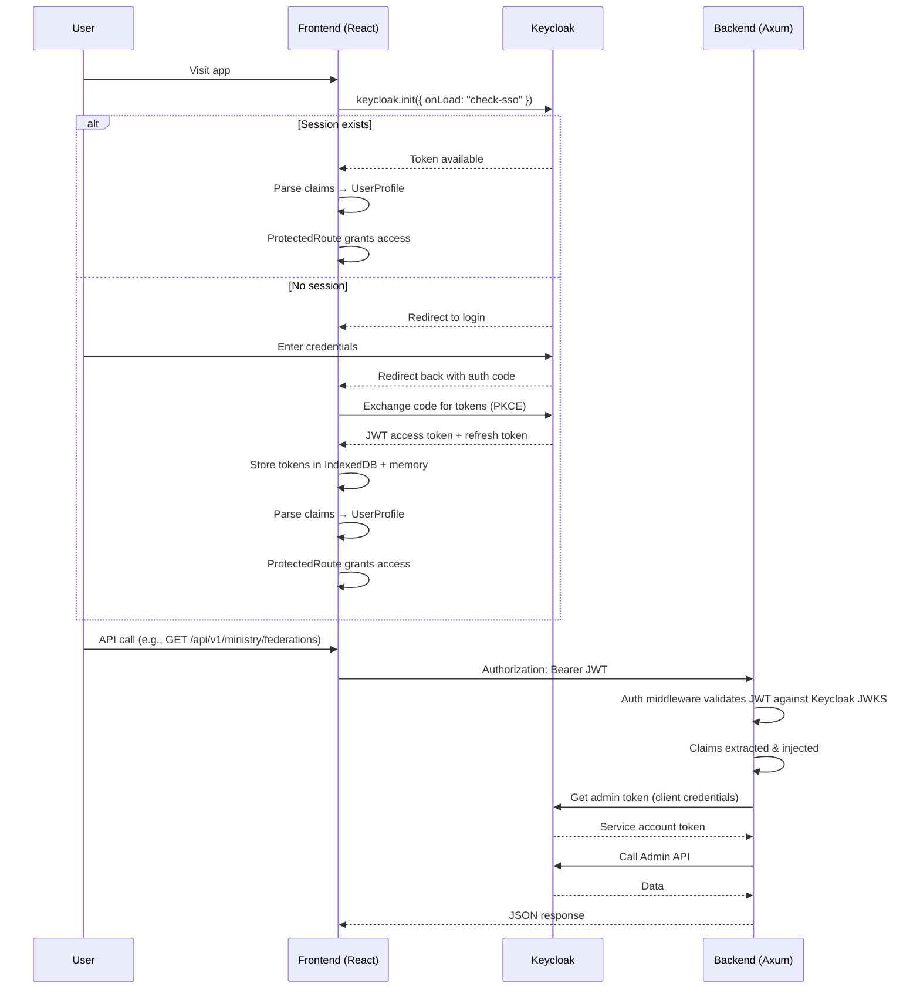
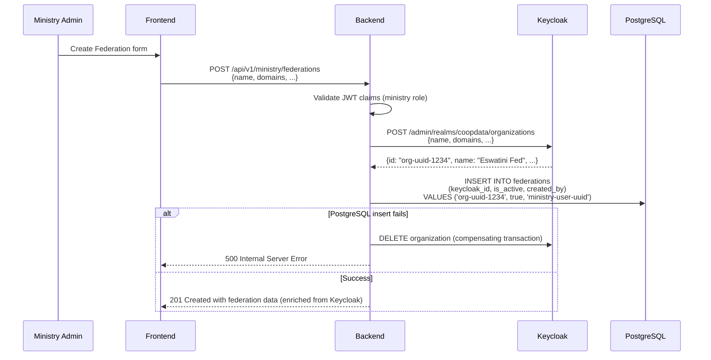
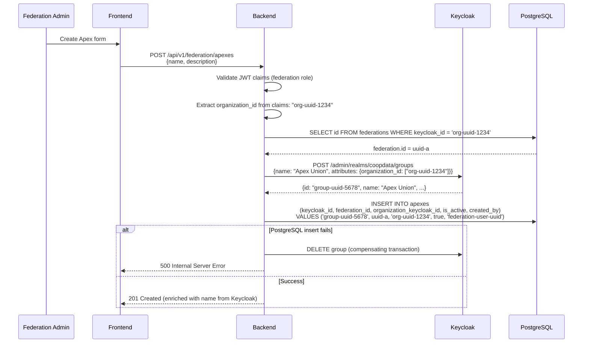
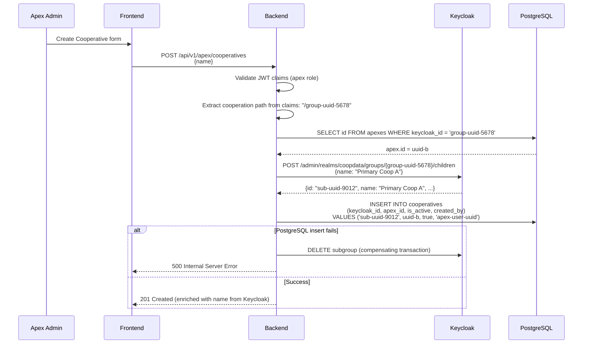
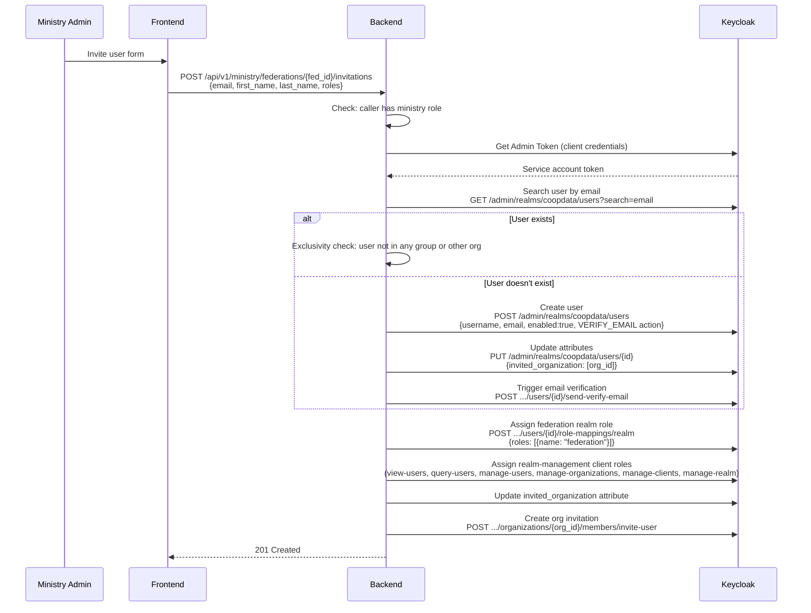

# CoopData IAM Architecture

> **Source of truth** for the CoopData identity, authentication, and authorization system.

## Table of Contents

1. [Architecture Overview](#1-architecture-overview)
2. [Entity Model](#2-entity-model)
3. [Data Model](#3-data-model)
4. [Entity Linking & Scope Enforcement](#4-entity-linking--scope-enforcement)
5. [Role System](#5-role-system)
6. [Keycloak Configuration](#6-keycloak-configuration)
7. [Authentication & Authorization](#7-authentication--authorization)
8. [Entity Lifecycle](#8-entity-lifecycle)
9. [User Management](#9-user-management)
10. [Data Responsibility Split](#10-data-responsibility-split)
11. [Backend Service Integration](#11-backend-service-integration)
12. [Frontend Integration](#12-frontend-integration)
13. [Bootstrap & Provisioning](#13-bootstrap--provisioning)
14. [Security Considerations](#14-security-considerations)

[Appendix A: API Routes](#appendix-a-api-routes) · [Appendix B: Frontend Routes](#appendix-b-frontend-routes)

---

## 1. Architecture Overview

CoopData uses **Keycloak 26.3.1** as its identity provider (IdP) and central authority for authentication and role management. The application architecture has three layers:



**Key principle:** Keycloak is the single source of truth for **authentication, user identity, and role assignments**. PostgreSQL is the source of truth for **application data and entity relationships**. The two systems are linked via `keycloak_id` foreign keys.

---

## 2. Entity Model

### 2.1 Four-Level Hierarchy

CoopData implements a four-level organizational hierarchy:



| Level | Domain Name | Keycloak Entity | PostgreSQL Table | Realm Role |
|-------|-------------|-----------------|-----------------|------------|
| 1 | Ministry | None (realm role only) | None | `ministry` |
| 2 | Federation | Organization | `federations` | `federation` |
| 3 | Apex | Group (top-level) | `apexes` | `apex` |
| 4 | Cooperative | Subgroup (nested under Apex Group) | `cooperatives` | `cooperative` |

### 2.2 Keycloak Entity Mapping

**Ministry** uses a realm role because Ministry users are platform-level administrators — they don't represent an organizational entity.

**Federation** maps to a Keycloak Organization because it semantically represents an organization with members, domains, and an admin. Keycloak's Organization feature provides built-in membership management, invitation flows, and domain verification.

**Apex** maps to a Keycloak Group (top-level) because it's a grouping of cooperatives under a federation. Keycloak Groups support nesting (subgroups), which maps to Apex → Cooperative.

**Cooperative** maps to a Keycloak Subgroup (nested under the Apex Group) because it's a child entity within an Apex. Users in a Cooperative subgroup are automatically members of the parent Apex group.

> **Important:** Keycloak Organizations and Groups are separate systems. A Keycloak Organization does not contain Groups. An Organization has Members (users), and Groups have Members (users), but Groups are not "inside" Organizations. The link between a Federation (Organization) and its Apexes (Groups) is maintained in PostgreSQL via the `federations.keycloak_id` and `apexes.organization_keycloak_id` columns.

### 2.3 Hybrid Architecture

Keycloak handles identity (users, roles, authentication, group membership). PostgreSQL handles application data (entity relationships, scope enforcement, audit trails, assessments). This hybrid approach provides:

- **Referential integrity** — PostgreSQL foreign keys enforce that an Apex belongs to a Federation, and a Cooperative belongs to an Apex. Keycloak groups have no such constraint.
- **Query performance** — Listing federations with their apexes and joining with assessment data is trivial in PostgreSQL. Doing the same through Keycloak's Admin API would require multiple API calls and client-side joins.
- **Audit trails** — Audit logs reference entities by ID. PostgreSQL provides proper relational queries for this.
- **Soft deletes** — Federations need `is_active` (Keycloak has no disabled state for organizations).
- **Scope enforcement** — The `organization_keycloak_id` column on `apexes` enables O(1) scope checks without joining to the federations table.

**Trade-off:** Two sources of truth (Keycloak for identity, PostgreSQL for application data). This is acceptable because all mutations go through the backend, which updates both systems. The `keycloak_id` column in each PostgreSQL table provides the link. If they get out of sync, the backend can reconcile by querying Keycloak and updating PostgreSQL.

---

## 3. Data Model

### 3.1 Table: `federations`

```sql
CREATE TABLE federations (
    id UUID PRIMARY KEY DEFAULT gen_random_uuid(),
    keycloak_id VARCHAR(255) UNIQUE NOT NULL,  -- Keycloak Organization ID
    is_active BOOLEAN NOT NULL DEFAULT TRUE,
    created_by VARCHAR(255),                  -- Keycloak user ID of the ministry admin
    created_at TIMESTAMPTZ NOT NULL DEFAULT NOW(),
    updated_at TIMESTAMPTZ NOT NULL DEFAULT NOW()
);

CREATE INDEX idx_federations_keycloak_id ON federations(keycloak_id);
CREATE INDEX idx_federations_active ON federations(is_active);
```

| Column | Purpose |
|--------|---------|
| `keycloak_id` | Links to the Keycloak Organization. UNIQUE constraint ensures one-to-one mapping. The Organization's name, description, and domains are stored in Keycloak — not duplicated here. |
| `is_active` | Soft delete flag. Keycloak doesn't have a "disabled" state for organizations. |
| `created_by` | Audit trail — which ministry admin created this federation. |

**Why no name, description, domains, sector, region, or contact info columns?**

Keycloak already stores name, description, and domains for Organizations. Duplicating that data in PostgreSQL would create a sync burden — every update would need to hit both systems. The backend reads metadata from Keycloak when needed (via admin API or JWT claims) and uses the PostgreSQL `keycloak_id` to join. Columns like `sector`, `region`, and contact info are not needed yet (YAGNI) and can be added via migration when the business need is clear.

### 3.2 Table: `apexes`

```sql
CREATE TABLE apexes (
    id UUID PRIMARY KEY DEFAULT gen_random_uuid(),
    keycloak_id VARCHAR(255) UNIQUE NOT NULL,         -- Keycloak Group ID
    federation_id UUID NOT NULL REFERENCES federations(id) ON DELETE CASCADE,
    organization_keycloak_id VARCHAR(255) NOT NULL,    -- Keycloak Organization ID (for scope enforcement)
    is_active BOOLEAN NOT NULL DEFAULT TRUE,
    created_by VARCHAR(255),                           -- Keycloak user ID of the federation admin
    created_at TIMESTAMPTZ NOT NULL DEFAULT NOW(),
    updated_at TIMESTAMPTZ NOT NULL DEFAULT NOW()
);

CREATE INDEX idx_apexes_keycloak_id ON apexes(keycloak_id);
CREATE INDEX idx_apexes_federation_id ON apexes(federation_id);
CREATE INDEX idx_apexes_active ON apexes(is_active);
```

| Column | Purpose |
|--------|---------|
| `keycloak_id` | Links to the Keycloak Group. UNIQUE constraint ensures one-to-one mapping. The Group's name and description are stored in Keycloak. |
| `federation_id` | PostgreSQL foreign key to the parent Federation — the structural link. |
| `organization_keycloak_id` | Denormalized Keycloak Organization ID for efficient scope enforcement. When a Federation admin makes a request, we can filter apexes by `organization_keycloak_id = claims.organization_id` without joining to the federations table. |
| `created_by` | Audit trail. |

**Why both `federation_id` and `organization_keycloak_id`?**

- `federation_id` is the **relational link** (PostgreSQL FK) — used for joins, cascading deletes, and data integrity.
- `organization_keycloak_id` is the **scope enforcement link** (denormalized) — used for fast JWT-claim-based filtering without joining to the federations table.

This denormalization is intentional: scope enforcement happens on every API request, and the join cost is unnecessary when we already have the organization ID in the JWT claims.

### 3.3 Table: `cooperatives`

```sql
CREATE TABLE cooperatives (
    id UUID PRIMARY KEY DEFAULT gen_random_uuid(),
    keycloak_id VARCHAR(255) UNIQUE NOT NULL,  -- Keycloak Subgroup ID
    apex_id UUID NOT NULL REFERENCES apexes(id) ON DELETE CASCADE,
    is_active BOOLEAN NOT NULL DEFAULT TRUE,
    created_by VARCHAR(255),                   -- Keycloak user ID of the apex admin
    created_at TIMESTAMPTZ NOT NULL DEFAULT NOW(),
    updated_at TIMESTAMPTZ NOT NULL DEFAULT NOW()
);

CREATE INDEX idx_cooperatives_keycloak_id ON cooperatives(keycloak_id);
CREATE INDEX idx_cooperatives_apex_id ON cooperatives(apex_id);
CREATE INDEX idx_cooperatives_active ON cooperatives(is_active);
```

| Column | Purpose |
|--------|---------|
| `keycloak_id` | Links to the Keycloak Subgroup. UNIQUE constraint ensures one-to-one mapping. The Subgroup's name is stored in Keycloak. |
| `apex_id` | PostgreSQL foreign key to the parent Apex — the structural link. |
| `created_by` | Audit trail. |

**Why no `organization_keycloak_id` on cooperatives?**

Scope enforcement for cooperatives goes through the Apex. When an Apex admin requests cooperatives, we filter by `apex_id` where the Apex's `keycloak_id` matches the `cooperation` claim in the JWT. The Apex already has `organization_keycloak_id`, and cooperative scope is enforced at the Apex level first. Adding it here would be redundant.

### 3.4 Updated `users` Table

```sql
ALTER TABLE users ADD COLUMN IF NOT EXISTS federation_id UUID REFERENCES federations(id) ON DELETE SET NULL;
ALTER TABLE users ADD COLUMN IF NOT EXISTS apex_id UUID REFERENCES apexes(id) ON DELETE SET NULL;
ALTER TABLE users ADD COLUMN IF NOT EXISTS cooperative_id UUID REFERENCES cooperatives(id) ON DELETE SET NULL;
```

These columns provide direct PostgreSQL links to the user's Federation, Apex, and Cooperative, supplementing the Keycloak group membership data. This enables:

- Fast scope enforcement queries without Keycloak API calls
- Relational integrity (a user can't be in an Apex that doesn't belong to their Federation)
- Audit trail queries (which users belong to which entities)

### 3.5 Entity-Relationship Diagram



---

## 4. Entity Linking & Scope Enforcement

### 4.1 Dual-Link Strategy

Entities are connected through two complementary mechanisms:

1. **PostgreSQL foreign keys** — structural relationships (`federation_id`, `apex_id`) for joins, cascading deletes, and data integrity.
2. **`keycloak_id` columns** — identity synchronization links for connecting PostgreSQL records to their Keycloak counterparts.



> **Note:** Keycloak Organizations and Groups are separate systems. The link between a Federation (Organization) and its Apexes (Groups) is maintained in PostgreSQL, not in Keycloak.

### 4.2 Scope Enforcement

Scope enforcement operates at two levels:

#### Level 1: Middleware — Role-Based Access Control

Route groups are protected by `require_role_layer()` middleware:

| Route Prefix | Required Role(s) | Middleware |
|-------------|-------------------|------------|
| `/api/v1/ministry/*` | `ministry` | `require_role_layer(["ministry"])` |
| `/api/v1/federation/*` | `federation` | `require_role_layer(["federation"])` |
| `/api/v1/apex/*` | `apex` | `require_role_layer(["apex"])` |
| `/api/v1/cooperative/*` | `cooperative`, `apex` | `require_role_layer(["cooperative", "apex"])` |

This ensures that only users with the correct role can reach the handler. A `cooperative` user calling a `ministry` endpoint gets a 403 before the handler executes.

#### Level 2: Handler — Data-Based Scope Enforcement

Even after passing the role check, a handler must verify that the user can only access data within their scope:

**Federation admin requests their Apexes:**
```
1. JWT claims contain: organization_id = "org-uuid-1234"
2. Backend query: SELECT * FROM apexes WHERE organization_keycloak_id = 'org-uuid-1234'
3. No Keycloak API call needed — PostgreSQL has all the data
```

**Apex admin requests their Cooperatives:**
```
1. JWT claims contain: cooperation = ["/group-uuid-5678"]
2. Backend extracts group_id from cooperation path
3. Backend query: SELECT * FROM cooperatives WHERE apex_id =
      (SELECT id FROM apexes WHERE keycloak_id = 'group-uuid-5678')
4. No Keycloak API call needed
```

**Ministry admin requests all Federations:**
```
1. JWT claims contain: realm_access.roles includes "ministry"
2. Backend query: SELECT * FROM federations (no scope filter — ministry sees all)
3. No Keycloak API call needed
```

**Cooperative user views their Cooperative:**
```
1. JWT claims contain: cooperation = ["/group-uuid-5678/sub-uuid-9012"]
2. Backend extracts the subgroup ID from the path
3. Backend query: SELECT * FROM cooperatives WHERE keycloak_id = 'sub-uuid-9012'
4. No Keycloak API call needed
```

**Why two levels?**

- Middleware provides fast, early rejection for wrong roles (no database query needed).
- Handler-level scope enforcement prevents data leakage within the correct role (a Federation admin can't see another Federation's Apexes).
- Defense in depth: if either level is bypassed, the other still protects the data.

### 4.3 Handler Scope Enforcement Examples

```rust
async fn list_apexes(
    claims: Extension<Arc<Claims>>,
    State(state): State<AppState>,
) -> AppResult<Json<Vec<ApexResponse>>> {
    // Role check already passed via middleware (federation role required)

    // Scope enforcement: only apexes within this federation
    let org_id = claims.get_organization_id()
        .ok_or(AppError::Forbidden("No organization associated"))?;

    let apexes = ApexRepository::find_by_federation_keycloak_id(
        &state.db, &org_id
    ).await?;

    Ok(Json(apexes.into_iter().map(ApexResponse::from).collect()))
}
```

```rust
async fn list_cooperatives(
    claims: Extension<Arc<Claims>>,
    State(state): State<AppState>,
) -> AppResult<Json<Vec<CooperativeResponse>>> {
    // Role check already passed via middleware (apex role required)

    // Scope enforcement: only cooperatives within this apex
    let group_id = claims.get_apex_group_id()
        .ok_or(AppError::Forbidden("No apex group associated"))?;

    let apex = ApexRepository::find_by_keycloak_id(&state.db, &group_id).await?;
    let cooperatives = CooperativeRepository::find_by_apex_id(
        &state.db, apex.id
    ).await?;

    Ok(Json(cooperatives.into_iter().map(CooperativeResponse::from).collect()))
}
```

---

## 5. Role System

### 5.1 Realm Roles

| Role | Description | Level |
|------|-------------|-------|
| `ministry` | Platform super-admin. Full control over all federations, apexes, cooperatives, users, and system settings. | 1 (Highest) |
| `application_admin` | Application-level admin. Assigned to the bootstrap user alongside `ministry`. | 1 |
| `federation` | Federation administrator. Can manage apexes within their federation, invite/manage federation members, create assessments. | 2 |
| `apex` | Apex administrator. Can manage cooperatives within their apex, add/remove members, create and manage assessments. | 3 |
| `cooperative` | Cooperative user. Can answer assessments and view submissions; may have `assigned_dimensions` restricting which dimensions they see. | 4 (Lowest) |
| `uma_authorization` | Standard Keycloak UMA role (auto-assigned). | — |
| `offline_access` | Standard Keycloak offline access role (auto-assigned). | — |

### 5.2 Client Roles (realm-management)

**For `federation` (organization invitation):**
- `view-users`, `query-users`, `manage-users`, `manage-organizations`, `manage-clients`, `manage-realm`
- Also assigned `federation` realm role

**For `apex` (cooperative member addition):**
- `manage-users`, `view-users`, `query-users`, `query-groups`, `view-realm`, `query-clients`, `view-clients`
- Also `view-groups` on `account` client
- Assigned `apex` realm role

**For `cooperative` (cooperative member addition):**
- `query-groups`, `view-users`
- Also `view-groups` on `account` client
- Assigned `cooperative` realm role

### 5.3 Role Assignment Mapping



### 5.4 Token Claims & Scope Extraction

The JWT token contains all the information needed for scope enforcement, without additional Keycloak API calls:

```json
{
  "realm_access": {
    "roles": ["federation"]
  },
  "organization": {
    "Eswatini Federation": {
      "id": "org-uuid-1234"
    }
  },
  "cooperation": ["/group-uuid-5678"],
  "assigned_dimensions": ["dim-uuid-1", "dim-uuid-2"],
  "is_member_of": true,
  "sub": "user-keycloak-uuid",
  "email": "admin@eswatini.coop"
}
```

| Level | Claim Used | Extraction Method | PostgreSQL Lookup |
|-------|-----------|-------------------|-------------------|
| Ministry | `realm_access.roles` contains `ministry` | `claims.is_ministry()` | None — sees all |
| Federation | `organization.id` | `claims.get_organization_id()` | `federations WHERE keycloak_id = ?` |
| Apex | `cooperation[0]` (group path) | `claims.get_apex_group_id()` | `apexes WHERE keycloak_id = ?` |
| Cooperative | `cooperation[0]` (full path with subgroup) | Parse subgroup ID from path | `cooperatives WHERE keycloak_id = ?` |

**Why no Keycloak API calls for scope enforcement?**

- JWT claims contain all the information needed (organization ID, group path).
- Keycloak Admin API calls are slow (network round-trip) and rate-limited.
- PostgreSQL lookups by `keycloak_id` are fast (indexed, single-row lookup).
- This design makes scope enforcement O(1) — one indexed query per request.

---

## 6. Keycloak Configuration

### 6.1 Realm Settings

- **Realm name:** `coopdata`
- **Features enabled:** `preview,organization` (enables Keycloak's Organization feature)
- **SMTP configured** for email verification and invitation emails

### 6.2 Clients

| Client | Type | Purpose | Auth Flow |
|--------|------|---------|-----------|
| `coopdata-frontend` | Public | Frontend SPA | Authorization Code + PKCE, `openid offline_access` scope |
| `coopdata-admin-client` | Confidential, service-account enabled | Backend service | Client Credentials Grant |
| `admin-portal` | Public | Admin self-service portal | Authorization Code |

### 6.3 Token Mappers

**`coopdata-frontend` token mappers:**

| Mapper Name | Type | Claim | Description |
|-------------|------|-------|-------------|
| `cooperation` | OIDC Group Membership Mapper | `cooperation` | Maps user's group memberships to `cooperation` claim with `full.path=true` |
| `organizations` | OIDC Organization Role Mapper | `organizations` | Maps organization memberships to `organizations` claim |

**`admin-portal` token mappers:**

| Mapper Name | Type | Claim | Description |
|-------------|------|-------|-------------|
| `organizations` | OIDC Organization Role Mapper | `organizations` | Maps org memberships |
| `org_id` | User Session Note Mapper | `org_id` | Adds organization ID from session notes to token |

### 6.4 Client Scopes

The `coopdata-frontend` has these default client scopes:
- `web-origins`, `acr`, `profile`, `roles`, `basic`, `email`, **`organization`**, **`user_attributes`**

The `organization` scope (added during provisioning) includes the organization membership mapper. The `user_attributes` scope maps custom attributes like `assigned_dimensions` and `invited_organization` into the token.

### 6.5 Service Account

`coopdata-admin-client` has a **service account** with `realm-admin` role from the `realm-management` client. The backend uses this service account to make Admin REST API calls to Keycloak.

---

## 7. Authentication & Authorization

### 7.1 Frontend Authentication Flow



### 7.2 AuthService

**File:** `frontend/src/services/shared/authService.ts`

| Method | Purpose |
|--------|---------|
| `login()` | Redirects to Keycloak login page |
| `logout()` | Clears stored tokens, redirects to Keycloak logout |
| `getAccessToken()` | Returns valid JWT; refreshes if expiring within 30s; falls back to cached token offline |
| `getUserProfile()` | Parses JWT claims into `UserProfile` with roles, org ID, org name, dimensions |
| `getOrganizationId()` | Extracts org ID from `organization` claim, falls back to parsing `cooperation` path |
| `hasRole(roles[])` | Checks if user has any of the specified realm roles |
| `getCooperationPath()` | Returns the first cooperation group path from the token |
| `fetchWithAuth(url, init)` | Makes authenticated HTTP requests with Bearer token |
| `storeTokens()` / `clearStoredTokens()` | Manages IndexedDB token persistence for offline support |

### 7.3 UserProfile Interface

```typescript
interface UserProfile {
  sub: string;                  // Keycloak user ID
  preferred_username?: string;
  name?: string;
  email?: string;
  roles?: string[];             // Combined realm + resource roles
  realm_access?: { roles: string[] };
  organization_name?: string;   // Name of the org from token
  organization?: string;        // Org ID from token
  cooperation?: string;         // Group path
  assigned_dimensions?: string[]; // Dimension IDs user can assess
  is_member_of?: boolean;       // Keycloak org membership flag
}
```

### 7.4 Backend Middleware & JWT Validation

**File:** `src/auth/middleware.rs`

The middleware is applied **globally** to all API routes in `create_app()`:

```rust
let api_router = routes::api::create_api_routes()
    .layer(axum::middleware::from_fn_with_state(
        state.clone(),
        crate::auth::middleware::auth_middleware,
    ));
```

The middleware:
1. Extracts the `Authorization: Bearer <token>` header
2. Validates the JWT signature against Keycloak's JWKS
3. Validates the issuer matches `{public_url}/realms/{realm}`
4. On success: inserts `Claims` struct and raw token string into request extensions
5. On failure: returns `401 UNAUTHORIZED`

### 7.5 Claims Extraction

**File:** `src/auth/claims.rs`

```rust
struct Claims {
    subject: String,                              // Keycloak user ID (sub claim)
    realm_access: Option<RealmAccess>,            // { roles: Vec<String> }
    resource_access: Option<HashMap<String, RealmAccess>>, // Client roles
    preferred_username: String,
    email: String,
    name: Option<String>,
    organization_id: Option<String>,               // From org_id mapper
}

impl Claims {
    fn is_ministry(&self) -> bool {
        self.has_realm_role("ministry")
    }

    fn is_federation(&self) -> bool {
        self.has_realm_role("federation")
    }

    fn is_apex(&self) -> bool {
        self.has_realm_role("apex")
    }

    fn is_cooperative(&self) -> bool {
        self.has_realm_role("cooperative")
    }

    fn has_realm_role(&self, role: &str) -> bool {
        // Checks if the given role exists in realm_access.roles
    }

    fn get_organization_id(&self) -> Option<String> {
        self.organization_id.clone()
    }
}
```

`Claims` implements `FromRequestParts`, so it can be injected directly into Axum handlers via `Extension(claims): Extension<Claims>`.

### 7.6 Frontend Route Protection

**File:** `frontend/src/router/routes.ts`

| Route | Allowed Roles | Layout |
|-------|---------------|--------|
| `/onboarding` | `ministry`, `federation`, `apex`, `cooperative` | — |
| `/ministry/*` | `ministry` | `MinistryLayout` |
| `/federation/*` | `federation` | `FederationLayout` |
| `/apex/*` | `apex` | `ApexLayout` |
| `/cooperative/*` | `cooperative`, `apex` | `CooperativeLayout` |

**ProtectedRoute Component** (`frontend/src/router/ProtectedRoute.tsx`):
1. Check if user is authenticated (via Keycloak + cached tokens)
2. Combine `user.roles` and `user.realm_access.roles` into role list
3. If user has `ministry` role and visits `/dashboard`, redirect to `/ministry/dashboard`
4. If `allowedRoles` is specified and user lacks the role, redirect to `/unauthorized`
5. If route requires `federation` role but user has no organization ID, show "Organization Required" message (offline users bypass this check)

**Navbar Redirection** (`frontend/src/components/shared/Navbar.tsx`):
- `ministry` → `/ministry/dashboard`
- `federation` → `/federation/dashboard`
- `apex` → `/apex/dashboard`
- `cooperative` → `/cooperative/dashboard`

### 7.7 Invitation Pending Detection

In `AuthContext.tsx`, if a user has the `federation` role but `is_member_of === false`, an `InvitationPendingDialog` is shown. This handles the case where a user has been assigned the `federation` role via invitation but hasn't yet accepted the Keycloak organization membership.

---

## 8. Entity Lifecycle

### 8.1 Creation Flows

All entity creation follows a **two-phase commit** pattern: create in Keycloak first, then create in PostgreSQL. If PostgreSQL creation fails, delete the Keycloak entity (compensating transaction).

**Why Keycloak first?**

- Keycloak is the authority for identity. If Keycloak creation fails, there's nothing to insert in PostgreSQL.
- If PostgreSQL fails after Keycloak succeeds, we can clean up Keycloak (compensating transaction).
- The reverse (PostgreSQL first, then Keycloak) would leave orphaned PostgreSQL records if Keycloak fails, which is harder to clean up.

#### Creating a Federation



#### Creating an Apex



#### Creating a Cooperative



### 8.2 Deletion Flows

Deletion cascades through both Keycloak and PostgreSQL. **Order matters:** delete children before parents, both in PostgreSQL (FK constraints enforce this) and Keycloak (subgroups before groups before organizations).

Keycloak does NOT cascade delete groups when deleting an organization (because Organizations and Groups are separate). All Keycloak groups/subgroups must be deleted explicitly before deleting the organization.

#### Deleting a Federation (Ministry action)

```
1. Validate JWT claims (ministry role)
2. Look up federation in PostgreSQL by keycloak_id
3. DELETE FROM cooperatives WHERE apex_id IN (SELECT id FROM apexes WHERE federation_id = ?)
   → Cascading delete of all cooperatives in PostgreSQL
4. DELETE FROM apexes WHERE federation_id = ?
   → Cascading delete of all apexes in PostgreSQL
5. DELETE FROM federations WHERE id = ?
   → Delete the federation in PostgreSQL
6. For each deleted cooperative: DELETE Keycloak subgroup
7. For each deleted apex: DELETE Keycloak group
8. DELETE Keycloak organization
9. Return 204 No Content
```

---

## 9. User Management

### 9.1 Invitation to Federation (by Ministry)

This is the most complex flow. Only `ministry` role can invite users to federations.



### 9.2 Invitation Handlers

**File:** `src/api/handlers/invitation.rs`

| Endpoint | Handler | Auth Check |
|----------|---------|------------|
| `POST /api/v1/ministry/federations/{fed_id}/invitations` | `invite_user_to_federation` | `ministry` required |
| `GET /api/v1/ministry/federations/{fed_id}/invitations` | `get_federation_invitations` | `ministry` required |
| `DELETE /api/v1/ministry/federations/{fed_id}/invitations/{id}` | `delete_federation_invitation` | `ministry` required |
| `POST /api/v1/ministry/federations/{fed_id}/invitations/{id}/resend` | `resend_federation_invitation` | `ministry` required |

### 9.3 Adding Members to Cooperatives

```
POST /api/v1/apex/cooperatives/{coop_id}/members
{email, first_name, last_name, roles: ["apex" | "cooperative"], dimension_ids}
```

**File:** `src/api/handlers/member.rs` → `add_member()`

Steps:
1. Get admin token from Keycloak
2. Search for existing user by email
3. **If user exists:**
   - Check user is not already in another group (exclusivity)
   - Check user is not already in a federation (exclusivity)
   - Check user doesn't have `invited_organization` attribute pointing to a different org
   - Update user attributes (e.g., `assigned_dimensions`) if provided
4. **If user doesn't exist:**
   - Create user with `email_verified: true`, `enabled: true`
   - Set `assigned_dimensions` attribute if provided
5. **Assign realm role** (`apex` or `cooperative`)
6. **Assign client roles** based on the realm role
7. **Add user to the Keycloak group** (cooperative subgroup)
8. Return 201

### 9.4 Dimension Assignment

Cooperative users can be restricted to specific assessment dimensions via the `assigned_dimensions` user attribute. This is stored in Keycloak as a custom attribute and propagated into the JWT token.

---

## 10. Data Responsibility Split

| Concern | Keycloak | PostgreSQL | Why |
|---------|----------|------------|-----|
| User identity (username, email, password) | ✅ | ❌ | Keycloak is the IdP — it owns user data |
| User roles (ministry, federation, apex, cooperative) | ✅ | ❌ | Roles are in JWT claims, managed by Keycloak |
| User membership in Organization/Group | ✅ | ❌ | Keycloak manages group/org membership |
| Authentication (login, tokens, sessions) | ✅ | ❌ | Keycloak is the auth server |
| Federation name, description, domains | ✅ | ❌ | Stored in Keycloak Organization entity — no duplication |
| Apex name | ✅ | ❌ | Stored in Keycloak Group entity — no duplication |
| Cooperative name | ✅ | ❌ | Stored in Keycloak Subgroup entity — no duplication |
| Entity relationships (FK: apex → federation) | ❌ | ✅ | PostgreSQL provides referential integrity |
| Entity active/inactive status | ❌ | ✅ | Keycloak has no "disabled" state for orgs/groups |
| Entity audit trail (created_by, timestamps) | ❌ | ✅ | Application-level auditing |
| Assessments, dimensions, gaps | ❌ | ✅ | Application data |
| Audit logs | ❌ | ✅ | Append-only, queryable, requires SQL |
| Scope enforcement queries | ❌ | ✅ | Fast, indexed, no Keycloak API calls needed |

---

## 11. Backend Service Integration

### 11.1 Service Account Authentication

The backend authenticates to Keycloak's Admin API using the **client credentials grant**:

```
POST {keycloak_url}/realms/{realm}/protocol/openid-connect/token
  grant_type=client_credentials
  client_id=coopdata-admin-client
  client_secret={COOPDATA_KEYCLOAK_CLIENT_SECRET}
```

This returns an access token with `realm-admin` privileges, which is then used for all Admin REST API calls.

**File:** `src/services/keycloak.rs` → `get_admin_token()`

The token is cached and reused until expiry.

### 11.2 KeycloakService Methods

**File:** `src/services/keycloak.rs`

| Method | Keycloak Admin API Endpoint | Purpose |
|--------|---------------------------|---------|
| `get_admin_token()` | `POST /realms/{realm}/protocol/openid-connect/token` | Obtain service account token |
| `create_organization()` | `POST /admin/realms/coopdata/organizations` | Create federation (Keycloak Org) |
| `get_organizations()` | `GET /admin/realms/coopdata/organizations` | List federations |
| `get_organization()` | `GET /admin/realms/coopdata/organizations/{id}` | Get federation |
| `update_organization()` | `PUT /admin/realms/coopdata/organizations/{id}` | Update federation |
| `delete_organization()` | `DELETE /admin/realms/coopdata/organizations/{id}` | Delete federation + cascade |
| `create_invitation()` | `POST /admin/realms/coopdata/organizations/{id}/members/invite-user` | Send federation invitation |
| `get_organization_invitations()` | `GET /admin/realms/coopdata/organizations/{id}/invitations` | List invitations |
| `delete_organization_invitation()` | `DELETE /admin/realms/coopdata/organizations/{id}/invitations/{iid}` | Cancel invitation |
| `resend_organization_invitation()` | `POST /admin/realms/coopdata/organizations/{id}/invitations/{iid}/resend` | Resend invitation |
| `create_user_with_email_verification()` | `POST /admin/realms/coopdata/users` | Create user |
| `update_user_attributes()` | `PUT /admin/realms/coopdata/users/{id}` | Update user attrs |
| `assign_realm_role_to_user()` | `POST /admin/realms/coopdata/users/{id}/role-mappings/realm` | Assign realm role |
| `assign_client_role_to_user()` | `POST /admin/realms/coopdata/users/{id}/role-mappings/clients/{cid}` | Assign client role |
| `add_user_to_organization()` | `POST /admin/realms/coopdata/organizations/{oid}/members` | Add user to federation |
| `add_user_to_group()` | `PUT /admin/realms/coopdata/users/{uid}/groups/{gid}` | Add user to apex/cooperative group |
| `create_group()` | `POST /admin/realms/coopdata/groups` | Create apex group |
| `get_groups()` | `GET /admin/realms/coopdata/groups?search=` | List groups |
| `delete_group()` | `DELETE /admin/realms/coopdata/groups/{id}` | Delete apex/cooperative group |
| `get_user_groups()` | `GET /admin/realms/coopdata/users/{id}/groups` | User's groups |
| `get_user_organizations()` | `GET /admin/realms/coopdata/users/{id}/organizations` | User's federations |
| `trigger_email_verification()` | `POST /admin/realms/coopdata/users/{id}/send-verify-email` | Verify email |
| `delete_user()` | `DELETE /admin/realms/coopdata/users/{id}` | Delete user |

### 11.3 Configuration

**File:** `src/config.rs`

```rust
struct KeycloakConfigs {
    url: String,           // Internal URL: http://keycloak:8080/keycloak
    public_url: String,    // Public URL: https://app.coopdata.org/keycloak
    realm: String,         // "coopdata"
    client_id: String,     // "coopdata-admin-client"
    client_secret: String, // From env: COOPDATA_KEYCLOAK_CLIENT_SECRET
}
```

The internal URL is used for backend-to-Keycloak communication within the Docker network. The public URL is used for JWKS validation (token issuer must match the public URL).

---

## 12. Frontend Integration

### 12.1 Keycloak Initialization

**File:** `frontend/src/services/shared/keycloakConfig.ts`

```typescript
export const keycloak = new Keycloak({
  url: VITE_KEYCLOAK_URL,      // e.g., https://app.coopdata.org/keycloak
  realm: "coopdata",
  clientId: "coopdata-frontend",
});

export const keycloakInitOptions = {
  onLoad: "check-sso",           // Check SSO silently on page load
  pkceMethod: "S256",            // PKCE for security
  checkLoginIframe: false,       // Disable iframe checks (CORS issues)
  scope: "openid offline_access", // Request offline access for refresh tokens
};
```

### 12.2 Token Persistence & Offline Support

The frontend stores tokens in IndexedDB via `idb-keyval`:

```typescript
const tokens = {
    accessToken: keycloak.token,
    refreshToken: keycloak.refreshToken,
    idToken: keycloak.idToken,
    expiresAt: keycloak.tokenParsed?.exp,
};
await set("auth_tokens", tokens);
await set("auth_profile", profile);
```

**Offline behavior:**
- `getAccessToken()` — If token is near expiry (>30s) and offline, uses cached token instead of refreshing
- `AuthProvider` — Re-hydrates from IndexedDB on page reload, manually restores `keycloak.token` and `keycloak.tokenParsed` when offline
- `federationRepository` — Falls back to IndexedDB when `navigator.onLine` is false
- `cooperativeRepository` — Caches fetched data in IndexedDB; queries local cache on error
- Inactivity timer (10 minutes) — Logs user out on inactivity; only active when authenticated and online

**Sync Queue Pattern:**
1. If online: call backend API, store response in IndexedDB
2. If offline: store locally with `syncStatus: "new"` or `"updated"`, add to sync queue
3. When back online: `syncService` processes queue and syncs changes to backend

---

## 13. Bootstrap & Provisioning

### 13.1 Keycloak Startup

**File:** `docker-compose.yml` + `keycloak-startup.sh` + `scripts/keycloak-provisioning.sh`

1. Keycloak container starts with `--import-realm` flag (imports `realm-export.json`)
2. `keycloak-startup.sh` starts Keycloak, waits for readiness, then runs `keycloak-provisioning.sh`
3. Provisioning script:
   - Logs in as admin on master realm (retries up to 120 times)
   - Creates user `360@dgrv.coop` with first name `fernando`, last name `espinosa`, temporary password
   - Assigns ALL `realm-management` client roles to this user
   - Assigns `realm-admin` role to `coopdata-admin-client` service account
   - Assigns `application_admin` and `ministry` realm roles to the user
   - Configures SMTP email settings
   - Sets realm `frontendUrl`
   - Resets `coopdata-admin-client` client secret
   - Adds `organization` and `user_attributes` scopes to `coopdata-frontend` default scopes

### 13.2 First Super-Admin

After provisioning, the first `ministry` user (`360@dgrv.coop`) can:
1. Log in at the platform
2. Access `/ministry/*` routes
3. Create federations
4. Invite federation admins to federations
5. Create apexes within federations

---

## 14. Security Considerations

### 14.1 Current Gaps

1. **Backend has no route-level authorization.** The auth middleware only validates that the JWT is properly signed and not expired. There is no middleware or guard that checks realm roles before allowing access to specific endpoints.

2. **Only 3 handlers check roles** — all in `invitation.rs`, and they only check for `ministry`:
   - `delete_federation_invitation`
   - `resend_federation_invitation`
   - `invite_user_to_federation`

3. **No federation-level or apex-level access control.** No handler verifies that a user belongs to a federation before allowing them to modify that federation's resources.

4. **No role hierarchy enforcement in the backend.** The role hierarchy (`ministry` > `federation` > `apex` > `cooperative`) is only enforced on the frontend via `ProtectedRoute`.

5. **`resource_access` (client roles) is extracted in JWT claims but never checked** by any backend handler.

6. **`organization_id` from JWT claims is available but never used for authorization** in any handler.

7. **`has_realm_role()` method exists but is only called by `is_ministry()`.** No other role checks exist in handlers.

8. **Destructive cascading deletes** — `delete_federation` deletes all Keycloak users belonging to the org before deleting the org itself, with no role check.

9. **Exclusivity checks** are present in `add_member` and `invite_user_to_federation` (preventing users from being in multiple orgs/groups) but are not enforced at the Keycloak level.

### 14.2 What Is Protected

- **Frontend routes:** All protected routes require authenticated JWT + correct role
- **API endpoints:** All API endpoints require a valid JWT (auth middleware)
- **Invitation endpoints:** Require `ministry` realm role
- **User self-service** (`GET/PATCH /api/v1/me`, `POST /api/v1/me/password`): Uses `Claims.subject` to identify the acting user

### 14.3 Recommendations

1. **Add backend role-checking middleware** that validates realm roles against required roles for each route group
2. **Add federation membership checks** — verify that the calling user belongs to the federation they're operating on
3. **Add cooperative access checks** — verify user membership before allowing cooperative modifications
4. **Implement resource-level authorization** — use the `organization_id` claim or query Keycloak for membership
5. **Add audit logging** for all administrative operations
6. **Consider using Keycloak Authorization Services** (resource-based permissions) for more granular control

---

## Appendix A: API Routes

### Federation Routes (`/api/v1/ministry/federations`)

| Method | Path | Handler | Auth |
|--------|------|---------|------|
| POST | `/api/v1/ministry/federations` | `create_federation` | `ministry` |
| GET | `/api/v1/ministry/federations` | `get_federations` | `ministry` |
| GET | `/api/v1/ministry/federations/:id` | `get_federation` | `ministry` |
| PATCH | `/api/v1/ministry/federations/:id` | `update_federation` | `ministry` |
| DELETE | `/api/v1/ministry/federations/:id` | `delete_federation` | `ministry` |
| POST | `/api/v1/ministry/federations/:id/invitations` | `invite_user_to_federation` | `ministry` |
| GET | `/api/v1/ministry/federations/:id/invitations` | `get_federation_invitations` | `ministry` |
| DELETE | `/api/v1/ministry/federations/:id/invitations/:inv_id` | `delete_federation_invitation` | `ministry` |
| POST | `/api/v1/ministry/federations/:id/invitations/:inv_id/resend` | `resend_federation_invitation` | `ministry` |
| GET | `/api/v1/ministry/federations/:id/members` | `get_federation_members` | `ministry` |

### Apex Routes (`/api/v1/federation/apexes`)

| Method | Path | Handler | Auth |
|--------|------|---------|------|
| POST | `/api/v1/federation/apexes` | `create_apex` | `federation` |
| GET | `/api/v1/federation/apexes` | `get_apexes` | `federation` |
| GET | `/api/v1/federation/apexes/:id` | `get_apex` | `federation` |
| PATCH | `/api/v1/federation/apexes/:id` | `update_apex` | `federation` |
| DELETE | `/api/v1/federation/apexes/:id` | `delete_apex` | `federation` |
| POST | `/api/v1/federation/apexes/:id/members` | `add_apex_member` | `federation` |
| GET | `/api/v1/federation/apexes/:id/members` | `get_apex_members` | `federation` |

### Cooperative Routes (`/api/v1/apex/cooperatives`)

| Method | Path | Handler | Auth |
|--------|------|---------|------|
| POST | `/api/v1/apex/cooperatives` | `create_cooperative` | `apex` |
| GET | `/api/v1/apex/cooperatives` | `get_cooperatives` | `apex` |
| GET | `/api/v1/apex/cooperatives/:id` | `get_cooperative` | `apex`, `cooperative` |
| PATCH | `/api/v1/apex/cooperatives/:id` | `update_cooperative` | `apex` |l
| DELETE | `/api/v1/apex/cooperatives/:id` | `delete_cooperative` | `apex` |
| POST | `/api/v1/apex/cooperatives/:id/members` | `add_cooperative_member` | `apex` |
| GET | `/api/v1/apex/cooperatives/:id/members` | `get_cooperative_members` | `apex`, `cooperative` |
| DELETE | `/api/v1/apex/cooperatives/:group_id/members/:user_id` | `remove_cooperative_member` | `apex` |

### Self-Service Routes

| Method | Path | Handler | Auth |
|--------|------|---------|------|
| GET | `/api/v1/me` | `get_me` | JWT (uses sub claim) |
| PATCH | `/api/v1/me` | `update_me` | JWT (uses sub claim) |
| POST | `/api/v1/me/password` | `change_password` | JWT (uses sub claim) |

---

## Appendix B: Frontend Routes

| Route Pattern | Required Roles | Layout |
|---------------|---------------|--------|
| `/ministry/*` | `ministry` | `MinistryLayout` (sidebar with Federations, Dimensions, Users, Reports) |
| `/federation/*` | `federation` | `FederationLayout` (sidebar with Apexes, Members, Assessments, Reports) |
| `/apex/*` | `apex` | `ApexLayout` (sidebar with Cooperatives, Members, Assessments) |
| `/cooperative/*` | `cooperative`, `apex` | `CooperativeLayout` (sidebar with Assessments, Submissions) |
| `/onboarding` | `ministry`, `federation`, `apex`, `cooperative` | — |