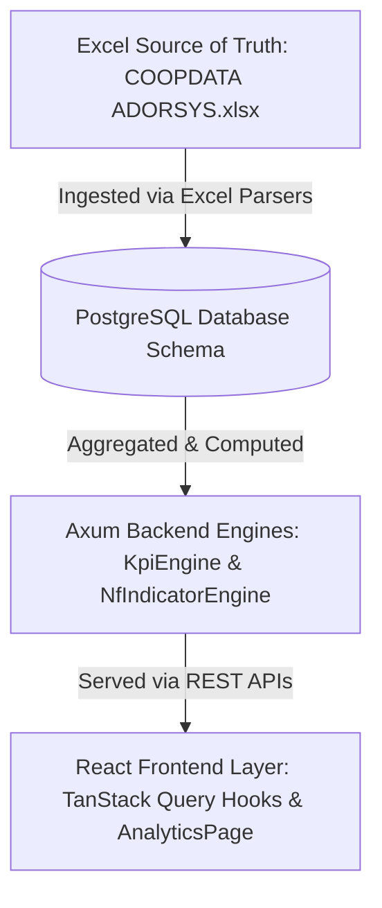

# Unified KPI & Indicator Mapping Report

This document maps all financial and non-financial Key Performance Indicators (KPIs) in the system, tracing them from their mathematical source of truth in the Excel workbook (`doc/COOPDATA ADORSYS.xlsx`) through the database schemas, the Axum backend engines, and the React frontend dashboard components.

---

## 1. Architecture Flow Summary

The analytical pipeline follows a strict bottom-up data aggregation model:

1. **Ingestion**: Raw sheets (`BALANCE SHEET` and non-financial databases `NF MSHIP`, `NF S`, `NF FS`, `NF LOANS`, `NF MP Fm COOP`) are parsed and loaded into PostgreSQL tables.
2. **Database Schema**: 
   - Financial statement line items are stored in `balance_sheet_line_items` by Chart of Accounts (COA) code.
   - Non-financial records are stored in structured ledger tables (`members`, `savings_accounts`, `fixed_deposits`, `loans`, `farm_coop`).
3. **Backend Service**:
   - `KpiEngine` handles pure memory-based math on financial line items (using COA codes).
   - `NfIndicatorEngine` queries and aggregates counts, averages, and percentages across non-financial database records.
4. **Frontend Integration**: Custom React hooks query backend API endpoints, supplying real-time metrics to `AnalyticsPage.tsx` and custom dashboard components.

---

## 2. Financial KPIs & Chart of Accounts Mapping

These indicators are defined in the **`INDICATORS`** sheet of the Excel workbook and computed in `backend/src/services/kpi_engine.rs` and `frontend/src/lib/kpi-calculations.ts`.

| KPI / Indicator Name | Excel Formula / Sheet Row | COA Account Codes | Backend Logic & Formula | Frontend KPI Name | Status Thresholds |
| :--- | :--- | :--- | :--- | :--- | :--- |
| **Total Assets** | Row 8: `=+'BALANCE SHEET'!C23` | `1999` | Value of Code `1999` | `totalAssets` | None (Currency) |
| **Gross Loan Portfolio** | Row 14: `Performing + All Arrears` | `1201 + 1202 + 1203 + 1204 + 1205` | Sum `1201..1205` | `grossLoanPortfolio` | None (Currency) |
| **Net Loan Portfolio** | Code `1200` - Provisions | `GLP - (1251 + 1252)` | `GLP - sum(1251..1252)` | `netLoanPortfolio` | None (Currency) |
| **Total Member Deposits** | Row 28: `Voluntary + Mandatory + Fixed` | `2101 + 2102 + 2103` | Sum `2101..2103` | `totalMemberDeposits` | None (Currency) |
| **Total Equity** | Code `3999` | `3999` | Value of Code `3999` | `totalEquity` | None (Currency) |
| **Net Surplus / (Deficit)** | Row 12: `Income - Expenses` | `6999` | Value of Code `6999` | `netSurplus` | None (Currency) |
| **PAR > 30 Days** | Row 15: `Arrears >30d / GLP` | `(1202+1203+1204+1205) / GLP` | `arrears_30_plus / GLP * 100` | `par30` | Lower is better: Green $\le$ 5%, Amber $\le$ 10%, Red > 10% |
| **PAR > 90 Days** | Row 16: `Arrears >90d / GLP` | `(1204+1205) / GLP` | `(1204+1205) / GLP * 100` | `par90` | Lower is better: Green $\le$ 2%, Amber $\le$ 5%, Red > 5% |
| **Non-Performing Loans** | Row 17: `NPL Ratio` | `1205 / GLP` | `1205 / GLP * 100` | `nplRatio` | Lower is better: Green $\le$ 2%, Amber $\le$ 5%, Red > 5% |
| **Loan Loss Coverage** | Row 18: `Provisions / Arrears >30d` | `(1251+1252) / Arrears_30_plus` | `sum(1251..1252) / arrears_30_plus * 100` | `loanLossCoverage` | Higher is better: Green $\ge$ 100%, Amber $\ge$ 80%, Red < 80% |
| **Return on Assets (ROA)** | Row 21: `Net Surplus / Total Assets` | `6999 / 1999` | `net_surplus / total_assets * 100` | `roa` | Higher is better: Green $\ge$ 3%, Amber $\ge$ 1%, Red < 1% |
| **Return on Equity (ROE)** | Row 22: `Net Surplus / Total Equity` | `6999 / 3999` | `net_surplus / total_equity * 100` | `roe` | Higher is better: Green $\ge$ 8%, Amber $\ge$ 4%, Red < 4% |
| **Operating Expense Ratio** | Row 23: `Opex / Total Assets` | `sum(5201..5204) / 1999` | `opex / total_assets * 100` | `operatingExpenseRatio` | Lower is better: Green $\le$ 5%, Amber $\le$ 8%, Red > 8% |
| **Capital Adequacy Ratio** | Row 34: `Total Equity / Total Assets` | `3999 / 1999` | `total_equity / total_assets * 100` | `capitalAdequacyRatio` | Higher is better: Green $\ge$ 10%, Amber $\ge$ 8%, Red < 8% |
| **Liquid Funds Ratio** | Row 39: `Liquid Assets / Total Assets` | `sum(1101..1104) / 1999` | `liquid_assets / total_assets * 100` | `liquidFundsRatio` | Higher is better: Green $\ge$ 15%, Amber $\ge$ 10%, Red < 10% |
| **Operational Self-Sufficiency** | Row 24: `Total Income / Total Expenses` | `sum(4101..4201) / sum(5101..5301)` | `total_income / total_expenses * 100` | `operationalSelfSufficiency` | Higher is better: Green $\ge$ 110%, Amber $\ge$ 100%, Red < 100% |
| **Net Interest Margin** | Derived financial spread metric | `(financial_income - financial_expense) / 1999` | `(sum(4101..4102) - sum(5101..5102)) / total_assets * 100` | `netInterestMargin` | None |
| **Deposits to Loans** | Loan portfolio funding ratio | `Total deposits / GLP` | `member_deposits / GLP * 100` | `depositsToLoans` | None |

---

## 3. Non-Financial (NF) Indicators & Entity Mapping

Non-financial indicators represent demographic, structural, operational, and behavioral details calculated from raw ledgers.

### 1. Membership (Sheet: `NF MSHIP` $\rightarrow$ DB Table: `members`)
*   **Purpose**: Tracks cooperative size, growth, gender diversity, age composition, regional penetration, and governance attendance.
*   **Database Entity**: `crate::entities::member`

| Excel Column Name | Database Column & Type | Enum Variants / Range | Backend Aggregation & Ratio Calculation | Frontend Display / Chart |
| :--- | :--- | :--- | :--- | :--- |
| **MemberID** | `member_id: String` | Raw alphanumeric string | Unique count gives total membership. | "Total Members" Card |
| **JoinDate** | `join_date: NaiveDate` | YYYY-MM-DD | Used for historical growth rate trend calculations. | Growth Trend Charts |
| **Status** | `status: MemberStatus` | `Active`, `Dormant`, `Exited` | Active/Dormant/Exit count divided by total membership. | "Dormancy Rate" & "Exit Rate" |
| **Exit Date** | `exit_date: Option<NaiveDate>` | YYYY-MM-DD | Tracks exact date of exit. | Exit analysis |
| **Gender** | `gender: Gender` | `Male`, `Female`, `Other` | Ratio calculated per variant against total members. | Gender Breakdown Pie Chart |
| **Age Group** | `age_group: AgeGroup` | `Under18`, `Between18And35`, `Between36And50`, `Over50` | `Youth` defined as `<18 + 18-35`. Ratios computed. | Age Demographics Bar Chart |
| **Region** | `region: EswatiniRegion` | `Hhohho`, `Lubombo`, `Manzini`, `Shiselweni` | Geospatial distributions across region boundaries. | Geographic Risk Map / Table |
| **Urban Rural** | `urban_rural: UrbanRural` | `Urban`, `Rural` | Ratio calculated per variant against total members. | Urban vs Rural Split Chart |
| **AGM Attendance** | `agm_attendance: bool` | `true`, `false` | Attendance count / total members * 100. | "AGM Participation Rate" |
| **Leadership Role** | `leadership_role: Option<String>`| Raw string, e.g., "Board Member" | Count of non-null fields tracks total governance pool. | Governance leadership stats |
| **Voting Exercised** | `voting_exercised: bool` | `true`, `false` | Voting count / total members * 100. | Governance activity index |

### 2. Savings (Sheet: `NF S` $\rightarrow$ DB Table: `savings_accounts`)
*   **Purpose**: Assesses member savings participation, account activity, withdrawal patterns, and deposit health.
*   **Database Entity**: `crate::entities::savings_account`

| Excel Column Name | Database Column & Type | Enum Variants / Range | Backend Aggregation & Ratio Calculation | Frontend Display / Chart |
| :--- | :--- | :--- | :--- | :--- |
| **Savings Account ID** | `savings_account_id: String`| Unique identifier | Unique count gives total savings accounts. | Savings accounts count |
| **Member ID** | `member_id: Uuid` | References `members.id` | Count of unique members with savings / total members. | "Savings Penetration" |
| **Account Type** | `account_type: AccountType` | `Voluntary`, `Mandatory`, `Fixed` | Categorizes the funding pool. | Savings breakdown chart |
| **Account Status** | `account_status: String` | `Active`, `Dormant` | Active savings accounts / total savings accounts. | "Active Savers Ratio" |
| **Contribution Frequency**| `contribution_frequency: String`| `Monthly`, `Quarterly`, etc. | Accounts with Monthly/Quarterly / total accounts. | "Regular Savers Ratio" |
| **Zero-Balance Flag** | `zero_balance_flag: bool` | `true`, `false` | Count of zero balance accounts / total accounts. | "Zero-Balance Accounts %" |
| **Balance Trend** | `balance_trend: String` | `Increasing`, `Stable`, `Declining` | Count of increasing balance / active savings accounts. | "Increasing Trend %" |
| **Withdrawal Category** | `withdrawal_frequency_category`| `High`, `Medium`, `Low` | Count of high withdrawals / active accounts. | High frequency analysis |
| **Emergency Withdrawals**| `emergency_withdrawals_flag` | `true`, `false` | Count of emergency flags / total active accounts. | Emergency incidence rate |
| **Interest Rate** | `interest_rate: Decimal` | Percentage rate | Weighted average interest rate. | Average interest rate card |
| **Balance** | `balance: Decimal` | Currency amount | Sum gives total balance; Avg balance = balance / count. | "Average Savings Balance" |

### 3. Fixed Deposits (Sheet: `NF FS` $\rightarrow$ DB Table: `fixed_deposits`)
*   **Purpose**: Analyzes term deposit commitment, rollover loyalty, and single-depositor liability risks.
*   **Database Entity**: `crate::entities::fixed_deposit`

| Excel Column Name | Database Column & Type | Enum Variants / Range | Backend Aggregation & Ratio Calculation | Frontend Display / Chart |
| :--- | :--- | :--- | :--- | :--- |
| **Fixed Deposit ID** | `fixed_deposit_id: String` | Unique identifier | Unique count gives total FD accounts. | Fixed deposits count |
| **Member ID** | `member_id: Uuid` | References `members.id` | Unique members with FDs / total members. | "FD Penetration" |
| **Deposit Type** | `deposit_type: String` | Standard, Special, etc. | Classification categorization. | FD types breakdown |
| **Status** | `status: FdStatus` | `Active`, `Matured`, `RolledOver`, `Withdrawn` | Active vs Matured vs Rolled over categorization. | FD status indicator |
| **Tenure Category** | `tenure_category: String` | `Long`, `Medium`, `Short` | Long-term FDs (>1 year) / total FDs. | "Long-Term FD Ratio" |
| **Early Withdrawal Flag**| `early_withdrawal_flag: bool`| `true`, `false` | Early withdrawal count / total FDs * 100. | "Early Withdrawal Rate" |
| **Rollover at Maturity** | `rollover_at_maturity_flag` | `true`, `false` | Rolled over count / (Matured + RolledOver) * 100. | "FD Rollover Rate" |
| **Single-Depositor Risk** | `single_depositor_dependency_flag`| `true`, `false` | Single depositor dependency count / total FDs. | "Concentration Risk" |
| **Interest Rate** | `interest_rate: Decimal` | Percentage rate | Average interest rate paid on term deposits. | Avg interest rate display |
| **Balance** | `balance: Decimal` | Currency amount | Sum gives total FD balance; Avg balance calculated. | "Average FD Balance" |

### 4. Loans (Sheet: `NF LOANS` $\rightarrow$ DB Table: `loans`)
*   **Purpose**: Measures credit outreach, repayments, delinquency metrics, and borrower demographics.
*   **Database Entity**: `crate::entities::loan`

| Excel Column Name | Database Column & Type | Enum Variants / Range | Backend Aggregation & Ratio Calculation | Frontend Display / Chart |
| :--- | :--- | :--- | :--- | :--- |
| **Loan ID** | `loan_id: String` | Unique identifier | Unique count of loan IDs. | Total loans count |
| **Member ID** | `member_id: Uuid` | References `members.id` | Unique members with active loans / total members. | "Credit Penetration" |
| **Loan Status** | `loan_status: LoanStatus` | `Performing`, `Arrears`, `Restructured`, `WrittenOff` | Active/arrears/written-off ratios computed. | Delinquency split charts |
| **Youth Borrower Flag** | `youth_borrower_flag: bool` | `true`, `false` | Youth borrowers / active loans * 100. | "Youth Borrowers Percent" |
| **Women Borrower Flag** | `women_borrower_flag: bool` | `true`, `false` | Women borrowers / active loans * 100. | "Women Borrowers Percent" |
| **Rural Borrower Flag** | `rural_borrower_flag: bool` | `true`, `false` | Rural borrowers / active loans * 100. | "Rural Borrowers Percent" |
| **Repayment Regularity** | `repayment_regularity: String` | `Regular`, `Irregular` | Regular repayment count / active loans * 100. | "On-Time Repayment Ratio" |
| **Restructured Loan Flag**| `restructured_loan_flag: bool`| `true`, `false` | Restructured loans count / total loans * 100. | "Restructured Loans Ratio" |
| **Balance** | `balance: Decimal` | Currency amount | Sum gives total balance; Avg balance calculated. | Average active loan balance |
| **Loan Amount** | `loan_amount: Decimal` | Currency amount | Sum gives total disbursed capital. | Average loan size card |

### 5. Multi-Purpose / Farm Cooperative (Sheet: `NF MP Fm COOP` $\rightarrow$ DB Table: `farm_coop`)
*   **Purpose**: Evaluates agricultural operational status, production systems, shared services, and climate risk resilience.
*   **Database Entity**: `crate::entities::farm_coop`

| Excel Column Name | Database Column & Type | Enum Variants / Range | Backend Aggregation & Ratio Calculation | Frontend Display / Chart |
| :--- | :--- | :--- | :--- | :--- |
| **Active Producer Flag** | `active_producer_flag: bool` | `true`, `false` | Active producers count / total coops * 100. | "Active Producer Ratio" |
| **Use of Prod. Planning** | `use_of_production_planning`| `true`, `false` | Planning adoption count / total coops * 100. | "Planning Adoption Ratio" |
| **Use of Shared Inputs** | `use_of_shared_inputs: bool` | `true`, `false` | Shared input count / total coops * 100. | "Shared Services Ratio" |
| **Formal Off-take** | `formal_offtake_agreement` | `true`, `false` | Off-take agreement count / total coops * 100. | "Formal Off-take Agreement %" |
| **Access to Storage** | `access_to_storage: bool` | `true`, `false` | Storage access count / total coops * 100. | "Storage Access Ratio" |
| **Access to Processing** | `access_to_processing_facilities`| `true`, `false` | Processing access count / total coops * 100. | "Processing Access Ratio" |
| **Irrigation Access** | `irrigation_access: bool` | `true`, `false` | Irrigation coverage count / total coops * 100. | "Irrigation Coverage %" |
| **Climate Mitigation** | `climate_mitigation_practices`| Raw text description | Mitigations count (non-empty) / total coops * 100. | "Climate Mitigation Ratio" |

---

## 4. Gap Analysis & Next Steps

1. **Incremental vs Full Snapshot Syncs**: The database structures support detailed transaction-level fields (e.g., `last_contribution_date` and `missed_installments_count`) which are parsed during file ingestion. In future phases, these will feed predictive risk models (Health Monitor / Abnormality Flag System).
2. **Benchmark Cache Strategy**: The `GET /api/v1/benchmarks` endpoint aggregates data dynamically across active submissions. Using the existing `CacheService` to cache these metrics under key patterns like `benchmark:{kpi_name}:{coop_type}:{year}` with a 1-hour TTL ensures high performance.
3. **Multi-tier Cascading Filtering**: Visualizations on the `AnalyticsPage` support filtering across regions and sectors server-side by propagating selected organizational IDs (`federation_id`, `apex_id`, `cooperative_id`) directly to the statistics retrieval endpoints.
