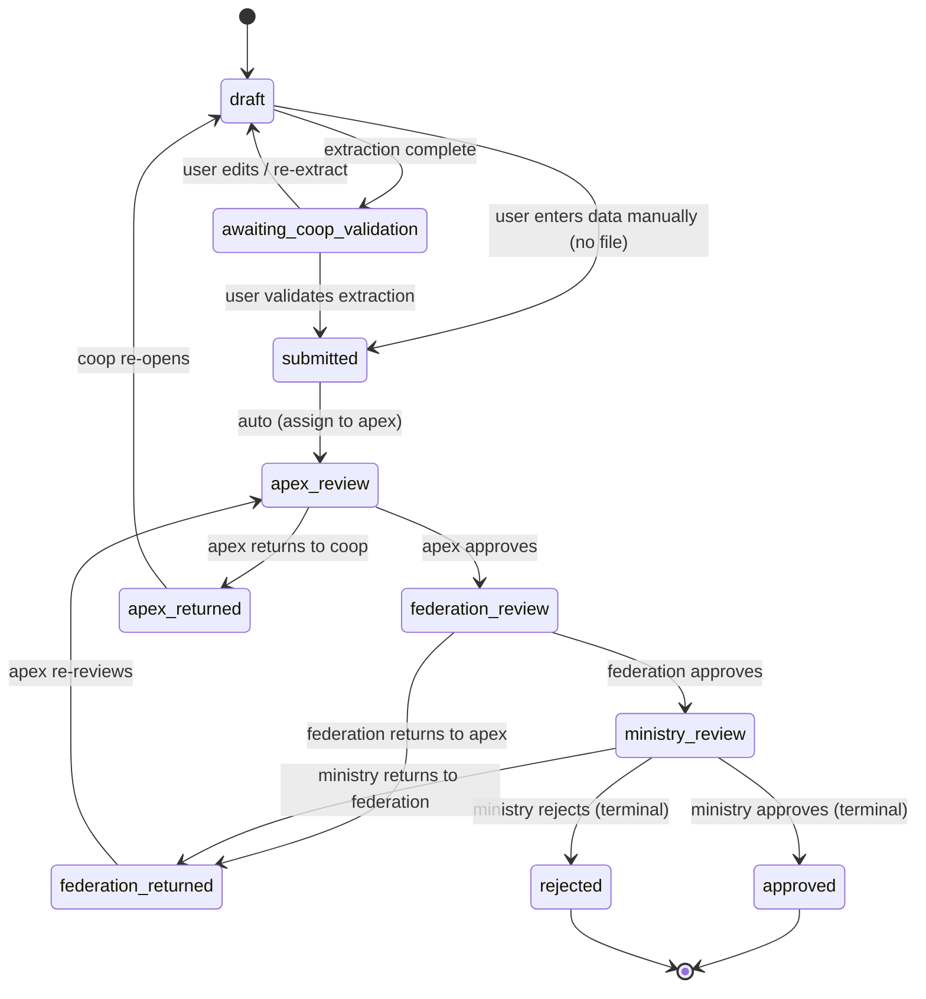

# CoopData — System Architecture, Database Schema & Data Flow

> **Document Version**: 1.0
> **Date**: 2026-07-03
> **Status**: Design — Source of Truth for Backend Data Layer
> **Scope**: End-to-end backend architecture, PostgreSQL schema, AI-extraction pipeline, 4-tier review workflow, KPI computation, abnormality flagging

> **CRITICAL**: This is the authoritative architecture for the data-collection & financial-statement subsystem.
> The earlier `docs/BACKEND_DESIGN.md` proposed a TanStack-Hono-Drizzle stack — that is **superseded** by the
> actual implemented stack (Rust / Axum / SeaORM / Keycloak) documented here. All code must follow this document.

---

## Table of Contents

1. [Context & Reconciliation](#1-context--reconciliation)
2. [System Overview](#2-system-overview)
3. [The 4-Tier Hierarchical Review Workflow](#3-the-4-tier-hierarchical-review-workflow)
4. [AI-Extraction Pipeline](#4-ai-extraction-pipeline)
5. [Backend Layer Architecture](#5-backend-layer-architecture)
6. [Database Schema (PostgreSQL / SeaORM)](#6-database-schema-postgresql--seaorm)
7. [Submission & Review State Machine](#7-submission--review-state-machine)
8. [KPI Computation & Materialization](#8-kpi-computation--materialization)
9. [Abnormality Flagging Rules](#9-abnormality-flagging-rules)
10. [API Surface (Contracts)](#10-api-surface-contracts)
11. [Multi-Tenancy & Scope Enforcement](#11-multi-tenancy--scope-enforcement)
12. [Offline-First Sync Contract](#12-offline-first-sync-contract)
13. [Migration & Seed Strategy](#13-migration--seed-strategy)
14. [Decision Log & Reasoning](#14-decision-log--reasoning)
15. [Implementation Roadmap (Phases)](#15-implementation-roadmap-phases)

---

## 1. Context & Reconciliation

### 1.1 What already exists

| Area | Implemented (real) | Note |
|---|---|---|
| Backend | Rust, Axum 0.8, SeaORM 1.1, PostgreSQL via `sqlx-postgres` | `backend/Cargo.toml` |
| Auth / IAM | Keycloak (OAuth2/OIDC), JWT validation, RBAC middleware | `src/auth/`, `src/services/keycloak.rs` |
| Hierarchy | Ministry → Federation → Apex → Cooperative, stored **entirely in Keycloak** (orgs/groups/subgroups) | `docs/apex-cooperative-architecture.md` |
| Entities so far | `organization`, `user`, `assessment` (SeaORM stubs) | `src/entities/` |
| Frontend | React + TanStack Router/Query, shadcn/ui, OpenAPI-fetch client | `frontend/src/` |
| Mock financial data | Full ADORSYS chart of accounts (1000–6999), KPI calc functions | `lib/financial-data.ts`, `lib/kpi-calculations.ts` |

### 1.2 What this document designs (the gap)

1. A **persistent PostgreSQL schema** for financial & non-financial cooperative data (replacing Keycloak-only storage and frontend mock data).
2. The **submission + 4-tier review workflow** (Cooperative → Apex → Federation → Ministry).
3. The **AI-extraction pipeline** (PDF/image/Excel → structured chart-of-accounts data → human validation).
4. **KPI materialization** and **abnormality flagging** as backend services.
5. **Data-flow** from upload through approval and analytics.

### 1.3 Key reconciliation decision: Keycloak vs PostgreSQL for identity

Identity (users, roles, federation/apex/cooperative groups) stays in **Keycloak** — it is the single source of truth for *who can do what*. The PostgreSQL database is the source of truth for *business data* (submissions, financial statements, members, loans, KPIs). The bridge is the **stable Keycloak group UUID** which is stored as a foreign key on the `cooperatives` table (see §6.3).

**Why split:** Keycloak owns authentication/authorization; Postgres owns transactional financial data. Mixing them would require duplicating group membership into the DB and keeping them in sync. Instead we store only the **cooperative ID** (Keycloak subgroup UUID) on every business row and rely on JWT-claim scope enforcement (already implemented in `ScopeEnforcement`).

---

## 2. System Overview

```
                         ┌──────────────────────────────────────────────┐
                         │                  Frontend (React)             │
                         │  TanStack Router · TanStack Query · shadcn    │
                         │  Offline: Dexie (IndexedDB) + sync queue      │
                         └───────────────────────┬──────────────────────┘
                                                 │ HTTPS / Bearer JWT
                                                 ▼
┌────────────────────────────────────────────────────────────────────────────┐
│                         Axum Backend (Rust)                                │
│  auth_layer (JWT) → role_guard_layer → Handler → Service/Repo → Postgres    │
│                                                                            │
│   ┌─────────────┐  ┌─────────────┐  ┌──────────────┐  ┌────────────────┐  │
│   │ Submission  │  │ Financial   │  │ AI Extraction│  │  KPI Engine    │  │
│   │ Workflow    │  │ Data Repo   │  │  Service     │  │  (Service)     │  │
│   └──────┬──────┘  └──────┬──────┘  └──────┬───────┘  └───────┬────────┘  │
│          └────────────────┴─────────────────┴──────────────────┘            │
│                              │                                             │
│              ┌───────────────┼────────────────┐                            │
│              ▼               ▼                ▼                            │
│        ┌──────────┐   ┌────────────┐   ┌──────────────┐                   │
│        │PostgreSQL│   │ Object Store│   │   Redis     │                   │
│        │(business)│   │ (MinIO/S3) │   │   (cache)   │                   │
│        └──────────┘   └────────────┘   └──────────────┘                   │
│              ▲                                                              │
│              └────────  Keycloak (IAM / RBAC / hierarchy)  ─────────────── │
└────────────────────────────────────────────────────────────────────────────┘
```

The backend keeps the **Arizona/Azimuth layer separation** mandated by `AGENTS.md`:
`Route → Handler → Service/Repository → Database`. Handlers are thin; repositories are thin; services orchestrate (Keycloak, AI, KPI, storage).

---

## 3. The 4-Tier Hierarchical Review Workflow

### 3.1 The flow you described, formalized

A cooperative submits a financial statement document. AI extracts values; the cooperative user validates; the submission then **escalates** up the hierarchy, where each tier either approves (forward) or returns (backward) for correction.

```
 ┌──────────────┐         ┌──────────┐         ┌────────────┐         ┌──────────┐
 │ COOPERATIVE  │ submit  │   APEX   │ review  │ FEDERATION │ review  │ MINISTRY │
 │ (data owner) ├────────►│ (tier 3) ├────────►│  (tier 2)  ├────────►│ (tier 1) │
 │              │         │          │         │            │         │          │
 │ validate AI  │◄────────┤  return  │◄────────┤   return   │◄────────┤  reject  │
 │  extraction  │ request │ for      │ request │  request    │ request │          │
 └──────────────┘         └──────────┘  changes└────────────┘  changes└──────────┘
        ▲                                                                        │
        └──────────────────── return to cooperative for changes ────────────────────┘
```

### 3.2 Submission lifecycle (status values)

A single `submission` moves through review tiers. The status reflects **both** phase and the tier currently holding it:

| Status | Who holds it | Meaning |
|---|---|---|
| `draft` | Cooperative | AI extraction in progress / user editing; not yet sent |
| `awaiting_coop_validation` | Cooperative | AI done; cooperative must validate data |
| `submitted` | Cooperative | Sent upward — now awaiting **Apex** review |
| `apex_review` | Apex | Apex is reviewing |
| `apex_approved` | — (transient) | Apex approved → auto-forwarded to Federation → becomes `federation_review` |
| `apex_returned` | Cooperative | Apex asked the cooperative to fix and resubmit |
| `federation_review` | Federation | Federation is reviewing |
| `federation_approved` | — (transient) | Federation approved → forwarded to Ministry → becomes `ministry_review` |
| `federation_returned` | Apex | Federation asked Apex to fix (returns one tier down, not all the way to cooperative) |
| `ministry_review` | Ministry | Ministry is reviewing |
| `approved` | Ministry | Final approval — submission is locked, KPIs finalized |
| `rejected` | — | Ministry rejected outright (terminal) |

> **Return granularity**: When Federation returns to Apex, the submission goes back to `apex_review` with a review comment; the Apex can then either fix forwarding metadata or return it further to the cooperative (`apex_returned`). This keeps each tier able to request changes from **its immediate subordinate** rather than forcing a straight-to-cooperative bounce.

### 3.3 Review record (audit trail at each tier)

Every review action (approve / return / reject / comment) appends a row to `submission_reviews` (see §6.7). This gives a full, immutable audit trail:

```
submission_reviews
  ├─ tier: cooperative | action: validated_extraction
  ├─ tier: apex        | action: approved  | comment: "values look consistent"
  ├─ tier: federation  | action: return    | comment: "PAR30 above threshold, verify 1202"
  ├─ tier: apex        | action: return    | comment: "re-checking with coop"
  └─ tier: federation  | action: approved
```

---

## 4. AI-Extraction Pipeline (format-agnostic, multi-modal)

### 4.1 Concept (verbatim from `doc/COOPDATA ADORSYS.xlsx` → "AI GENERATIVE" sheet)

The Excel defines the AI system precisely:

> **Objective**: a Generative AI–enabled system capable of **capturing** financial statements from images (photos, PDFs, scans) and **converting** them into structured, standardized financial data, enabling cross-sector comparability.
>
> **End-to-End Flow**:
> 1. **Capture** — user uploads a photo/PDF of a financial statement (Balance Sheet, Income Statement, Cash Flow).
> 2. **AI Extraction (CV + OCR + LLM)** — OCR extracts raw text; AI interprets structure (tables, categories, line items); LLM maps content into financial logic (assets, liabilities, revenue).
> 3. **Standardization Engine** — data is mapped into a **unified Chart of Accounts**, with adjustments for **different formats, naming inconsistencies, and local accounting practices**.
> 4. **Validation Layer** — AI checks balance-sheet consistency (Assets = Liabilities + Equity), missing/inconsistent values, and **flags anomalies for human review**.
> 5. **Storage & Structuring** — clean data stored centrally, tagged by **cooperative, sector, time period**.
> 6. **Benchmarking & Analytics** — financial ratios, peer comparisons, industry averages, dashboards.

**Key Features**: Image-to-Finance conversion; Standardized Reporting Framework; Cross-Cooperative Benchmarking; Automated Data Validation & Alerts; **Multi-country adaptability (critical for Africa context)**.

> Use case from the sheet: "A SACCO in a rural area takes a picture of its handwritten or Excel-based financial statement, uploads it via mobile, the system converts it into standardized format and instantly compares it with other SACCOs and sector benchmarks."

### 4.2 Why the format-agnostic design matters (the central challenge)

The uploaded documents will **never** follow the same format (explicitly stated in row 39–42: *"Adjustments for different formats, naming inconsistencies, local accounting practices"*). Real inputs are wildly heterogeneous:

| Input reality | Why naive parsing fails | How the pipeline handles it |
|---|---|---|
| Handwritten SACCO ledger photographed on a phone | No table grid; skewed; smudges | OCR + deskew/preprocess → LLM interprets free text |
| Exported Excel with custom column headers ("Caja", "Efectivo", "Préstamos") | Names ≠ ADORSYS CoA names | LLM fuzzy-maps localized names → canonical CoA codes |
| Scanned PDF balance sheet with merged cells / 2-column layout | Position-based extraction breaks | Layout-agnostic: LLM reconstructs semantic structure, not cell geometry |
| Only **some** account codes present (cooperatives report subsets) | Missing rows ≠ zero | Distinguish *absent* (null) vs *zero* (0.00); flag missing required codes |
| Photo of an Excel on a monitor | Moiré, glare, partial rows | OCR with confidence + LLM cross-checks totals |
| Wrong currency / period inferred | Ambiguity | User confirms reporting year + currency in upload metadata; AI does not guess |

The system **must not** assume any column order, header naming, or row layout. The LLM is the structure interpreter; the CoA is the fixed target schema.

### 4.3 Pipeline stages

```
 [1. Upload]      [2. Preprocess]      [3. Extract & Map]              [4. Validate]            [5. Human review]
 ─────────        ──────────────       ──────────────────────          ─────────────             ────────────────
 coop uploads     - mime sniff         - Excel → calamine cells        - balance check:          - draft written
 multipart        - image: deskew,    - image/PDF → OCR → raw text     Assets = Liab+Equity      to balance_sheet_
 file + reporting - denoise, OCR-pg   - LLM maps ALL of the above      - child≠parent totals     line_items (per
 year + currency  - PDF: page raster   → canonical CoA codes            - missing required codes   account/month)
 via POST         - store blob (S3)    & monthly values                 - funds constitution      - per-line confidence
                  - enqueue job        - appends chart-of-accounts     - flag anomalies          & flags surfaced
                                      formula reconciliation          - compute confidence      to coop for editing
```

The output at stage 3 is a **structured JSON** of `{ account_code, month, value, confidence, source_span }` that the LLM emits, constrained to the seeded `chart_of_accounts` codes for the cooperative's type. Stage 4 computes derived checks (totals reconciliation, % of portfolio) and writes `abnormality_flags`. Stage 5 hands the cooperative a draft to accept/edit.

### 4.4 LLM-driven mapping (standardization engine)

The LLM call is schema-constrained to the ADORSYS Chart of Accounts. The prompt provides:

1. **The target CoA** — the full seeded `chart_of_accounts` (codes 1000–6999, names, categories, applicable cooperative types) as the permitted enum.
2. **Account-code alias dictionary** — seed `account_aliases` (Swazi/English/French/Spanish synonyms like "Caja"→1101, "Efectivo"→1101, "Préstamos"→1200) so the LLM maps localized labels. Editable reference table (not code).
3. **The raw extracted content** — OCR text blocks or Excel cells as an unstructured blob.
4. **Output contract** — strictly: `{ line_items: [{ account_code, month, value, confidence, raw_label }] }`, plus a `totals_reconciliation` block the LLM fills so the backend can verify Assets = Liab + Equity.

Unknown labels the LLM cannot map emit `account_code: null` and are stored as `unmapped` rows for human disposition. This is the key resilience mechanism for "formats we've never seen" (row 40: *"different formats"*).

### 4.5 Validation layer (row 44–49: "AI checks + flags anomalies")

After mapping, before persisting, the backend runs deterministic checks (independent of the LLM — don't trust the model for arithmetic):

- **Balance identity**: `1999 (Total Assets) == 2999 (Total Liabilities) + 3999 (Total Equity)`.
- **Roll-up reconciliation** for every parent code using the `chart_of_accounts.formula` (e.g. `1100 == 1101+1102+1103+1104`; `1999 == 1100+1200+1250+1300`). Mismatches flag `TOTAL_MISMATCH`.
- **Missing required codes** for the cooperative's type (per `chart_of_accounts.is_required` / cooperative-type applicability) → `MISSING_ACCOUNT`.
- **Portfolio composition sanity** (the FINAN SHEET UPLOAD logic): each loan-portfolio code as % of total Loans (1200), Total Arrears = (1202+1203+1204+1205) as % of 1200 — flag implausible compositions.
- **Cross-months** (TENDENCE logic): structure % per account/category and trend ($ and % delta month-over-month) computed by the backend; flagged only if sign flips or magnitude impossible. These derived % are **computed, never stored as inputs** (STARTING POINT row 3: *"the system calculates all the rest"*).

Failures land in `abnormality_flags` (structured) and `financial_statements.validation_errors` (JSONB). The submission cannot leave `awaiting_coop_validation` until error-severity flags are resolved.

### 4.6 Extraction job model

`extraction_jobs` (one row per extraction attempt):

| Field | Purpose |
|---|---|
| `id` | UUID |
| `submission_id` | FK → submissions |
| `source_file_id` | FK → uploaded_files |
| `status` | `queued` / `preprocessing` / `extracting` / `mapping` / `succeeded` / `failed` / `partial` |
| `engine` | `ocr` / `xlsx-parse` / `llm-map` (plus raw `vision-ocr` for images) |
| `raw_text` | OCR / cell dump (debuggable & re-runnable) |
| `extracted_json` | candidate line-items + totals_reconciliation before validation |
| `confidence` | overall confidence 0.0–1.0 (min of per-line confidences weighted) |
| `page_or_sheet` | which PDF page / Excel sheet the data came from |
| `error_message` | on failure |
| `started_at` / `completed_at` | timing |

### 4.7 Extraction service (`src/services/ai_extraction.rs`)

A trait + impls, injected via `AppState` (swappable per Twelve-Factor Factor IV):

```rust
#[async_trait]
pub trait FinancialStatementExtractor: Send + Sync {
    /// preprocess + OCR/parse → raw text/cells
    async fn capture(&self, file: &UploadedFile) -> Result<CaptureOutput>;
    /// LLM maps raw content → canonical CoA line items (per month, per code)
    async fn map_to_coa(&self, capture: CaptureOutput, coa: &[ChartAccount]) -> Result<MappedStatement>;
}
```

- **`OpenAiExtractor`** — real provider (vision + text), endpoint/key from env `AI_PROVIDER_URL`/`AI_API_KEY`. Never hardcode.
- **`MockExtractor`** — deterministic from known fixtures, used in tests/offline.
- **`CalamineExcelExtractor`** — native Rust parsing of `.xlsx/.xls/.ods` (no LLM needed when a real upload sheet structure is parseable); still routes ambiguous cells through mapping.

`extracted_json` is retained for re-run and forensic audit (re-running a job overwrites the draft `balance_sheet_line_items` for that submission only while status == `draft`).

> **Design note**: extraction runs **off-request** (async). The upload endpoint returns `202 Accepted` immediately; the frontend polls `GET /extraction-jobs/{id}` or reads `submission.extraction_status`. Low-bandwidth mobile clients never hold a connection during AI processing.

---

## 5. Backend Layer Architecture

### 5.1 Module layout (additions to existing `backend/src/`)

```
backend/src/
├── api/
│   ├── handlers/
│   │   ├── submission.rs        ← NEW: create/submit/validate/review handlers
│   │   ├── financial_statement.rs ← NEW: CRUD for balance sheets & line items
│   │   ├── members.rs           ← NEW
│   │   ├── savings.rs           ← NEW
│   │   ├── loans.rs             ← NEW
│   │   ├── fixed_deposits.rs    ← NEW
│   │   ├── kpi.rs               ← NEW: read computed KPIs + recompute
│   │   ├── upload.rs            ← NEW: multipart file upload
│   │   └── extraction.rs        ← NEW: extraction job status/poll
│   ├── dto/
│   │   ├── submission.rs        ← NEW
│   │   ├── financial.rs         ← NEW: line items, chart of accounts
│   │   ├── non_financial.rs     ← NEW: members/savings/loans/fd
│   │   └── kpi.rs               ← NEW
│   └── routes/
│       ├── cooperative.rs       ← EXTEND: cooperative data endpoints
│       ├── apex.rs              ← EXTEND: review endpoints
│       ├── federation.rs        ← EXTEND: review endpoints
│       └── ministry.rs          ← EXTEND: review endpoints
├── entities/
│   ├── submission.rs            ← NEW (replaces the old assessment stub)
│   ├── financial_statement.rs  ← NEW
│   ├── balance_sheet_line_item.rs ← NEW
│   ├── chart_of_accounts.rs     ← NEW (reference seed)
│   ├── member.rs, savings.rs, loan.rs, fixed_deposit.rs ← NEW
│   ├── kpi.rs, compliance_score.rs, benchmark.rs ← NEW
│   ├── uploaded_file.rs, extraction_job.rs, submission_review.rs ← NEW
│   └── cooperative.rs           ← NEW (links to Keycloak group id)
├── repositories/
│   ├── submission.rs, financial_statement.rs, ... (mirror entities)
├── services/
│   ├── ai_extraction.rs         ← NEW: extraction orchestration
│   ├── kpi_engine.rs           ← NEW: KPI computation
│   ├── abnormality_detector.rs  ← NEW: flagging rules
│   ├── object_storage.rs       ← NEW: S3/MinIO abstraction
│   └── keycloak.rs, cache.rs    ← existing
└── migration/
    └── src/ m20260703_*.rs     ← SeaORM-migration files (NEW dir)
```

### 5.2 `AppState` evolution

```rust
#[derive(Clone)]
pub struct AppState {
    pub db: Database,                 // SeaORM DatabaseConnection
    pub config: AppConfig,
    pub cache: CacheService,          // existing Redis
    pub keycloak: KeycloakService,    // existing
    pub jwt_validator: Arc<JwtValidator>,
    // NEW:
    pub storage: ObjectStorageService,       // S3/MinIO
    pub extractor: Arc<dyn FinancialStatementExtractor>, // AI
}
```

All backing services injected via `AppState` — swappable by config (Twelve-Factor Factor IV). No global singletons.

---

## 6. Database Schema (PostgreSQL / SeaORM)

> All monetary values use `Decimal` (PostgreSQL `numeric(15,2)`). All PKs are UUID v7 (time-ordered). All tables carry `created_at`/`updated_at`. Soft deletes are used only where historical retention matters (members).

### 6.1 Entity-Relationship Overview

```
              chart_of_accounts (seed, reference)
                        │ validates account_code
                        ▼
cooperatives ──◄── submissions ──► uploaded_files ──► extraction_jobs
 (kc group id)        │
                     ├─► financial_statements ──► balance_sheet_line_items
                     │
                     ├─► submission_reviews (audit per tier)
                     │
                     ├─► members ──► savings_accounts
                     │           ──► loans
                     │           ──► fixed_deposits
                     │
                     ├─► computed_kpis
                     ├─► compliance_scores
                     └─► abnormality_flags

cooperatives ──► benchmark_data (regional/sector/national)
            ──► audit_logs
```

### 6.2 Enums (Postgres enum types)

```sql
submission_status: draft, awaiting_coop_validation, submitted, apex_review,
                   apex_approved, apex_returned, federation_review,
                   federation_approved, federation_returned, ministry_review,
                   approved, rejected

review_tier:       cooperative, apex, federation, ministry
review_action:     validated_extraction, submitted, approved, returned, rejected, commented

account_category:  assets, liabilities, equity, income, expenses, surplus

currency:          SZL, USD

accounting_year:   calendar, fiscal      -- calendar = Jan→Dec; fiscal = Jun→Jul (per STARTING POINT rows 12-15)

cooperative_type:  sacco, multipurpose, farm, housing, transport, finance, other
                    -- "Depending on the kind of Coop" (STARTING POINT row I); drives applicable CoA subset

member_status:     Active, Dormant, Exited
gender:            Male, Female, Other
age_group:         '<18', '18-35', '36-50', '50+'
urban_rural:       Urban, Rural
account_type:      Voluntary, Mandatory, Fixed
loan_status:       Performing, Arrears, Restructured, WrittenOff
dpd_category:      0, '1-30', '31-60', '61-90', '91+'
fd_status:         Active, Matured, Withdrawn, RolledOver
coop_status:       Active, Inactive, Suspended
compliance_status: green, amber, red
```

### 6.3 cooperatives (bridge + identity, per `DATA` sheet)

```sql
CREATE TABLE cooperatives (
  id              UUID PRIMARY KEY DEFAULT gen_random_uuid(),
  keycloak_group_id  UUID NOT NULL UNIQUE,  -- KC subgroup id (single identity↔data link)
  apex_group_id      UUID NOT NULL,         -- parent apex (KC group)
  federation_org_id  UUID NOT NULL,         -- parent federation (KC org)
  -- identity fields from DATA sheet
  name               VARCHAR(255) NOT NULL,
  institution_type   cooperative_type NOT NULL,  -- "Institution Type"
  reg_no             VARCHAR(30)  NOT NULL UNIQUE,  -- "Registration Number" (e.g. COP-2018-04921)
  tin                VARCHAR(20),                 -- "TIN" tax identification number
  address            VARCHAR(255),                -- "Address" (free text)
  georeference       VARCHAR(100),                -- "Georeference" (lat,long for geo map dashboard)
  region             VARCHAR(50)  NOT NULL,        -- "Region"
  geographic_classif urban_rural NOT NULL,        -- "Geographic classification: urban / rural"
  phone              VARCHAR(30),                 -- "Phone number"
  sector             VARCHAR(50)  NOT NULL,       -- cached from apex/federation for fast filtering
  -- responsibility split (DATA sheet rows 12-14)
  responsibe_financial       UUID,   -- keycloak user id responsible for financial info
  responsible_non_financial  UUID,   -- keycloak user id responsible for non-financial info
  status             coop_status NOT NULL DEFAULT 'Active',
  registered_on      DATE NOT NULL,
  accounting_year    accounting_year NOT NULL DEFAULT 'calendar', -- coop's reporting basis
  created_at         TIMESTAMPTZ NOT NULL DEFAULT now(),
  updated_at         TIMESTAMPTZ NOT NULL DEFAULT now()
);
```

**Reason**: Mirrors the `DATA` sheet cooperative identity block literally. `institution_type` is critical — it determines **which subset of the chart of accounts applies** (STARTING POINT row I: *"Depending on the kind of Coop"*). `georeference` powers the DASHBOARD sheet "Geographic Risk Map". `accounting_year` (calendar Jan-Dec vs fiscal Jun-Jul, per STARTING POINT rows 12-15) drives which 12 months a yearly financial_statement spans. We still do **not** duplicate the Keycloak group *tree* — only the coop leaf registry row + cached apex/federation ids for fast scoped queries.

### 6.4 submissions (the workflow core)

```sql
CREATE TABLE submissions (
  id              UUID PRIMARY KEY DEFAULT gen_random_uuid(),
  reference       VARCHAR(20)  NOT NULL UNIQUE,    -- SUB-2026-00001
  cooperative_id  UUID         NOT NULL REFERENCES cooperatives(id),
  type            VARCHAR(50)  NOT NULL,           -- 'financial', 'membership', 'savings', 'loans', 'fixed_deposits'
  reporting_year  INTEGER      NOT NULL,            -- e.g. 2025 (the fiscal/calendar year covered by the ADORSYS 12-month grid)
  status          submission_status NOT NULL DEFAULT 'draft',
  current_tier    review_tier  NOT NULL DEFAULT 'cooperative',
  submitted_by    UUID         NOT NULL,           -- Keycloak user id
  submitted_at    TIMESTAMPTZ,
  -- review tracking
  last_reviewed_by UUID,
  last_reviewed_at TIMESTAMPTZ,
  rejection_reason TEXT,
  priority        VARCHAR(20)  NOT NULL DEFAULT 'Routine',
  metadata        JSONB        NOT NULL DEFAULT '{}',
  created_at      TIMESTAMPTZ  NOT NULL DEFAULT now(),
  updated_at      TIMESTAMPTZ  NOT NULL DEFAULT now(),
  UNIQUE (cooperative_id, type, reporting_year)
);
```

**Reason**: Per the ADORSYS Excel, the balance sheet (BALANCE SHEET + TENDENCE sheets) is a **full-year grid of 12 monthly columns** (Dec→Dec / Jan→Dec), not a single snapshot. So a financial submission represents one **reporting_year**, and its line items carry a `month` 1-12 (see §6.6). For non-financial types the year is still the reporting year of the roster. `UNIQUE(cooperative_id, type, reporting_year)` prevents duplicate statements per year. `current_tier` + `status` encode workflow state (§7). User UUIDs are not FK-constrained since users live in Keycloak.

### 6.5 uploaded_files & extraction_jobs

```sql
CREATE TABLE uploaded_files (
  id              UUID PRIMARY KEY DEFAULT gen_random_uuid(),
  submission_id   UUID NOT NULL REFERENCES submissions(id) ON DELETE CASCADE,
  original_name   VARCHAR(255) NOT NULL,
  mime_type       VARCHAR(100) NOT NULL,
  storage_key     TEXT NOT NULL,            -- S3/MinIO object key
  size_bytes      BIGINT NOT NULL,
  uploaded_by     UUID NOT NULL,
  created_at      TIMESTAMPTZ NOT NULL DEFAULT now()
);

CREATE TABLE extraction_jobs (
  id              UUID PRIMARY KEY DEFAULT gen_random_uuid(),
  submission_id   UUID NOT NULL REFERENCES submissions(id) ON DELETE CASCADE,
  source_file_id  UUID NOT NULL REFERENCES uploaded_files(id),
  status          VARCHAR(20) NOT NULL,     -- queued, processing, succeeded, failed, partial
  engine          VARCHAR(30) NOT NULL,
  raw_text        TEXT,
  extracted_json  JSONB,
  confidence      NUMERIC(4,3),
  error_message   TEXT,
  started_at      TIMESTAMPTZ,
  completed_at    TIMESTAMPTZ,
  created_at      TIMESTAMPTZ NOT NULL DEFAULT now()
);
```

### 6.6 chart_of_accounts + cooperative-type applicability + account_aliases (seeded references)

```sql
CREATE TABLE chart_of_accounts (
  account_code        INTEGER PRIMARY KEY,            -- 1101, 1201, ... 6999
  account_name        VARCHAR(255) NOT NULL,
  account_category    account_category NOT NULL,
  account_subcategory VARCHAR(100) NOT NULL,
  is_total            BOOLEAN NOT NULL DEFAULT false, -- totals like 1999, 2999
  is_section_header   BOOLEAN NOT NULL DEFAULT false, -- headers like 1000, 2000, 3000
  parent_code         INTEGER,                        -- rollup parent (e.g. 1101.parent=1100)
  formula             TEXT,                           -- '1101+1102+1103+1104' (how total computed)
  display_order       INTEGER NOT NULL,
  baseline_active     BOOLEAN NOT NULL DEFAULT true   -- apply to all coop types unless excluded
);

-- "Depending on the kind of Coop" (STARTING POINT row I): not every coop uses every code
CREATE TABLE chart_of_accounts_coop_types (
  account_code        INTEGER NOT NULL REFERENCES chart_of_accounts(account_code),
  cooperative_type    cooperative_type NOT NULL,
  is_required BOOLEAN NOT NULL DEFAULT false, -- must be present & non-null for this type
  is_active   BOOLEAN NOT NULL DEFAULT true,   -- applicable (vs excluded)
  PRIMARY KEY (account_code, cooperative_type)
);

-- localized/legacy label synonyms for AI standardization engine (§4.4)
CREATE TABLE account_aliases (
  id          UUID PRIMARY KEY DEFAULT gen_random_uuid(),
  account_code INTEGER NOT NULL REFERENCES chart_of_accounts(account_code),
  alias_label VARCHAR(255) NOT NULL,    -- "Caja", "Efectivo", "Préstamos" ...
  language    VARCHAR(10),              -- 'es','en','pt','ss'(SiSwati)
  UNIQUE (account_code, alias_label)
);
```

**Reason**: The Excel's STARTING POINT sheet row I explicitly says *"Depending on the kind of Coop"* — a SACCO, a farm coop, a housing coop each report a *subset* of the 1000–6999 codes. Splitting applicability into the join table keeps `chart_of_accounts` the canonical 41-code master while letting the AI (§4.4) and the validation layer (§4.5) know which codes are required/active per cooperative type. `account_aliases` is the standardization dictionary the LLM uses to map localized labels ("Caja"→1101) so uploads in any format/language map to canonical codes — this is the concrete enabler of the format-agnostic pipeline. `parent_code` + `formula` encode the BALANCE SHEET / TENDENCE rollup structure (e.g. 1999 = 1100+1200+1250+1300; 1100 = 1101+1102+1103+1104).

### 6.6b financial_statements & balance_sheet_line_items — monthly grid (BALANCE SHEET + TENDENCE sheets)

```sql
CREATE TABLE financial_statements (
  id                UUID PRIMARY KEY DEFAULT gen_random_uuid(),
  submission_id     UUID NOT NULL REFERENCES submissions(id) ON DELETE CASCADE,
  cooperative_id    UUID NOT NULL REFERENCES cooperatives(id),
  reporting_year    INTEGER NOT NULL,                -- 2025 (the year the 12-month grid covers)
  accounting_year   accounting_year NOT NULL DEFAULT 'calendar', -- calendar (Jan-Dec) or fiscal (Jun-Jul)
  currency          currency NOT NULL DEFAULT 'SZL',
  is_validated      BOOLEAN NOT NULL DEFAULT false,  -- coop validated the AI extraction
  validation_errors JSONB,                          -- array of ValidationError
  created_at        TIMESTAMPTZ NOT NULL DEFAULT now(),
  updated_at        TIMESTAMPTZ NOT NULL DEFAULT now(),
  UNIQUE (cooperative_id, reporting_year)
);

CREATE TABLE balance_sheet_line_items (
  id                      UUID PRIMARY KEY DEFAULT gen_random_uuid(),
  financial_statement_id  UUID NOT NULL REFERENCES financial_statements(id) ON DELETE CASCADE,
  account_code            INTEGER NOT NULL,          -- e.g. 1101, 1201 (validated against chart_of_accounts)
  account_name            VARCHAR(255) NOT NULL,    -- canonical name snapshot (denormalized for read)
  account_category        account_category NOT NULL,
  account_subcategory     VARCHAR(100) NOT NULL,
  month                   SMALLINT NOT NULL,         -- 1..12 (position within the reporting year per accounting_year)
  value                   NUMERIC(15,2),            -- NULL = absent (coop didn't report); 0 = explicitly zero
  ai_confidence           NUMERIC(4,3),             -- per-cell extraction confidence
  ai_flagged              BOOLEAN NOT NULL DEFAULT false,
  manually_edited         BOOLEAN NOT NULL DEFAULT false,
  created_at              TIMESTAMPTZ NOT NULL DEFAULT now(),
  updated_at              TIMESTAMPTZ NOT NULL DEFAULT now(),
  UNIQUE (financial_statement_id, account_code, month)
);
```

**Reason — monthly matrix (decision D3, refined against the Excel)**: The ADORSYS `BALANCE SHEET` sheet is a **12-month grid** (Dec→Dec columns) and `TENDENCE` adds per-month structure-% and trend. Modeling a single `value` per account code (v1) would lose monthly granularity required for the TENDENCE trend KPIs and graph sheet. Instead one row = one (account_code × month) cell. For 41 codes × 12 months = ~492 rows/year/coop — trivial for Postgres, and `UNIQUE(financial_statement_id, account_code, month)` enforces exactly one value per cell. `month` is a position within the reporting year governed by `accounting_year` (calendar: month 1=Jan; fiscal: month 1=Jun) per STARTING POINT rows 12-15. **`value` is nullable** to distinguish *absent* (cooperative didn't report that code — flags `MISSING_ACCOUNT`) from *explicitly zero* (`0.00`). Derived structure-% (`value / category_total`) and month-over-month trend ($ and %) are **computed** by the backend at read time / KPI materialization — never stored as inputs (STARTING POINT row 3: *"the system calculates all the rest"*). `ai_confidence`/`ai_flagged`/`manually_edited` drive the validate-AI UI per cell.

### 6.6c loan-portfolio composition (FINAN SHEET UPLOAD)

The `FINAN SHEET UPLOAD` sheet computes each loan-portfolio code as a % of total Loans (1200) and Total Arrears = (1202+1203+1204+1205) as % of 1200. These are **derived, not stored**: the abnormality detector (§9.1) and KPI engine recompute them from `balance_sheet_line_items` where `account_category='assets'` and account_code in 1201–1205. No extra table.

### 6.7 submission_reviews (immutable audit per tier)

```sql
CREATE TABLE submission_reviews (
  id            UUID PRIMARY KEY DEFAULT gen_random_uuid(),
  submission_id UUID NOT NULL REFERENCES submissions(id) ON DELETE CASCADE,
  tier          review_tier NOT NULL,
  reviewer_id   UUID NOT NULL,            -- Keycloak user id
  action        review_action NOT NULL,
  comment       TEXT,
  created_at    TIMESTAMPTZ NOT NULL DEFAULT now()
);
```

**Reason**: Append-only. Gives a full chain: who touched the submission at each tier and why. Drives the UI "review history" timeline.

### 6.8 Non-financial data (members, savings, loans, fixed deposits)

These are scoped to a cooperative and a submission/reporting period. Each mirrors the Excel "NF *" sheets.

```sql
-- MEMBERS (NF MSHIP)
CREATE TABLE members (
  id              UUID PRIMARY KEY DEFAULT gen_random_uuid(),
  cooperative_id  UUID NOT NULL REFERENCES cooperatives(id),
  submission_id   UUID REFERENCES submissions(id) ON DELETE CASCADE,
  member_id       VARCHAR(20) NOT NULL,         -- display 'M001'
  join_date       DATE NOT NULL,
  status          member_status NOT NULL DEFAULT 'Active',
  exit_date       DATE,
  gender          gender NOT NULL,
  age_group       age_group NOT NULL,
  region          VARCHAR(50) NOT NULL,
  urban_rural     urban_rural NOT NULL,
  agm_attendance  BOOLEAN NOT NULL DEFAULT false,
  leadership_role VARCHAR(100),
  voting_exercised BOOLEAN NOT NULL DEFAULT false,
  created_at      TIMESTAMPTZ NOT NULL DEFAULT now(),
  updated_at      TIMESTAMPTZ NOT NULL DEFAULT now(),
  UNIQUE (cooperative_id, member_id)
);

-- SAVINGS ACCOUNTS (NF S)
CREATE TABLE savings_accounts (
  id                          UUID PRIMARY KEY DEFAULT gen_random_uuid(),
  cooperative_id              UUID NOT NULL REFERENCES cooperatives(id),
  submission_id              UUID REFERENCES submissions(id) ON DELETE CASCADE,
  member_id                  UUID NOT NULL REFERENCES members(id),
  savings_account_id         VARCHAR(20) NOT NULL,
  account_type               account_type NOT NULL,
  account_opening_date       DATE NOT NULL,
  account_status             VARCHAR(20) NOT NULL DEFAULT 'Active',
  contribution_frequency     VARCHAR(20) NOT NULL,
  last_contribution_date     DATE NOT NULL,
  number_of_contributions    INTEGER NOT NULL DEFAULT 0,
  balance_trend              VARCHAR(20) NOT NULL,
  zero_balance_flag          BOOLEAN NOT NULL DEFAULT false,
  withdrawal_frequency_category VARCHAR(20) NOT NULL,
  emergency_withdrawals_flag BOOLEAN NOT NULL DEFAULT false,
  interest_rate              NUMERIC(5,2) NOT NULL,
  balance                    NUMERIC(15,2) NOT NULL DEFAULT 0,
  created_at, updated_at
);

-- LOANS (NF LOANS)
CREATE TABLE loans (
  id                          UUID PRIMARY KEY DEFAULT gen_random_uuid(),
  cooperative_id              UUID NOT NULL REFERENCES cooperatives(id),
  submission_id              UUID REFERENCES submissions(id) ON DELETE CASCADE,
  member_id                  UUID NOT NULL REFERENCES members(id),
  loan_id                    VARCHAR(20) NOT NULL,
  loan_product_type          VARCHAR(100) NOT NULL,
  loan_start_date            DATE NOT NULL,
  loan_maturity_date         DATE NOT NULL,
  loan_status                loan_status NOT NULL DEFAULT 'Performing',
  borrower_type              VARCHAR(50) NOT NULL,
  youth_borrower_flag        BOOLEAN NOT NULL DEFAULT false,
  women_borrower_flag        BOOLEAN NOT NULL DEFAULT false,
  rural_borrower_flag        BOOLEAN NOT NULL DEFAULT false,
  repayment_regularity       VARCHAR(20) NOT NULL,
  days_past_due_category     dpd_category NOT NULL DEFAULT '0',
  missed_installments_count  INTEGER NOT NULL DEFAULT 0,
  restructured_loan_flag     BOOLEAN NOT NULL DEFAULT false,
  number_of_restructurings   INTEGER NOT NULL DEFAULT 0,
  early_settlement_flag      BOOLEAN NOT NULL DEFAULT false,
  multiple_loans_flag        BOOLEAN NOT NULL DEFAULT false,
  large_borrower_flag        BOOLEAN NOT NULL DEFAULT false,
  interest_rate              NUMERIC(5,2) NOT NULL,
  balance                    NUMERIC(15,2) NOT NULL,
  loan_amount                NUMERIC(15,2) NOT NULL,
  created_at, updated_at
);

-- FIXED DEPOSITS (NF FS)
CREATE TABLE fixed_deposits (
  id                          UUID PRIMARY KEY DEFAULT gen_random_uuid(),
  cooperative_id              UUID NOT NULL REFERENCES cooperatives(id),
  submission_id              UUID REFERENCES submissions(id) ON DELETE CASCADE,
  member_id                  UUID NOT NULL REFERENCES members(id),
  fixed_deposit_id           VARCHAR(20) NOT NULL,
  deposit_type               VARCHAR(20) NOT NULL,  -- Short/Medium/Long-term
  start_date                 DATE NOT NULL,
  maturity_date              DATE NOT NULL,
  status                     fd_status NOT NULL DEFAULT 'Active',
  tenure_category            VARCHAR(10) NOT NULL,
  original_tenure_selected    VARCHAR(50) NOT NULL,
  early_withdrawal_flag      BOOLEAN NOT NULL DEFAULT false,
  rollover_at_maturity_flag  BOOLEAN NOT NULL DEFAULT false,
  number_of_renewals         INTEGER NOT NULL DEFAULT 0,
  change_in_tenure_at_renewal BOOLEAN NOT NULL DEFAULT false,
  single_depositor_dependency_flag BOOLEAN NOT NULL DEFAULT false,
  interest_rate              NUMERIC(5,2) NOT NULL,
  balance                    NUMERIC(15,2) NOT NULL,
  created_at, updated_at
);
```

**Reason**: `submission_id` (nullable, cascade) ties non-financial records to a reporting submission so historical snapshots are preserved per period. Members use soft-delete (`status=Exited`) instead of hard delete to keep exit-rate KPI history (decision D4 legacy). `member_id` is a display string; the UUID PK is the relational anchor for savings/loans/fixed deposits.

### 6.9 KPI & compliance tables

```sql
CREATE TABLE computed_kpis (
  id              UUID PRIMARY KEY DEFAULT gen_random_uuid(),
  cooperative_id  UUID NOT NULL REFERENCES cooperatives(id),
  submission_id   UUID REFERENCES submissions(id) ON DELETE CASCADE,
  reporting_period VARCHAR(7) NOT NULL,
  kpi_category    VARCHAR(50) NOT NULL,    -- financial, membership, savings, loans, fixed_deposits
  kpi_name        VARCHAR(100) NOT NULL,
  value           NUMERIC(15,4) NOT NULL,
  formatted       VARCHAR(50) NOT NULL,
  unit            VARCHAR(20) NOT NULL,    -- percent, currency, ratio, number
  status          VARCHAR(10),             -- green, amber, red
  benchmark       NUMERIC(15,4),
  description     TEXT,
  computed_at     TIMESTAMPTZ NOT NULL DEFAULT now(),
  UNIQUE (cooperative_id, kpi_name, reporting_period)
);

CREATE TABLE compliance_scores (
  id                       UUID PRIMARY KEY DEFAULT gen_random_uuid(),
  cooperative_id           UUID NOT NULL REFERENCES cooperatives(id),
  reporting_period         VARCHAR(7) NOT NULL,
  overall_score            NUMERIC(5,1) NOT NULL,    -- 0-100
  status                   compliance_status NOT NULL,
  timely_submission_score  NUMERIC(5,1) NOT NULL,
  data_quality_score       NUMERIC(5,1) NOT NULL,
  financial_ratios_score   NUMERIC(5,1) NOT NULL,
  documentation_score      NUMERIC(5,1) NOT NULL,
  summary                  TEXT,
  computed_at              TIMESTAMPTZ NOT NULL DEFAULT now(),
  UNIQUE (cooperative_id, reporting_period)
);

CREATE TABLE benchmark_data (
  id               UUID PRIMARY KEY DEFAULT gen_random_uuid(),
  region           VARCHAR(50),
  sector           VARCHAR(50),
  kpi_name         VARCHAR(100) NOT NULL,
  reporting_period VARCHAR(7) NOT NULL,
  regional_average  NUMERIC(15,4),
  sector_average    NUMERIC(15,4),
  national_average  NUMERIC(15,4),
  computed_at      TIMESTAMPTZ NOT NULL DEFAULT now()
);

CREATE TABLE abnormality_flags (
  id              UUID PRIMARY KEY DEFAULT gen_random_uuid(),
  submission_id   UUID NOT NULL REFERENCES submissions(id) ON DELETE CASCADE,
  cooperative_id  UUID NOT NULL REFERENCES cooperatives(id),
  rule_id         VARCHAR(50) NOT NULL,
  severity        VARCHAR(10) NOT NULL,   -- warning, error
  message         TEXT NOT NULL,
  field_ref       VARCHAR(100),           -- account_code or member field
  created_at      TIMESTAMPTZ NOT NULL DEFAULT now()
);
```

**Reason (materialized KPIs, decision D7)**: Dashboards need 50+ KPI values per cooperative; computing on every request is too expensive. KPIs are materialized into `computed_kpis` whenever a submission is validated/approved and via a nightly batch. `abnormality_flags` is the structured output of the detector (§9) — separate from generic `validation_errors` JSONB so flags can be queried, filtered, and trended.

### 6.10 audit_logs

```sql
CREATE TABLE audit_logs (
  id            UUID PRIMARY KEY DEFAULT gen_random_uuid(),
  user_id       UUID NOT NULL,             -- Keycloak user id
  action        VARCHAR(50) NOT NULL,
  entity_type   VARCHAR(50) NOT NULL,
  entity_id     UUID NOT NULL,
  changes       JSONB,
  ip_address    VARCHAR(45),
  user_agent    TEXT,
  created_at    TIMESTAMPTZ NOT NULL DEFAULT now()
);
```

### 6.11 Indexes

```sql
-- cooperatives
CREATE INDEX idx_coop_region    ON cooperatives(region);
CREATE INDEX idx_coop_sector    ON cooperatives(sector);
CREATE INDEX idx_coop_apex      ON cooperatives(apex_group_id);
-- submissions
CREATE INDEX idx_sub_coop       ON submissions(cooperative_id);
CREATE INDEX idx_sub_status     ON submissions(status);
CREATE INDEX idx_sub_tier       ON submissions(current_tier);
CREATE INDEX idx_sub_period     ON submissions(reporting_period);
-- financial
CREATE INDEX idx_fs_coop_period ON financial_statements(cooperative_id, reporting_period);
CREATE INDEX idx_bsli_stmt      ON balance_sheet_line_items(financial_statement_id);
CREATE INDEX idx_bsli_cat       ON balance_sheet_line_items(account_category);
CREATE INDEX idx_bsli_code      ON balance_sheet_line_items(account_code);
CREATE INDEX idx_bsli_month     ON balance_sheet_line_items(financial_statement_id, month);
CREATE INDEX idx_bsli_stmt_cat  ON balance_sheet_line_items(financial_statement_id, account_category);
CREATE INDEX idx_bsli_stmt_code_month ON balance_sheet_line_items(financial_statement_id, account_code, month);
-- chart-of-accounts applicability
CREATE INDEX idx_coa_coop_type  ON chart_of_accounts_coop_types(cooperative_type);
CREATE INDEX idx_aliases_label  ON account_aliases(alias_label);
-- non-financial
CREATE INDEX idx_members_coop   ON members(cooperative_id);
CREATE INDEX idx_savings_coop   ON savings_accounts(cooperative_id);
CREATE INDEX idx_savings_member ON savings_accounts(member_id);
CREATE INDEX idx_loans_coop     ON loans(cooperative_id);
CREATE INDEX idx_loans_member   ON loans(member_id);
CREATE INDEX idx_loans_status   ON loans(loan_status);
CREATE INDEX idx_fd_coop        ON fixed_deposits(cooperative_id);
-- kpi
CREATE INDEX idx_kpi_coop_period ON computed_kpis(cooperative_id, reporting_period);
CREATE INDEX idx_kpi_name        ON computed_kpis(kpi_name);
-- flags/audit
CREATE INDEX idx_flags_sub      ON abnormality_flags(submission_id);
CREATE INDEX idx_audit_entity   ON audit_logs(entity_type, entity_id);
CREATE INDEX idx_audit_date     ON audit_logs(created_at);
```

---

## 7. Submission & Review State Machine

### 7.1 Transition diagram



### 7.2 Transition authority matrix

| Transition | Permitted role | Side effect |
|---|---|---|
| draft → awaiting_coop_validation | system (extraction job) | write draft line items |
| → submitted | cooperative | append `submission_reviews(cooperative, submitted)` |
| submitted → apex_review | cooperative (submit) | set `current_tier=apex`, assign |
| apex_review → federation_review | apex | append review(apex, approved), `current_tier=federation` |
| apex_review → apex_returned | apex | append review(apex, returned) |
| federation_review → ministry_review | federation | append review(federation, approved), `current_tier=ministry` |
| federation_review → federation_returned | federation | append review(federation, returned) |
| ministry_review → approved | ministry | **trigger KPI finalize** + compliance score |
| ministry_review → rejected | ministry | append review(ministry, rejected) |

### 7.3 Implementation

A `submission_workflow` service centralizes all transitions with a `match` on `(from_status, action, role)` — no handler mutates `status` directly. Each transition:
1. Validates the caller's tier authority (from JWT role + scope).
2. Appends a `submission_reviews` row.
3. Updates `submissions.status` + `current_tier` + `last_reviewed_*`.
4. Emits a tracing event and invalidates the submission cache key.
5. On `approved`: invokes the KPI engine to finalize + recalculation + benchmark update.

---

## 8. KPI Computation & Materialization

### 8.1 Compute engine (`src/services/kpi_engine.rs`)

Port the existing frontend `kpi-calculations.ts` logic to Rust, reading from `balance_sheet_line_items` (aggregating by account code) and the non-financial tables. Output rows into `computed_kpis`.

### 8.2 Financial KPIs (read from CoA codes)

| KPI | Formula (CoA codes) | Threshold (green/amber/red) |
|---|---|---|
| totalAssets | 1999 | — |
| grossLoanPortfolio | 1201+1202+1203+1204+1205 | — |
| netLoanPortfolio | grossLP − (1251+1252) | — |
| totalMemberDeposits | 2101+2102+2103 | — |
| totalEquity | 3999 | — |
| par30 | (1203+1204+1205) / grossLP × 100 | ≤5 green, ≤10 amber, >10 red |
| par60 | (1204+1205) / grossLP × 100 | ≤3 / ≤5 |
| par90 | 1205 / grossLP × 100 | ≤2 / ≤5 |
| nplRatio | 1205 / grossLP × 100 | — |
| loanLossCoverage | (1251+1252) / (1203+1204+1205) × 100 | ≥100 green |
| roa | netSurplus / avgTotalAssets × 100 | ≥3 / ≥1 |
| roe | netSurplus / avgTotalEquity × 100 | — |
| financialRevenueRatio | 4101 / totalIncome | — |
| financialExpenseRatio | (5101+5102) / totalIncome | — |
| operatingExpenseRatio | (5201–5204) / totalAssets | — |
| costOfFunds | (5101+5102) / avgDeposits | — |
| yieldOnPortfolio | 4101 / avgGrossLP | — |
| netInterestMargin | (4101 − (5101+5102)) / avgAssets | — |
| operationalSelfSufficiency | totalIncome / totalExpenses × 100 | ≥100 green |
| currentRatio | liquidAssets / shortTermLiabilities | — |
| cashRatio | (1101+1102) / shortTermLiabilities | — |
| capitalAdequacyRatio | totalEquity / totalAssets × 100 | ≥15 / ≥10 |
| debtToEquity | totalLiabilities / totalEquity | — |
| liquidFundsRatio | liquidAssets / totalAssets | — |
| depositsToLoans | totalDeposits / grossLP | — |
| savingsToAssets | totalDeposits / totalAssets | — |
| voluntarySavingsRatio | 2101 / totalDeposits | — |

where `netSurplus = 6999`, `totalIncome = 4999`, `totalExpenses = 5999`.

### 8.3 Non-financial KPIs (from Excel NF sheets)

**Membership** — totalMembers, membershipGrowthRate=(New−Exits)/Total, dormancyRate=Dormant/Total, exitRate=Exited/Total, activeMembersRatio (≥70 green), agmParticipationRate (≥50 green), womenMembersPercent, youthMembersPercent, ruralMembersPercent, womenInGovernancePercent, youthInGovernancePercent.

**Savings** — savingsPenetration (members w/ savings / total, ≥70), activeSaversRatio, regularSaversRatio (≥60), dormantSavingsAccountsPercent (≤20), zeroBalanceAccountsPercent, stableBalanceRatio, highWithdrawalFrequencyPercent, emergencyWithdrawalIncidence, averageInterestRate, accountConcentration.

**Loans** — creditPenetration (members w/ loan / total), onTimeRepaymentRatio (≥75), loansInArrearsPercent (≤20), restructuredLoansRatio (≤10), womenBorrowersPercent, youthBorrowersPercent, ruralBorrowersPercent, averageLoanSize, loansPerMember, averageInterestRate.

**Fixed deposits** — fdPenetration (≥20 red≥), longTermFdRatio, fdRolloverRate (≥60), earlyWithdrawalRate (≤15), concentrationRisk.

### 8.4 Compliance score (weighted)

```
overall =
  timely_submission   (30%)  — on-time vs due date
+ data_quality         (25%)  — 1 − (abnormality_flags errors / account codes)
+ financial_ratios     (25%)  — count of green KPIs / total financial KPIs
+ documentation        (20%)  — uploaded file present & validated
```
Thresholds: ≥80 green, 50–79 amber, <50 red.

### 8.5 When KPIs compute

- **On `apex_approved`** (forward to federation): provisional KPIs computed for reviewer insight.
- **On `approved` (ministry)**: KPIs finalized and locked; benchmark aggregates (regional/sector/national) recomputed.
- **Nightly batch**: recompute any cooperative whose data changed in the last 24h; refresh `benchmark_data`.

---

## 9. Abnormality Flagging Rules

The `abnormality_detector` service runs on submission validation and on `apex_review`/`ministry_review`. Each rule emits a row in `abnormality_flags`.

### 9.1 Balance-sheet integrity

| Rule | Condition | Severity |
|---|---|---|
| `BALANCE_UNBALANCED` | abs(totalAssets − totalLiabilities − totalEquity) > 1 | error |
| `TOTAL_MISMATCH` | sum of child codes ≠ parent total (e.g. 1101..1104 ≠ 1100) | error |
| `NEGATIVE_ASSET` | any asset code < 0 | error |
| `MISSING_NET_SURPLUS` | 6999 absent while income/expense present | warning |
| `MISSING_ACCOUNT` | a code flagged `is_required` for the coop's type has NULL value for any month | warning |
| `MONTH_GAP` | an account code has values for some months then NULL mid-year | warning |
| `PORTFOLIO_OVER_100` | sum(1201..1205) as % of 1200 implausible (FINAN SHEET UPLOAD check) | error |

### 9.2 Ratio / risk flags

| Rule | Condition | Severity |
|---|---|---|
| `HIGH_PAR30` | par30 > 10% | warning |
| `CRITICAL_PAR30` | par30 > 20% | error |
| `LOW_CAPITAL_ADEQUACY` | capitalAdequacyRatio < 8% | warning |
| `LOW_LOSS_COVERAGE` | loanLossCoverage < 80% | warning |
| `NEGATIVE_SURPLUS` | netSurplus < 0 | warning |
| `HIGH_OPERATING_EXPENSE` | operatingExpenseRatio > 15% | warning |
| `SINGLE_DEPOSITOR_RISK` | fixed_deposits.single_depositor_dependency_flag true | warning |

### 9.3 Non-financial consistency

| Rule | Condition | Severity |
|---|---|---|
| `MEMBER_COUNT_DRIFT` | members count ≠ cooperatives cached member_count | warning |
| `LOAN_WITHOUT_MEMBER` | loan.member_id not in members for period | error |
| `MATURITY_BEFORE_START` | loan_maturity_date < loan_start_date | error |
| `DPD_STATUS_MISMATCH` | loan_status=Performing but days_past_due_category != 0 | error |
| `EXIT_BEFORE_JOIN` | members.exit_date < join_date | error |

### 9.4 Extraction confidence flags

| Rule | Condition | Severity |
|---|---|---|
| `LOW_EXTRACTION_CONFIDENCE` | balance_sheet_line_items.ai_confidence < 0.6 | warning |
| `UNMAPPED_ACCOUNT` | extraction produced a code not in chart_of_accounts | error |
| `AI_TOTAL_DRIFT` | AI total (1999) differs from sum of components | warning |

Flags feed the Apex/Federation/Ministry review UI so reviewers see a prioritized risk list before approving.

---

## 10. API Surface (Contracts)

All under `/api/v1/`. RBAC enforced by `role_guard_layer` per existing pattern. Scope from JWT claims.

### 10.1 Cooperative (data owner)

| Method | Path | Role | Action |
|---|---|---|---|
| POST | `/cooperative/financial-statement/upload` | cooperative | multipart upload → create submission (`draft`) + file + enqueue extraction |
| GET | `/cooperative/submissions` | cooperative | list own submissions |
| PATCH | `/cooperative/financial-statements/{id}/line-items` | cooperative | edit/validate AI-extracted values |
| POST | `/cooperative/submissions/{id}/validate-extraction` | cooperative | `awaiting_coop_validation`→`submitted` |
| POST | `/cooperative/submissions/{id}/submit` | cooperative | `submitted`→`apex_review` |
| GET | `/cooperative/extraction-jobs/{id}` | cooperative | poll extraction status |
| POST | `/cooperative/non-financial/{type}` | cooperative | upsert members/savings/loans/fixed-deposits |

### 10.2 Apex (review tier 3)

| Method | Path | Role | Action |
|---|---|---|---|
| GET | `/apex/submissions` | apex | list submissions in `apex_review` |
| POST | `/apex/submissions/{id}/approve` | apex | forward to federation |
| POST | `/apex/submissions/{id}/return` | apex | return to cooperative |
| GET | `/apex/submissions/{id}/flags` | apex | review abnormality flags + KPIs |

### 10.3 Federation (review tier 2)

| Method | Path | Role | Action |
|---|---|---|---|
| GET | `/federation/submissions` | federation | list `federation_review` |
| POST | `/federation/submissions/{id}/approve` | federation | forward to ministry |
| POST | `/federation/submissions/{id}/return` | federation | return to apex |

### 10.4 Ministry (review tier 1)

| Method | Path | Role | Action |
|---|---|---|---|
| GET | `/ministry/submissions` | ministry | list `ministry_review` |
| POST | `/ministry/submissions/{id}/approve` | ministry | finalize → approved (KPI compute) |
| POST | `/ministry/submissions/{id}/reject` | ministry | terminal reject |
| GET | `/dashboard/summary` | ministry | national KPI aggregates |

### 10.5 Shared read

| Method | Path | Role | Action |
|---|---|---|---|
| GET | `/kpis/{coopId}` | any (scoped) | computed KPIs |
| GET | `/compliance/{coopId}` | any (scoped) | compliance score |
| GET | `/benchmarks` | any | regional/sector/national |
| GET | `/submissions/{id}` | any (scoped) | full detail incl. reviews + flags |

All endpoints return `AppResult<T>` (error handling per `docs/knowledge/rust/rust-error-handling.md`). Handlers carry `#[utoipa::path]` annotations; schemas registered in `openapi.rs`.

---

## 11. Multi-Tenancy & Scope Enforcement

Reuse the existing `ScopeEnforcement` from `src/auth/rbac.rs`. Each repository query adds a predicate derived from the JWT:

| Role | Scope filter on business data |
|---|---|
| ministry | none (sees all cooperatives) |
| federation | `cooperative.federation_org_id = claims.org_id` |
| apex | `cooperative.apex_group_id = claims.apex_group_id` |
| cooperative | `cooperative.id = claims.cooperative_id` |

The `cooperatives` table caches `apex_group_id`/`federation_org_id` exactly so these filters are single-table predicates — no Keycloak round-trip per request (decision D4-style application-level filtering, in Rust/SeaORM).

---

## 12. Offline-First Sync Contract

The frontend stores drafts in Dexie (IndexedDB) and pushes via a sync queue (per `AGENTS.md` Offline-First Backend Support Rules).

- `POST /api/v1/sync/push` — accepts a batch of queue items (submission line-item edits, non-financial upserts). Each item validated individually; conflicts (server has a newer `updated_at`) returned with the server version.
- `GET /api/v1/sync/pull?since={timestamp}` — incremental snapshot for the cooperative since the last sync.
- Idempotency: client-generated UUID v7 per item acts as dedup key.
- Extracted balance-sheet line items are uploaded as a draft; the cooperative validates offline and the validate action syncs when online.

---

## 13. Migration & Seed Strategy

SeaORM-migration files in `backend/src/migration/` (new dir; currently absent). Order:

1. `m20260703_000001_chart_of_accounts.sql` — create enums, seed full ADORSYS CoA (1000–6999) from the Excel, **plus** `chart_of_accounts_coop_types` applicability ("Depending on the kind of Coop") and `account_aliases` localization dictionary.
2. `m20260703_000002_cooperatives.sql`
3. `m20260703_000003_submissions.sql` (+ replaces the stub `assessments` table)
4. `m20260703_000004_financial.sql` (financial_statements + line items)
5. `m20260703_000005_non_financial.sql` (members, savings, loans, fixed deposits)
6. `m20260703_000006_kpi.sql` (computed_kpis, compliance_scores, benchmark_data, abnormality_flags)
7. `m20260703_000007_extraction.sql` (uploaded_files, extraction_jobs, submission_reviews)
8. `m20260703_000008_audit.sql` (audit_logs)
9. `m20260703_000009_indexes.sql`

Migrations run as a separate step at startup (not embedded in app code) per Twelve-Factor Factor XII. Seed script: the existing frontend mock data (`lib/mock-data.ts`) maps directly to these tables (see `BACKEND_DESIGN.md` §8.2 mapping table — still valid).

---

## 14. Decision Log & Reasoning

### D1 — Keycloak owns identity, Postgres owns business data (not duplicated)
Mixing them would duplicate the org/group tree and require bidirectional sync. Storing only the cooperative's stable KC UUID on business rows + relying on JWT scope enforcement keeps a clean boundary and one source of truth per concern.

### D2 — EAV-hybrid for balance-sheet line items (with monthly cells)
41+ ADORSYS codes would force a wide table and a migration for every code change. `balance_sheet_line_items` stores one row per **account_code × month** per statement, mirroring the BALANCE SHEET / TENDENCE 12-column grid. Flexible, queryable by category, validated against the seeded `chart_of_accounts`; AI extraction writes these rows directly. The monthly `month 1..12` dimension (position-relative to `accounting_year` calendar/fiscal) lets trend & structure-% KPIs (TENDENCE sheet) be computed directly. `value` is nullable to separate *absent* from *zero* — essential for missing-account flagging per cooperative type (STARTING POINT "Depending on the kind of Coop").

### D3 — `numeric(15,2)` for all money
PostgreSQL `numeric` is exact decimal — no floating-point rounding on financial values. 15 digits covers up to ~999 trillion SZL.

### D4 — Materialized KPIs
Dashboards need 50+ values per cooperative. Computing on demand would do 10+ heavy joins per load. KPIs are materialized on approval/nightly into `computed_kpis` and benchmark aggregates into `benchmark_data`.

### D5 — 4-tier return granularity (return to immediate subordinate)
Returning one tier down (Federation→Apex, Apex→Cooperative) keeps each tier responsible for its own review and avoids bouncing submissions straight to the cooperative across multiple tiers. The `submission_reviews` audit trail records every hop.

### D6 — Async extraction
Upload returns `202` immediately; extraction runs as a background job. This keeps the upload endpoint fast and lets low-bandwidth mobile clients not hold a connection during AI processing.

### D7 — Separated `abnormality_flags` table vs JSONB
Flags are queryable, filterable, and trendable (e.g. "show all HIGH_PAR30 flags this quarter") — impossible if stored only as a JSONB blob on the submission.

### D8 — SeaORM over raw sqlx
Already chosen by the existing codebase (`Cargo.toml`). Consistent with `AGENTS.md` Rust knowledge docs. Keeps entity/repository pattern.

---

## 15. Implementation Roadmap (Phases)

Phases map onto `docs/progress.md` (to be extended). Build bottom-up per `AGENTS.md`.

### Phase 6 — Database & Schema (next)
- [ ] Create `migration/` dir + SeaORM-migration files (§13)
- [ ] Seed `chart_of_accounts` from the ADORSYS Excel
- [ ] Create SeaORM entities for all new tables
- [ ] Create `cooperatives` bridge + sync-on-create hook (Apex creates cooperative → upsert local row)

### Phase 7 — Financial Data Layer
- [ ] DTOs: financial statement + line items
- [ ] Repository: CRUD + aggregate-by-category queries
- [ ] Handler: `financial_statement.rs`
- [ ] Routes under `/cooperative/financial-statements`

### Phase 8 — AI Extraction Pipeline
- [ ] `object_storage.rs` service (MinIO via existing reqwest/env config)
- [ ] `ai_extraction.rs` service + `FinancialStatementExtractor` trait + mock impl
- [ ] `upload.rs` handler (multipart) → file + extraction job
- [ ] `extraction.rs` handler (poll status)
- [ ] Wire OpenAPI annotations

### Phase 9 — Submission & Review Workflow
- [ ] `submission_workflow` service (state machine + authority check)
- [ ] `submission_reviews` append
- [ ] Handlers for each tier (approve/return/reject)
- [ ] Routes under apex/federation/ministry
- [ ] Replace legacy `assessment` entity

### Phase 10 — Non-Financial Data
- [ ] Entities/DTOs/repos/handlers for members, savings, loans, fixed deposits
- [ ] Offline sync push/pull endpoints

### Phase 11 — KPI Engine & Abnormality Detection
- [ ] Port `kpi-calculations.ts` → `kpi_engine.rs`
- [ ] `abnormality_detector.rs` (rules §9)
- [ ] Compliance scoring
- [ ] KPI read handlers + benchmark aggregation
- [ ] Nightly batch (tokio task)

### Phase 12 — Frontend Integration
- [ ] Replace `lib/mock-data.ts` consumers with real hooks
- [ ] Financial-statement upload + AI-validation UI
- [ ] Review dashboards per tier (flags + KPIs)
- [ ] Sync queue for offline drafts

### Phase 13 — Testing & Polish
- [ ] Repo unit tests, handler integration tests
- [ ] State-machine transition tests (every illegal transition rejected)
- [ ] Abnormality-rule tests
- [ ] E2E: upload → extract → validate → apex → federation → ministry → approved

---

_End of document._