# Benchmarking Design & Implementation — Cooperative Access & Privacy-Safe Averages

> **Status**: Implemented ✅
> **Ticket**: [#75](https://github.com/ADORSYS-GIS/CoopData/issues/75) — Enhance Basic Analytics Dashboard & Implement Cooperative Benchmarking
> **Scope**: Let **Cooperative** users benchmark against National / Regional / Sector averages **without exposing other cooperatives' raw data**.
> **Deferred (not addressed now)**: I4 — Basic Analytics dashboard enhancement (see §8).

---

## 1. The Problem

### 1.1 How benchmarking worked before (admin-only)

`/app/benchmarking` was guarded to `["ministry", "federation", "apex"]`. The flow:

1. Frontend calls `GET /api/v1/analytics/national-overview`.
2. Backend returns `NationalOverviewResponse` containing a **`cooperatives[]` array with the raw KPI row of every cooperative** (assets, profit, members, etc.).
3. `CooperativeComparison.tsx` loops over that array **in the browser** and computes `systemAverages` (national) and `regionalAverages` (per-region) locally.
4. The user picks a target coop (or an average) and the widget renders the comparison.

This worked for admins **only because they are authorized to see every coop's raw data.**

### 1.2 The architectural conflict (the core issue)

Ticket #75 requires giving **Cooperative** users access so they can compare themselves to National/Regional/Sector averages. But the existing design made that impossible without breaking one of two invariants:

| Scenario | What happens | Why it's broken |
|---|---|---|
| **A — Data leak** | Coop user calls the endpoint, receives all coops' raw rows | Massive privacy breach — competitors' financials exposed |
| **B — Broken math** | Backend scopes the array to the coop's own row only | Frontend computes "national average" from a single coop → the average *is* their own score → benchmarking is meaningless |

**Root cause:** The average computation lived in the **wrong layer**. Averages were computed **client-side over raw data**, so the client *had* to receive the raw data to compute them. Privacy (don't send raw data) and correctness (need the full population) were therefore in direct conflict.

---

## 2. The Architectural Shift (the fix)

> **The principle:** *Averages must be computed server-side over the full population; only the aggregate numbers cross the wire. The client must never receive another cooperative's raw rows.*

We moved the average computation **from the browser to the backend** and made the cooperative response **structurally incapable** of containing other cooperatives' data.

```mermaid
flowchart TD
    subgraph Before[Before — client-side math]
        A1[GET national-overview] --> A2[Backend returns ALL raw coop rows]
        A2 --> A3[Browser computes averages over raw data]
        A3 --> A4[Coop user sees competitors' raw data = LEAK]
    end

    subgraph After[After — server-side averages]
        B1[Coop user opens /app/benchmarking] --> B2[GET /analytics/benchmark]
        B2 --> B3[Backend computes averages over FULL population server-side]
        B3 --> B4[Backend returns ONLY own row + aggregate averages]
        B4 --> B5[Frontend renders comparison against returned averages]
    end
```



### Why a dedicated endpoint (not overloading `national-overview`)

We added a **new** endpoint `GET /api/v1/analytics/benchmark` rather than reusing `national-overview`. Reason: the privacy guarantee becomes **structural** — the `BenchmarkResponse` type literally cannot contain other coops' rows — rather than a runtime filter you must remember to apply. This makes the boundary part of the type system, not a convention.

---

## 3. Design Decisions & Reasons

| Decision | Choice | Reason |
|---|---|---|
| **Where averages are computed** | Backend, over the full population | The client must never receive raw rows; only aggregates cross the wire |
| **Endpoint** | Dedicated `GET /analytics/benchmark` | Privacy is structural in the response type, not a runtime filter |
| **Response shape** | `{ cooperative, national_average, regional_average, sector_average, sector_regional_average, insufficient_data }` | Own row + aggregate maps only; no `cooperatives[]` array |
| **Role-awareness** | Coop users → benchmark endpoint; admins → national-overview | Admins are authorized to see all data and compare any two coops; coop users are not |
| **Min-contributor guard** | Coop users: `MIN_CONTRIBUTORS = 3` (server); Apex/Fed: `MIN_CONTRIBUTORS_APEX_FED = 2` (client) | Averages over tiny populations leak individual data (differential privacy). Apex/Fed may drop to 2 since they already have visibility into their own scoped coops |
| **Sector scope** | Sector (national) + Sector (regional), scoped to the apex/fed level | Full industry + industry-within-region comparison matrix; apex/fed sector averages are computed over their own scoped coops (level-scoped), not true national |
| **DRY** | Shared `scoped_average()` (backend) + `computeKpiAverages()` (frontend) | No duplicated averaging logic across the four slices |

---

## 4. What Was Implemented — Backend

### 4.1 Refactor: extracted `compute_coop_rows()`

The monolithic `get_national_overview` was split. The per-cooperative row computation (approved-submission filtering, KPI records, line-item fallback, NF entries, custom-KPI evaluation) was extracted into a reusable `compute_coop_rows(state, coop_ids, reporting_year) -> Vec<CoopKpiRow>`. Both `get_national_overview` (aggregation) and `get_benchmark` (server-side averages) now share it. **Admin behavior is unchanged** — this was a pure refactor.

### 4.2 New endpoint — `GET /api/v1/analytics/benchmark`

In `backend/src/api/handlers/national_overview.rs`:

```rust
pub async fn get_benchmark(State, Extension(claims), Query(params)) -> AppResult<impl IntoResponse> {
    let caller_coop_ids = resolve_caller_cooperative_ids(&state, &claims).await?; // coop → own coop only

    // Compute rows for the FULL population server-side. Only aggregates are
    // returned; individual rows never leave this function.
    let all_rows = compute_coop_rows(&state, all_coop_ids, params.reporting_year).await?;

    let own_row = all_rows.iter().find(|r| caller_coop_ids.contains(&r.cooperative_id))...;

    let national_average = compute_averages(&all_rows, &BENCHMARK_KPIS);

    let (regional_average, regional_insufficient) = match own_row.region.as_deref() {
        Some(region) => scoped_average(&all_rows, |r| r.region.as_deref() == Some(region)),
        None => (None, true),
    };
    let (sector_average, sector_insufficient) = match own_row.sector.as_deref() {
        Some(sector) => scoped_average(&all_rows, |r| r.sector.as_deref() == Some(sector)),
        None => (None, true),
    };
    let (sector_regional_average, sector_regional_insufficient) =
        match (own_row.sector.as_deref(), own_row.region.as_deref()) {
            (Some(sector), Some(region)) => scoped_average(&all_rows, |r| {
                r.sector.as_deref() == Some(sector) && r.region.as_deref() == Some(region)
            }),
            _ => (None, true),
        };

    Ok(Json(BenchmarkResponse { cooperative: own_row, national_average, regional_average,
        sector_average, sector_regional_average, insufficient_data: ... }))
}
```

### 4.3 DRY helpers

- **`scoped_average(all_rows, predicate)`** — filters rows by a predicate, applies the min-contributor guard, returns `(Option<HashMap>, insufficient_flag)`. Shared by regional, sector, and sector+regional slices — **no duplicated averaging logic**.
- **`compute_averages(rows, keys)`** — averages each KPI over cooperatives-with-data only.
- **`get_kpi_value(row, key)`** — reads a financial KPI from `row.kpis` or a non-financial KPI from `row.non_financial`.

### 4.4 DTOs — `backend/src/api/dto/national_overview.rs`

```rust
pub struct BenchmarkResponse {
    pub reporting_year: Option<i32>,
    pub cooperative: CoopKpiRow,                       // caller's OWN row only
    pub national_average: Option<HashMap<String, f64>>,
    pub regional_average: Option<HashMap<String, f64>>,
    pub sector_average: Option<HashMap<String, f64>>,          // same sector, nationally
    pub sector_regional_average: Option<HashMap<String, f64>>, // same sector + same region
    pub insufficient_data: BenchmarkInsufficientData,
}
pub struct BenchmarkInsufficientData {
    pub national: bool,
    pub regional: bool,
    pub sector: bool,
    pub sector_regional: bool,
}
```

**The privacy guarantee is structural:** the response type has no `cooperatives[]` field — it is impossible to serialize another coop's row into it.

### 4.5 Min-contributor guard (differential privacy)

```rust
const MIN_CONTRIBUTORS: usize = 3; // server-side, applied for cooperative callers
```

If fewer than 3 cooperatives-with-data contribute to a slice, the average is **withheld** (`null` + `insufficient_data.<slice> = true`). This prevents leaking individual data: with only 2 coops in a sector, the "average" is essentially the competitor's figure, which the caller could derive from their own value.

The guard applies to **all four** slices — national, regional, sector, and sector+regional. The national average is gated too: with a small national with-data sample, a calling coop that knows its own value could otherwise solve for a competitor's (`other = 2 * national_avg − own`). `BenchmarkInsufficientData` therefore carries a `national` flag alongside `regional`, `sector`, and `sector_regional`.

> **Role-based thresholds.** The backend guard (3) applies to **cooperative** callers, who must not be able to infer a competitor's figure. **Apex/Federation** callers compute sector averages client-side over their own scoped coops and use a lower threshold of **2** (`MIN_CONTRIBUTORS_APEX_FED`), because they are already authorized to see their own coops' raw data — there is no leak to protect. This keeps the two levels consistent in *behaviour* (both withhold below their threshold) while acknowledging apex/fed's greater data visibility.

---

## 5. What Was Implemented — Frontend

### 5.1 Route guard — `frontend/src/routes/app.benchmarking.tsx`

Added `"cooperative"` to `allowedRoles` → `["ministry", "federation", "apex", "cooperative"]`.

### 5.2 Navigation — `frontend/src/constants/roles.ts`

Added `"/app/benchmarking"` to `ROLE_NAV_ITEMS.cooperative.intelligence`, so cooperative users see the Benchmarking link in their sidebar.

### 5.3 Data hook — `frontend/src/hooks/analytics/useBenchmark.ts`

New `useBenchmark({ reportingYear }, enabled)` hook calling `GET /api/v1/analytics/benchmark` via the generated OpenAPI client, with the typed `BenchmarkResponse` interface.

### 5.4 Role-aware widget — `frontend/src/components/analytics/CooperativeComparison.tsx`

The widget now branches on role:

- **Coop users** → fetch `useBenchmark`; their own coop is pre-selected and **locked** (the target-coop combobox is disabled); the comparison-peer dropdown shows **only averages** (never other coops); averages come from the server.
- **Admins** → keep `useNationalOverview`; can still compare any two coops; averages computed client-side (they are authorized to see all data).

**DRY refactor:** a shared `computeKpiAverages(rows, kpis, getValue)` helper replaced the duplicated inline averaging in `systemAverages` / `regionalAverages`, and is reused for `sectorAverages` / `sectorRegionalAverages`.

**Comparison targets (all four):**
1. **National Average** (all coops)
2. **Regional Average** (same region)
3. **Sector Average** (same sector, nationally)
4. **Sector Average** (same sector + same region)

The sector options are always relative to the **selected cooperative's sector**. The labels read simply **"Sector Average"** / **"Sector Average (region)"** — the sector name is deliberately **not** embedded in the label, so it doesn't look like the sector is the comparison factor.

**Sector context is surfaced separately** (not in the label):
- A **sector badge** (e.g. `🏭 Sector: finance`) plus a **region pill** appear next to the selected cooperative in the "Target Cooperative" selector, so the sector is always visible.
- A **subtitle** appears under the comparison target when a sector target is selected — e.g. *"Comparing against the finance sector"* or *"Comparing against the finance sector in Hhohho"*.

**Apex/Fed sector scope:** sector averages for apex/fed are computed **client-side over their own scoped coops** (level-scoped), not true national. Sector (national) = all scoped coops with the same sector; Sector (regional) = scoped coops with the same sector **and** same region. Both respect `MIN_CONTRIBUTORS_APEX_FED = 2`.

**Honest empty states:** when an average is withheld (below the threshold), the widget shows an amber notice instead of a misleading `0` — e.g., *"Not enough cooperatives in your sector have submitted data to compute a reliable sector average."* This applies to both coop users (backend `insufficient_data`, including the national flag) and apex/fed users (client-side null average).

### 5.5 i18n

Added all new strings (`sectorAverage`, `sectorRegionalAverage`, `sectorAvg`, `sectorRegionalAvg`, `sectorBadge`, `sectorTargetSubtitle`, `sectorRegionalTargetSubtitle`, `insufficientNationalData`, `insufficientSectorData`, `insufficientSectorRegionalData`, plus the earlier `insufficientRegionalData`) to all 4 locales: `en`, `fr`, `pt`, `ss`.

---

## 6. How the Data-Leak Problem Was Solved (recap)

| Before (leaky) | After (safe) |
|---|---|
| Client received **all** coops' raw rows | Client receives **only its own row** + aggregate averages |
| Averages computed **in the browser** | Averages computed **server-side** over the full population |
| Privacy depended on a runtime filter | Privacy is **structural** in the response type |
| No guard on small populations | Role-based guard (3 for coop, 2 for apex/fed) withholds averages that would leak data |

---

## 7. Verification

- **Backend:** `cargo fmt` ✅, `cargo clippy` ✅, `cargo test` — 253 tests pass (incl. new `tests/handlers_benchmark.rs` verifying route registration + OpenAPI schemas).
- **Frontend:** `tsc --noEmit` ✅, changed files lint-clean ✅, 184 unit tests pass.
- **OpenAPI:** regenerated `backend/openapi.json` + frontend client with the new endpoint and schemas.
- **Manual (dev DB):** seeded approved 2025 submissions for 4 finance coops under apex "apexy" (with varied, realistic SACCO KPI values) and verified the **Sector** and **Sector (regional)** charts render at the apex/fed level once the slice reaches the contributor threshold. Confirmed the "Not enough cooperatives…" notice appears when a slice falls below the threshold.

---

## 8. Deferred (not addressed now)

**I4 — Basic Analytics dashboard enhancement** (`QuestionnaireAnalyticsPage.tsx`): traffic-light indicators for liquidity/solvency/asset-quality, 3–5yr trend graphs, and dynamic insight callouts. Documented for a future iteration.

---

## 9. Summary

The fix was architectural: **move average computation to the backend, make the cooperative response structurally incapable of containing other cooperatives' data, and add a minimum-population guard.** The frontend then simply renders server-computed aggregates. This resolves the data-leak / broken-math conflict (I2, I3, I5) and completes the sector benchmarking requirement (I1) with a four-target comparison matrix.
