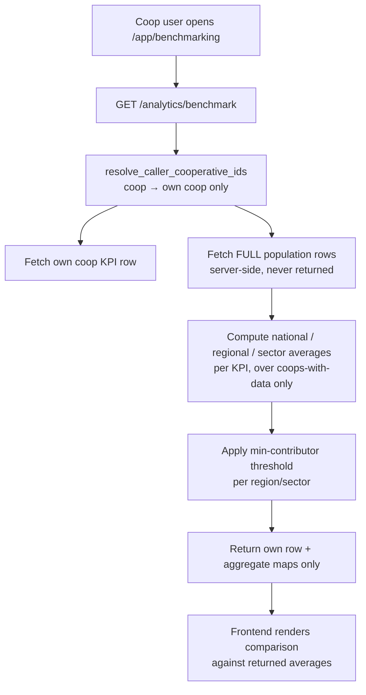

# Benchmarking Design — Cooperative Access & Privacy-Safe Averages

> **Status**: Implemented — backend endpoint + role-aware frontend widget (see §5)
> **Scope of this document**: The architectural fix to let **Cooperative** users benchmark against National/Regional/Sector averages **without exposing other cooperatives' raw data**.
> **Ticket**: [#75](https://github.com/ADORSYS-GIS/CoopData/issues/75) — Enhance Basic Analytics Dashboard & Implement Cooperative Benchmarking
> **Scope of this document**: The architectural fix to let **Cooperative** users benchmark against National/Regional/Sector averages **without exposing other cooperatives' raw data**.
> **Out of scope (deferred, not addressed now)**: I1 (Sector average) and I4 (Basic Analytics dashboard enhancement) — see §3.

---

## 1. Current State (How It Works Today)

**Benchmarking is admin-only.** `/app/benchmarking` is guarded to `["ministry", "federation", "apex"]`. The flow:

1. Frontend calls `GET /api/v1/analytics/national-overview`
2. Backend returns `NationalOverviewResponse` containing a **`cooperatives[]` array with the raw KPI row of every cooperative** (assets, profit, members, etc.)
3. `CooperativeComparison.tsx` loops over that array **in the browser** and computes `systemAverages` (national) and `regionalAverages` (per-region) locally
4. The user picks a target coop (or an average) and the widget renders the comparison

This works for admins **only because they are authorized to see every coop's raw data.**

---

## 2. The Core Issue: An Architectural Conflict

Ticket #75 requires giving **Cooperative** users access so they can compare themselves to National/Regional/Sector averages. But the current design makes that impossible without breaking one of two invariants:

| Scenario | What happens | Why it's broken |
|---|---|---|
| **A — Data leak** | Coop user calls the endpoint, receives all coops' raw rows | Massive privacy breach — competitors' financials exposed |
| **B — Broken math** | Backend scopes the array to the coop's own row only | Frontend computes "national average" from a single coop → the average *is* their own score → benchmarking is meaningless |

**Root cause:** The average computation lives in the **wrong layer**. Averages are computed **client-side over raw data**, so the client *must* receive the raw data to compute them. Privacy (don't send raw data) and correctness (need the full population) are therefore in direct conflict.

**The principle that resolves it:** *Averages must be computed server-side over the full population; only the aggregate numbers cross the wire. The client must never receive another cooperative's raw rows.*

---

## 3. Secondary Issues

**I1 — Sector average doesn't exist.** The current widget supports National + Regional averages but **not Sector average**, which the ticket explicitly requires. `CooperativeComparison.tsx` has no sector-average computation at all.
> **DEFERRED — not addressed in this iteration.**

**I2 — Peer-combobox still lists other coops.** Even with backend scoping, the comparison-peer `SearchableCombobox` (lines 572–615) renders all cooperatives as selectable options. For a coop user this is confusing at best, a leak vector at worst (defense-in-depth violation).

**I3 — Duplicated math.** `systemAverages` / `regionalAverages` are recomputed client-side even though the backend already computes some aggregates server-side (`NfPortfolioSummary`, traffic-light `distributions`). Two sources of truth for the same numbers.

**I4 — Basic Analytics dashboard is static.** `QuestionnaireAnalyticsPage.tsx` has stat cards and charts but **no traffic-light indicators** for liquidity/solvency/asset-quality, **no 3–5yr trend graphs**, and **no dynamic insight callouts** — all required by the ticket.
> **DEFERRED — not addressed in this iteration.**

**I5 — No minimum-population guard (privacy caveat).** Averages over tiny groups (a region with 2–3 coops) still reveal individual data. The ticket doesn't address this; it's a differential-privacy concern.

---

## 4. Blockers

| # | Blocker | Detail |
|---|---|---|
| B1 | **No approved design** | `docs/design.md` doesn't cover this feature. Per AGENTS.md Step 0, we must document + approve before coding. |
| B2 | **Backend contract undefined** | No endpoint exists that returns server-computed per-KPI averages for a coop user. The response shape is undecided. |
| B3 | **Frontend average math is coupled to raw data** | `CooperativeComparison.tsx` derives averages from `overview.cooperatives`. Refactoring to consume server averages touches the widget's core logic. |
| B4 | **Sector field availability** | Sector-average requires reliable `sector` on each coop row — need to confirm it's consistently populated in `CoopKpiRow` / DB. *(Relevant once I1 is addressed.)* |
| B5 | **Small-population policy undecided** | Need a decision on the minimum-contributor threshold before the endpoint can return honest "insufficient data" states. |
| B6 | **i18n keys** | New UI strings (traffic-light labels, insight text, "insufficient data") must be added to all 4 locale files (en/fr/pt/ss). |

---

## 5. Design Flow Fix

### 5.1 Backend — new role-aware endpoint

Add a dedicated endpoint (recommended over overloading `national-overview`):

```
GET /api/v1/analytics/benchmark?reporting_year=2026
```

**Response contract (structurally privacy-safe):**

```jsonc
{
  "reporting_year": 2026,
  "cooperative": { /* ONLY the caller's own CoopKpiRow */ },
  "national_average":  { "capital_adequacy_ratio": 18.2, "total_members": 1200, ... },
  "regional_average":  { "...": 0 },   // null if < N contributors
  "sector_average":    { "...": 0 },   // null if < N contributors
  "insufficient_data": { "regional": false, "sector": false }
}
```

**Flow:**



**Key rules:**
- The response type **cannot contain other coops' rows** — the privacy guarantee is structural, not a runtime filter.
- Averages computed over **cooperatives-with-data only** (matching current frontend semantics), and only for KPIs that have data.
- `regional_average` / `sector_average` return `null` + `insufficient_data` flag when contributors < N (recommend N=3–5).

### 5.2 Frontend — role-aware widget

- **Route guard:** add `"cooperative"` to `app.benchmarking.tsx`.
- **Nav:** add `"/app/benchmarking"` to `ROLE_NAV_ITEMS.cooperative.intelligence` in `roles.ts`.
- **`CooperativeComparison.tsx`:**
  - **Coop path:** call the new benchmark endpoint; own coop pre-selected + locked; comparison targets = **National / Regional / Sector averages only** (peer combobox hides all other coops); consume server averages instead of client-side math.
  - **Admin path:** keep current behavior (compare any two coops) — optionally also switch to server averages to remove duplication (I3).
  - Show honest "insufficient data" state when a target average is `null`.

### 5.3 Basic Analytics dashboard enhancement

> **DEFERRED — not addressed in this iteration.** Documented for future reference.

In `QuestionnaireAnalyticsPage.tsx`:
- **Traffic-light indicators** for key ratios (liquidity, solvency, asset quality) using existing `status` (green/amber/red) from KPI data.
- **3–5yr trend graphs** — needs a small backend addition (per-year KPI history for the coop's own data; already partially covered by `nf-trend` / `monthly-trend` endpoints).
- **Dynamic insight callouts** ("Your liquidity ratio is 5% above the national average") — computed from the same server averages.

### 5.4 Sequencing (bottom-up, per AGENTS.md)

1. **Design doc** → update `docs/design.md` + `docs/progress.md` (resolve B1)
2. **Backend:** benchmark endpoint + DTOs + scope + min-population guard (B2, B5)
3. **Frontend data layer:** `useBenchmark` hook (B3)
4. **Frontend UI:** route guard, nav, coop-locked widget (I2)
5. **i18n** for all new strings (B6)
6. **Verify:** `cargo clippy`/`test`, `npm run lint`/`typecheck`, E2E for coop + admin journeys

---

## 6. Summary

The fix is architectural — **move average computation to the backend, make the coop response structurally incapable of containing other coops' data, and add a minimum-population guard.** The frontend then just renders server-computed aggregates.

**In scope now:** the cooperative benchmarking access + privacy-safe averages (I2, I3, I5, B1–B3, B5, B6).
**Deferred:** I1 (sector average) and I4 (basic analytics dashboard enhancement).
