# CoopData — Database Schema & Entity Relationships

> **Companion to**: `docs/architecture.md` §6
> **Purpose**: A focused reference for the PostgreSQL/SeaORM schema — every table, its columns, and how it links to other tables. Visualized as a Mermaid ER diagram for quick navigation.
> **Conventions**: All PKs are UUID v7. All monetary values are `numeric(15,2)`. All tables carry `created_at`/`updated_at`. Soft deletes used only on `members` (via `status='Exited'`).

---

## 1. Mermaid ER Diagram (Full Schema)

```mermaid
erDiagram
    COOPERATIVES ||--o{ SUBMISSIONS : "cooperative_id"
    COOPERATIVES ||--o{ FINANCIAL_STATEMENTS : "cooperative_id"
    COOPERATIVES ||--o{ MEMBERS : "cooperative_id"
    COOPERATIVES ||--o{ SAVINGS_ACCOUNTS : "cooperative_id"
    COOPERATIVES ||--o{ LOANS : "cooperative_id"
    COOPERATIVES ||--o{ FIXED_DEPOSITS : "cooperative_id"
    COOPERATIVES ||--o{ COMPUTED_KPIS : "cooperative_id"
    COOPERATIVES ||--o{ ABNORMALITY_FLAGS : "cooperative_id"

    SUBMISSIONS ||--o{ UPLOADED_FILES : "submission_id"
    SUBMISSIONS ||--o{ EXTRACTION_JOBS : "submission_id"
    SUBMISSIONS ||--o{ SUBMISSION_REVIEWS : "submission_id"
    SUBMISSIONS ||--o{ FINANCIAL_STATEMENTS : "submission_id"
    SUBMISSIONS ||--o{ ABNORMALITY_FLAGS : "submission_id"
    SUBMISSIONS ||--o{ COMPUTED_KPIS : "submission_id"
    SUBMISSIONS ||--o{ MEMBERS : "submission_id"
    SUBMISSIONS ||--o{ SAVINGS_ACCOUNTS : "submission_id"
    SUBMISSIONS ||--o{ LOANS : "submission_id"
    SUBMISSIONS ||--o{ FIXED_DEPOSITS : "submission_id"

    UPLOADED_FILES ||--o{ EXTRACTION_JOBS : "source_file_id"

    FINANCIAL_STATEMENTS ||--o{ BALANCE_SHEET_LINE_ITEMS : "financial_statement_id"

    CHART_OF_ACCOUNTS ||--o{ BALANCE_SHEET_LINE_ITEMS : "account_code (logical)"
    CHART_OF_ACCOUNTS ||--o{ CHART_OF_ACCOUNTS_COOP_TYPES : "account_code"
    CHART_OF_ACCOUNTS ||--o{ ACCOUNT_ALIASES : "account_code"
    CHART_OF_ACCOUNTS ||--o{ CHART_OF_ACCOUNTS : "parent_code (self-ref)"

    MEMBERS ||--o{ SAVINGS_ACCOUNTS : "member_id"
    MEMBERS ||--o{ LOANS : "member_id"
    MEMBERS ||--o{ FIXED_DEPOSITS : "member_id"

    COOPERATIVES {
        uuid id PK
        uuid keycloak_group_id UK
        uuid apex_group_id
        uuid federation_org_id
        varchar name
        cooperative_type institution_type
        varchar reg_no UK
        varchar tin
        varchar address
        varchar georeference
        varchar region
        urban_rural geographic_classif
        varchar phone
        varchar sector
        uuid responsibe_financial
        uuid responsible_non_financial
        coop_status status
        date registered_on
        accounting_year accounting_year
        timestamptz created_at
        timestamptz updated_at
    }

    SUBMISSIONS {
        uuid id PK
        varchar reference UK
        uuid cooperative_id FK
        int reporting_year
        submission_status status
        review_tier current_tier
        uuid submitted_by
        timestamptz submitted_at
        uuid last_reviewed_by
        timestamptz last_reviewed_at
        text rejection_reason
        varchar priority
        jsonb metadata
        timestamptz created_at
        timestamptz updated_at
    }

    UPLOADED_FILES {
        uuid id PK
        uuid submission_id FK
        varchar original_name
        varchar mime_type
        text storage_key
        bigint size_bytes
        uuid uploaded_by
        timestamptz created_at
    }

    EXTRACTION_JOBS {
        uuid id PK
        uuid submission_id FK
        uuid source_file_id FK
        varchar status
        varchar engine
        text raw_text
        jsonb extracted_json
        numeric confidence
        text error_message
        timestamptz started_at
        timestamptz completed_at
        timestamptz created_at
    }

    FINANCIAL_STATEMENTS {
        uuid id PK
        uuid submission_id FK
        uuid cooperative_id FK
        int reporting_year
        accounting_year accounting_year
        currency currency
        boolean is_validated
        jsonb validation_errors
        timestamptz created_at
        timestamptz updated_at
    }

    BALANCE_SHEET_LINE_ITEMS {
        uuid id PK
        uuid financial_statement_id FK
        int account_code
        varchar account_name
        account_category account_category
        varchar account_subcategory
        smallint month
        numeric value
        numeric ai_confidence
        boolean ai_flagged
        boolean manually_edited
        timestamptz created_at
        timestamptz updated_at
    }

    CHART_OF_ACCOUNTS {
        int account_code PK
        varchar account_name
        account_category account_category
        varchar account_subcategory
        boolean is_total
        boolean is_section_header
        int parent_code FK
        text formula
        int display_order
        boolean baseline_active
    }

    CHART_OF_ACCOUNTS_COOP_TYPES {
        int account_code FK
        cooperative_type cooperative_type
        boolean is_required
        boolean is_active
    }

    ACCOUNT_ALIASES {
        uuid id PK
        int account_code FK
        varchar alias_label
        varchar language
    }

    SUBMISSION_REVIEWS {
        uuid id PK
        uuid submission_id FK
        review_tier tier
        uuid reviewer_id
        review_action action
        text comment
        timestamptz created_at
    }

    MEMBERS {
        uuid id PK
        uuid cooperative_id FK
        uuid submission_id FK
        varchar member_id
        date join_date
        member_status status
        date exit_date
        gender gender
        age_group age_group
        varchar region
        urban_rural urban_rural
        boolean agm_attendance
        varchar leadership_role
        boolean voting_exercised
        timestamptz created_at
        timestamptz updated_at
    }

    SAVINGS_ACCOUNTS {
        uuid id PK
        uuid cooperative_id FK
        uuid submission_id FK
        uuid member_id FK
        varchar savings_account_id
        account_type account_type
        date account_opening_date
        varchar account_status
        varchar contribution_frequency
        date last_contribution_date
        int number_of_contributions
        varchar balance_trend
        boolean zero_balance_flag
        varchar withdrawal_frequency_category
        boolean emergency_withdrawals_flag
        numeric interest_rate
        numeric balance
        timestamptz created_at
        timestamptz updated_at
    }

    LOANS {
        uuid id PK
        uuid cooperative_id FK
        uuid submission_id FK
        uuid member_id FK
        varchar loan_id
        varchar loan_product_type
        date loan_start_date
        date loan_maturity_date
        loan_status loan_status
        varchar borrower_type
        boolean youth_borrower_flag
        boolean women_borrower_flag
        boolean rural_borrower_flag
        varchar repayment_regularity
        dpd_category days_past_due_category
        int missed_installments_count
        boolean restructured_loan_flag
        int number_of_restructurings
        boolean early_settlement_flag
        boolean multiple_loans_flag
        boolean large_borrower_flag
        numeric interest_rate
        numeric balance
        numeric loan_amount
        timestamptz created_at
        timestamptz updated_at
    }

    FIXED_DEPOSITS {
        uuid id PK
        uuid cooperative_id FK
        uuid submission_id FK
        uuid member_id FK
        varchar fixed_deposit_id
        varchar deposit_type
        date start_date
        date maturity_date
        fd_status status
        varchar tenure_category
        varchar original_tenure_selected
        boolean early_withdrawal_flag
        boolean rollover_at_maturity_flag
        int number_of_renewals
        boolean change_in_tenure_at_renewal
        boolean single_depositor_dependency_flag
        numeric interest_rate
        numeric balance
        timestamptz created_at
        timestamptz updated_at
    }

    COMPUTED_KPIS {
        uuid id PK
        uuid cooperative_id FK
        uuid submission_id FK
        varchar reporting_period
        varchar kpi_category
        varchar kpi_name
        numeric value
        varchar formatted
        varchar unit
        varchar status
        numeric benchmark
        text description
        timestamptz computed_at
    }

    BENCHMARK_DATA {
        uuid id PK
        varchar region
        varchar sector
        varchar kpi_name
        varchar reporting_period
        numeric regional_average
        numeric sector_average
        numeric national_average
        timestamptz computed_at
    }

    ABNORMALITY_FLAGS {
        uuid id PK
        uuid submission_id FK
        uuid cooperative_id FK
        varchar rule_id
        varchar severity
        text message
        varchar field_ref
        timestamptz created_at
    }

    AUDIT_LOGS {
        uuid id PK
        uuid user_id
        varchar action
        varchar entity_type
        uuid entity_id
        jsonb changes
        varchar ip_address
        text user_agent
        timestamptz created_at
    }
```

---

## 2. Logical Grouping of Tables

### 2.1 Reference / Seed (immutable, system-managed)
| Table | Role |
|---|---|
| `chart_of_accounts` | Master CoA (codes 1000–6999), categories, rollup formulas |
| `chart_of_accounts_coop_types` | Which codes are required/active per cooperative type |
| `account_aliases` | Localized label synonyms for AI standardization mapping |
| `benchmark_data` | Regional/sector/national aggregate averages |

### 2.2 Identity Bridge
| Table | Role |
|---|---|
| `cooperatives` | Leaf registry row linking Keycloak group UUID → business data; caches apex/federation IDs for scope filtering |

### 2.3 Submission & Workflow
| Table | Role |
|---|---|
| `submissions` | One per cooperative × reporting_year — the annual reporting envelope |
| `submission_reviews` | Append-only audit trail per review tier |
| `uploaded_files` | Multipart upload blobs (S3/MinIO keys) |
| `extraction_jobs` | Async AI-extraction job state + raw/extracted JSON |

### 2.4 Financial Data
| Table | Role |
|---|---|
| `financial_statements` | One per cooperative × reporting_year — header + validation |
| `balance_sheet_line_items` | One row per account_code × month — the 12-month grid cells |

### 2.5 Non-Financial Data
| Table | Role |
|---|---|
| `members` | Membership roster per cooperative per period |
| `savings_accounts` | Member savings account details |
| `loans` | Member loan records + risk flags |
| `fixed_deposits` | Member fixed deposit records |

### 2.6 KPIs, Compliance & Flags
| Table | Role |
|---|---|
| `computed_kpis` | Materialized KPI values per cooperative × period |
| `abnormality_flags` | Structured output of the abnormality detector |

### 2.7 Audit
| Table | Role |
|---|---|
| `audit_logs` | Generic audit trail of user actions on any entity |

---

## 3. Relationship Summary (text form)

| Parent | Child | FK column | Cardinality | Notes |
|---|---|---|---|---|
| `cooperatives` | `submissions` | `cooperative_id` | 1:N | A coop has many submissions |
| `cooperatives` | `financial_statements` | `cooperative_id` | 1:N | Denormalized for fast scoped queries |
| `cooperatives` | `members` | `cooperative_id` | 1:N | |
| `cooperatives` | `savings_accounts` | `cooperative_id` | 1:N | |
| `cooperatives` | `loans` | `cooperative_id` | 1:N | |
| `cooperatives` | `fixed_deposits` | `cooperative_id` | 1:N | |
| `cooperatives` | `computed_kpis` | `cooperative_id` | 1:N | |

| `cooperatives` | `abnormality_flags` | `cooperative_id` | 1:N | Denormalized for filtered queries |
| `submissions` | `uploaded_files` | `submission_id` | 1:N | Cascade delete |
| `submissions` | `extraction_jobs` | `submission_id` | 1:N | Cascade delete |
| `submissions` | `submission_reviews` | `submission_id` | 1:N | Append-only audit |
| `submissions` | `financial_statements` | `submission_id` | 1:1 | |
| `submissions` | `members` | `submission_id` | 1:N | Nullable, cascade |
| `submissions` | `savings_accounts` | `submission_id` | 1:N | Nullable, cascade |
| `submissions` | `loans` | `submission_id` | 1:N | Nullable, cascade |
| `submissions` | `fixed_deposits` | `submission_id` | 1:N | Nullable, cascade |
| `submissions` | `abnormality_flags` | `submission_id` | 1:N | Cascade delete |
| `submissions` | `computed_kpis` | `submission_id` | 1:N | Cascade delete |
| `uploaded_files` | `extraction_jobs` | `source_file_id` | 1:N | A file can be re-extracted |
| `financial_statements` | `balance_sheet_line_items` | `financial_statement_id` | 1:N | Cascade delete |
| `chart_of_accounts` | `balance_sheet_line_items` | `account_code` (logical) | 1:N | Logical validation, not FK-constrained at DB level |
| `chart_of_accounts` | `chart_of_accounts_coop_types` | `account_code` | 1:N | Applicability per coop type |
| `chart_of_accounts` | `account_aliases` | `account_code` | 1:N | Localization synonyms |
| `chart_of_accounts` | `chart_of_accounts` | `parent_code` | 1:N (self-ref) | Rollup hierarchy (e.g. 1101→1100) |
| `members` | `savings_accounts` | `member_id` | 1:N | |
| `members` | `loans` | `member_id` | 1:N | |
| `members` | `fixed_deposits` | `member_id` | 1:N | |

> **Note on user UUIDs**: `submitted_by`, `reviewer_id`, `uploaded_by`, `responsibe_financial`, `responsible_non_financial`, and `audit_logs.user_id` are NOT FK-constrained — users live in Keycloak, not in this DB. They are stored as plain `UUID` columns validated only by JWT at the application layer.

---

## 4. Enum Types (PostgreSQL custom types)

| Enum | Values |
|---|---|
| `submission_status` | `draft`, `awaiting_coop_validation`, `submitted`, `apex_review`, `apex_approved`, `apex_returned`, `federation_review`, `federation_approved`, `federation_returned`, `ministry_review`, `approved`, `rejected` |
| `review_tier` | `cooperative`, `apex`, `federation`, `ministry` |
| `review_action` | `validated_extraction`, `submitted`, `approved`, `returned`, `rejected`, `commented` |
| `account_category` | `assets`, `liabilities`, `equity`, `income`, `expenses`, `surplus` |
| `currency` | `SZL`, `USD` |
| `accounting_year` | `calendar` (Jan→Dec), `fiscal` (Jun→Jul) |
| `cooperative_type` | `sacco`, `multipurpose`, `farm`, `housing`, `transport`, `finance`, `other` |
| `member_status` | `Active`, `Dormant`, `Exited` |
| `gender` | `Male`, `Female`, `Other` |
| `age_group` | `<18`, `18-35`, `36-50`, `50+` |
| `urban_rural` | `Urban`, `Rural` |
| `account_type` | `Voluntary`, `Mandatory`, `Fixed` |
| `loan_status` | `Performing`, `Arrears`, `Restructured`, `WrittenOff` |
| `dpd_category` | `0`, `1-30`, `31-60`, `61-90`, `91+` |
| `fd_status` | `Active`, `Matured`, `Withdrawn`, `RolledOver` |
| `coop_status` | `Active`, `Inactive`, `Suspended` |

---

## 5. Unique Constraints

| Table | Constraint | Purpose |
|---|---|---|
| `cooperatives` | `(keycloak_group_id)` UNIQUE | Single identity→data link |
| `cooperatives` | `(reg_no)` UNIQUE | Registration number unique |
| `submissions` | `(reference)` UNIQUE | SUB-2026-00001 human ref |
| `submissions` | `(cooperative_id, reporting_year)` UNIQUE | One submission envelope per cooperative per year |
| `financial_statements` | `(cooperative_id, reporting_year)` UNIQUE | One statement per year |
| `balance_sheet_line_items` | `(financial_statement_id, account_code, month)` UNIQUE | Exactly one value per cell |
| `chart_of_accounts_coop_types` | `(account_code, cooperative_type)` PK | Composite PK |
| `account_aliases` | `(account_code, alias_label)` UNIQUE | No duplicate synonyms |
| `members` | `(cooperative_id, member_id)` UNIQUE | Display ID unique per coop |
| `computed_kpis` | `(cooperative_id, kpi_name, reporting_period)` UNIQUE | One KPI value per period |

---

## 6. Cascade Behavior

| Child | On parent delete | Rationale |
|---|---|---|
| `uploaded_files` | CASCADE | Files belong to submission only |
| `extraction_jobs` | CASCADE | Jobs belong to submission only |
| `submission_reviews` | CASCADE | Audit belongs to submission |
| `financial_statements` | CASCADE | Statement owned by submission |
| `balance_sheet_line_items` | CASCADE | Cells owned by statement |
| `abnormality_flags` | CASCADE | Flags owned by submission |
| `computed_kpis` | CASCADE | KPIs owned by submission |
| `members` | CASCADE | Snapshot per submission (but soft-delete via status) |
| `savings_accounts` | CASCADE | |
| `loans` | CASCADE | |
| `fixed_deposits` | CASCADE | |

> `cooperatives` is never hard-deleted (use `status='Suspended'`/`'Inactive'`). All child rows survive cooperatives becoming inactive.

---

## 7. Migration Order (SeaORM-migration sequence)

1. Enums + `chart_of_accounts` + `chart_of_accounts_coop_types` + `account_aliases` (seeded from ADORSYS Excel)
2. `cooperatives`
3. `submissions` (replaces stub `assessments`)
4. `financial_statements` + `balance_sheet_line_items`
5. `members` + `savings_accounts` + `loans` + `fixed_deposits` (non-financial)
6. `computed_kpis` + `benchmark_data` + `abnormality_flags`
7. `uploaded_files` + `extraction_jobs` + `submission_reviews`
8. `audit_logs`
9. Indexes

---

## 8. Table-by-Table Reference (Purpose, Fields, Decisions, Relationships)

> This section is the human narrative for every table: what it does, why each field exists, the design decisions taken during architecture review, and how it links to other tables. Use this as the primary reference when implementing entities/migrations.

### 8.1 `cooperatives` — Identity bridge (Level 4 leaf)

**Purpose**: A single table where **one row = one cooperative**. It bridges Keycloak (where the org/group tree and users live) to the PostgreSQL business-data layer by storing the cooperative's stable Keycloak group UUID plus cached hierarchy IDs for fast scoped queries.

**Why a bridge, not a copy**: Identity (users, roles, federation/apex groups) stays in Keycloak — the single source of truth for *who can do what*. Postgres owns only *business data*. We store only the cooperative leaf row + cached `apex_group_id`/`federation_org_id` so repository queries can filter by role scope without a Keycloak round-trip per request.

**Fields**
| Field | Use |
|---|---|
| `id` | Internal PK; what every business row FKs to |
| `keycloak_group_id` UNIQUE | The immutable KC subgroup UUID — the identity↔data link |
| `apex_group_id` | Parent apex (KC group) — cached so apex scope = `cooperative.apex_group_id = claims.apex_group_id` |
| `federation_org_id` | Parent federation (KC org) — cached for federation scope |
| `name` | Cooperative display name (from DATA sheet) |
| `institution_type` (`cooperative_type`) | Kind of coop — drives which CoA subset applies ("Depending on the kind of Coop") |
| `reg_no` UNIQUE | Registration number, e.g. `COP-2018-04921` |
| `tin` | Tax identification number (optional) |
| `address` | Free-text address |
| `georeference` | lat,long string for the dashboard geographic risk map |
| `region` | Region (filter dimension) |
| `geographic_classif` (`urban_rural`) | Urban/Rural — `Urban`/`Rural` |
| `phone` | Contact phone |
| `sector` | Cached from apex/federation for fast filtering |
| `responsibe_financial` / `responsible_non_financial` | Keycloak user UUIDs responsible for each data area (optional; typed in DATA sheet rows 12-14) |
| `status` (`coop_status`) | `Active`/`Inactive`/`Suspended` — never hard-deleted; use status |
| `registered_on` | Registration date |
| `accounting_year` | `calendar` (Jan→Dec) or `fiscal` (Jun→Jul) — decides what `month=1` means on line items |
| `created_at`/`updated_at` | Audit timestamps |

**Decisions taken**
- **D1**: Keycloak owns identity; we store only the leaf + cached parent IDs. No duplication of the group tree.
- `cooperatives` is never hard-deleted (historical financial data must stay queryable).
- Some identity-ish fields (`tin`, `address`, `phone`, `georeference`, `region`, `sector`, responsibility UUIDs) are kept here as **cache/denormalization** for dashboard joins rather than calling Keycloak on every report query.

**Relationships**
- 1:N → `submissions`, `financial_statements`, `members`, `savings_accounts`, `loans`, `fixed_deposits`, `computed_kpis`, `abnormality_flags`
- All user-UUID columns (`responsibe_*`, `submitted_by`, `reviewer_id`, `uploaded_by`) are **plain UUIDs**, NOT FK-constrained — users live in Keycloak.

---

### 8.2 `submissions` — Annual reporting envelope (workflow core)

**Purpose**: One row per **cooperative × reporting_year**. It is the container that the 4-tier review workflow (Cooperative → Apex → Federation → Ministry) moves through. All data tables (`financial_statements`, `members`, `savings_accounts`, `loans`, `fixed_deposits`) link back to a submission via `submission_id`.

**Decision (revised during review)**: We **removed the `type` column** that the original architecture had. Instead of one submission per type (financial/membership/savings/loans/fixed_deposits) per year, we use **one annual envelope per cooperative per year**. Which data sections are present is implicit from which child tables have rows linking to the submission. Rationale: a cooperative reports its period once, not five separate times; this matches the user mental model and avoids five parallel workflows.

**Fields**
| Field | Use |
|---|---|
| `id` | PK |
| `reference` UNIQUE | Human-readable id, e.g. `SUB-2026-00001` |
| `cooperative_id` FK | Owner cooperative |
| `reporting_year` | e.g. 2025 — the year the data covers |
| `status` (`submission_status`) | Current workflow state (draft → … → approved/rejected) |
| `current_tier` (`review_tier`) | Which tier holds it now: cooperative/apex/federation/ministry |
| `submitted_by` | KC user who created/sent it |
| `submitted_at` | When sent upward |
| `last_reviewed_by` / `last_reviewed_at` | Latest review touch |
| `rejection_reason` | Ministry reject reason (terminal) |
| `priority` | e.g. `Routine` |
| `metadata` JSONB | Extensible type-specific extras without schema churn |
| `created_at`/`updated_at` | — |

**Constraint**: `UNIQUE (cooperative_id, reporting_year)` — one envelope per coop per year (no per-type splitting).

**Relationships**
- N:1 ← `cooperatives`
- 1:N → `uploaded_files`, `extraction_jobs`, `submission_reviews`, `financial_statements`, `abnormality_flags`, `computed_kpis`, `members`, `savings_accounts`, `loans`, `fixed_deposits` (all cascade on delete)

---

### 8.3 `uploaded_files` & `extraction_jobs` — AI extraction pipeline support

**`uploaded_files`** — file registry. Does NOT store bytes; stores metadata + an S3/MinIO object key. Real files live in object storage (cheaper, CDN-friendly, multi-instance).
| Field | Use |
|---|---|
| `submission_id` FK | Which submission the file belongs to |
| `original_name` | User's filename |
| `mime_type` | `application/pdf`, `image/png`, xlsx… |
| `storage_key` | Object path in S3/MinIO |
| `size_bytes` | For quota/bandwidth/mobile UX |
| `uploaded_by` | KC user |

**`extraction_jobs`** — async AI worker state. Separate from `uploaded_files` because one file can be re-extracted, multiple engines can run, and raw text/JSON is retained for audit & replay.
| Field | Use |
|---|---|
| `source_file_id` FK | Which file is processed |
| `status` | queued → preprocessing/extracting/mapping → succeeded/failed/partial |
| `engine` | `ocr`, `xlsx-parse`, `llm-map`, `vision-ocr` |
| `raw_text` | OCR/cell dump (debuggable, re-runnable) |
| `extracted_json` | Candidate line-items + totals reconciliation |
| `confidence` | Overall 0.0–1.0 |
| `error_message` | On failure |
| `started_at`/`completed_at` | Timing |

**Decision (D6)**: Extraction is **async** — upload returns `202 Accepted` immediately; frontend polls `GET /extraction-jobs/{id}`. Low-bandwidth mobile clients never hold a connection during AI processing.

**Relationships**: `uploaded_files` 1:N `extraction_jobs`; both N:1 `submissions`.

---

### 8.4 `chart_of_accounts`, `chart_of_accounts_coop_types`, `account_aliases` — Financial reference (seed)

**`chart_of_accounts`** — the canonical ADORSYS master (codes 1000–6999). Already exists as TypeScript constants in `frontend/src/lib/financial-data.ts`; the DB table is the backend copy the validation/AI/mapping layers use.
| Field | Use |
|---|---|
| `account_code` PK | e.g. 1101 |
| `account_name` | Canonical English name |
| `account_category` | assets/liabilities/equity/income/expenses/surplus |
| `account_subcategory` | Finer group |
| `is_total` | true for rolled-up totals (1999, 2999…) |
| `is_section_header` | true for display headers (1000, 2000…) |
| `parent_code` (self-ref) | Rollup parent (1101→1100) |
| `formula` | e.g. `1101+1102+1103+1104` for verification |
| `display_order` | Report sort |
| `baseline_active` | Active for all coop types unless excluded |

**`chart_of_accounts_coop_types`** — applicability matrix answering "which codes apply to which coop type" (STARTING POINT row I: *"Depending on the kind of Coop"*).
| Field | Use |
|---|---|
| `account_code` FK | — |
| `cooperative_type` | sacco/farm/housing… |
| `is_required` | Must be present & non-null for this type (drives `MISSING_ACCOUNT` flag) |
| `is_active` | Applicable vs excluded |

**`account_aliases`** — localized/legacy label synonyms for AI mapping (e.g. `Caja`→1101, `Préstamos`→1200).
| Field | Use |
|---|---|
| `account_code` FK | — |
| `alias_label` | Real-world/local name |
| `language` | `es`/`en`/`pt`/`ss` |

**Decision (under review)**: An LLM receiving the full CoA in its prompt can fuzzy-map known labels itself, so `account_aliases` is **optional for v1**. It earns its keep for the Excel fast-path (direct hash lookup, no LLM call), auditability, and an offline/no-LLM fallback. Keep seeded but expect to drop it if the LLM proves sufficient.

**Relationships**: `chart_of_accounts` self-refs via `parent_code`; 1:N `chart_of_accounts_coop_types` and `account_aliases`; validates `balance_sheet_line_items.account_code` (logical, app-validated — not a hard DB FK so the CoA can evolve via seed without migration churn).

---

### 8.5 `financial_statements` & `balance_sheet_line_items` — Monthly financial grid

**`financial_statements`** — the header for a 12-month balance sheet (one per cooperative per year).
| Field | Use |
|---|---|
| `submission_id` FK | Owning envelope |
| `cooperative_id` FK | Denormalized for scoped queries |
| `reporting_year` | 2025 |
| `accounting_year` | calendar vs fiscal — governs what `month=1` means |
| `currency` | SZL/USD |
| `is_validated` | Coop confirmed AI extraction |
| `validation_errors` JSONB | Array of validation errors |

**`balance_sheet_line_items`** — the actual cells. One row = one (account_code × month) cell, mirroring the BALANCE SHEET/TENDENCE 12-column grid. ~41 codes × 12 months ≈ 492 rows/year/coop.
| Field | Use |
|---|---|
| `financial_statement_id` FK | — |
| `account_code` | e.g. 1101 |
| `account_name` | Canonical snapshot (denormalized for reads) |
| `account_category` | assets/liabilities/equity/… |
| `month` | 1..12 (position relative to `accounting_year`) |
| `value` NUMERIC(15,2) | **Nullable** — NULL = absent (didn't report); 0 = explicitly zero. Critical distinction for `MISSING_ACCOUNT`. |
| `ai_confidence` | Per-cell extraction confidence 0.0–1.0 |
| `ai_flagged` | AI flagged as suspicious |
| `manually_edited` | Human overrode AI value |

**Decisions**
- **D2 (EAV-hybrid monthly cells)**: A wide table (one column per code×month) would need 492 columns and a migration per code change. Row-per-cell is flexible and queryable by category/code.
- **D3**: `numeric(15,2)` exact decimal for all money — no float rounding on financials.
- `UNIQUE (financial_statement_id, account_code, month)` — exactly one value per cell.
- Derived structure-% and month-over-month trend are **computed** at read/KPI time, never stored as inputs (STARTING POINT row 3: *"the system calculates all rest"*).

**Relationships**: `financial_statements` 1:N `balance_sheet_line_items` (cascade); both N:1 `submissions`.

---

### 8.6 `submission_reviews` — Immutable audit trail per tier

**Purpose**: Append-only event log — every review action (validate/submit/approve/return/reject/comment) appends a row. Gives the full "who did what and when" chain for the UI review-history timeline and compliance.

**Why not merged into `submissions`**: `submissions` is the **current state** (updatable, latest only); `submission_reviews` is the **history** (append-only, many rows). Merging would force either overwriting history (no audit trail) or multiple same-id rows (no single source of truth for current state). This is the standard event-log vs current-state split (like a bank balance vs transaction log).

| Field | Use |
|---|---|
| `submission_id` FK | — |
| `tier` (`review_tier`) | cooperative/apex/federation/ministry |
| `reviewer_id` | KC user id |
| `action` (`review_action`) | validated_extraction/submitted/approved/returned/rejected/commented |
| `comment` | Reviewer note |

**Relationships**: N:1 `submissions` (cascade).

---

### 8.7 Non-financial data — `members`, `savings_accounts`, `loans`, `fixed_deposits`

These mirror the Excel "NF *" sheets and are scoped to a cooperative + submission period. Each links to `submissions.id` (nullable, cascade) so historical snapshots are preserved per reporting period.

**`members`** — membership roster with mandatory demographic coding (US2.2).
| Field | Use |
|---|---|
| `cooperative_id`/`submission_id` FK | — |
| `member_id` | Display id `M001` (UNIQUE per cooperative) |
| `join_date`, `status` (`Active`/`Dormant`/`Exited`), `exit_date` | Soft-delete via `status='Exited'` keeps exit-rate KPI history |
| `gender`, `age_group`, `urban_rural` | Demographic coding → women %, youth %, rural % KPIs |
| `region` | Geographic breakdown |
| `agm_attendance`, `leadership_role`, `voting_exercised` | Governance KPIs (agm participation, women/youth in governance) |

**`savings_accounts`** (US2.3) — member savings product records (account type, contribution frequency, balance trend, zero-balance/emergency flags, interest rate, balance).

**`loans`** (US2.3) — member loan records with risk flags.
| Key fields |
|---|
| `loan_status` (Performing/Arrears/Restructured/WrittenOff), `days_past_due_category` (DPD buckets feeding PAR30/60/90), youth/women/rural borrower flags, restructuring/early-settlement/multiple-loans/large-borrower flags, missed installments count, balance, loan_amount, interest_rate |

**`fixed_deposits`** (US2.3) — member fixed deposit records with tenure & rollover behaviour (deposit_type, tenure_category, early-withdrawal/rollolover flags, single-depositor-dependency risk flag, balance).

**Decisions**
- `submission_id` is **nullable + cascade** so non-financial records can exist for legacy imports without a submission and are removed when a submission is deleted.
- `members` uses soft-delete (`status='Exited'`) rather than hard delete so exit-rate history survives.
- `member_id` is a display string; the UUID PK is the relational anchor for savings/loans/fixed_deposits.
- `UNIQUE (cooperative_id, member_id)`.

**Relationships**: `members` 1:N `savings_accounts`, `loans`, `fixed_deposits`; all N:1 `cooperatives` and `submissions`.

---

### 8.8 KPI & abnormality tables — `computed_kpis`, `benchmark_data`, `abnormality_flags`

These store the **output** of the KPI/abnormality engines (computed, not raw inputs).

**`computed_kpis`** — materialized individual KPI values per cooperative × period (50+ per coop).
| Field | Use |
|---|---|
| `reporting_period` | e.g. `2025-01` or `2025` |
| `kpi_category` | financial/membership/savings/loans/fixed_deposits |
| `kpi_name` | par30, roa, membershipGrowthRate… |
| `value`/`formatted`/`unit` | Raw number + display string + percent/currency/ratio/number |
| `status` | green/amber/red (threshold-driven) |
| `benchmark` | Industry average for comparison |

**`benchmark_data`** — regional/sector/national averages recomputed by a nightly batch so dashboards show peer comparison.

**`abnormality_flags`** — structured output of the abnormality detector (separate from JSONB `validation_errors` so flags are queryable, filterable, trendable — decision D7).
| Field | Use |
|---|---|
| `submission_id`/`cooperative_id` FK | — |
| `rule_id` | e.g. `HIGH_PAR30`, `TOTAL_MISMATCH`, `EXIT_BEFORE_JOIN` |
| `severity` | warning/error |
| `message` | Human-readable |
| `field_ref` | Which code/member field is wrong |

**Decision**: `compliance_scores` was **removed** during review — the weighted compliance report-card was deemed unnecessary for v1. The green/amber/red status lives on individual KPIs instead.

**Relationships**: all N:1 `cooperatives`; `computed_kpis`/`abnormality_flags` also N:1 `submissions` (cascade).

---

### 8.9 `audit_logs` — generic audit trail

| Field | Use |
|---|---|
| `user_id` | KC user id (not FK) |
| `action` | CREATE/UPDATE/DELETE/… |
| `entity_type`/`entity_id` | What was touched |
| `changes` JSONB | Diff payload |
| `ip_address`/`user_agent` | Forensic context |

Append-only (enforced at DB level — no UPDATE/DELETE). Cross-cutting; added to all mutation handlers.