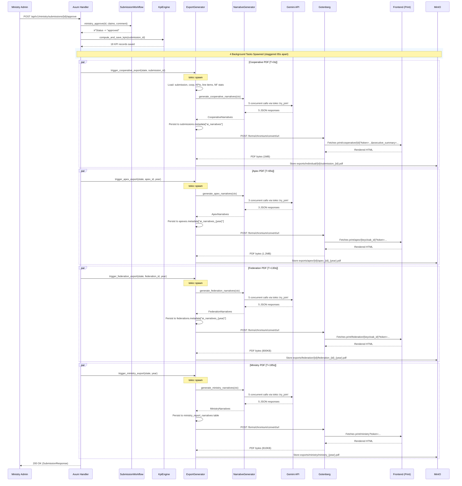

# Design Document — AI-Powered Report Narratives (S4-T6)

> **Ticket:** [S4-T6 — AI-Powered Report Summarization](https://github.com/ADORSYS-GIS/CoopData/issues/64)
> **Status:** Implemented (Backend + Frontend — all tiers)
> **Last Updated:** 2026-07-31

---

## 1. Problem Statement

Currently, all PDF report tiers (Cooperative, Apex, Federation, Ministry) contain hardcoded narrative text that provides no meaningful insight. Reviewers (Apex, Federation, Ministry) must manually interpret financial values and ratios to assess cooperative health. This enhancement introduces an AI-powered reporting summary engine that generates professional executive summaries from the actual financial data.

**Total narrative sections:** 18 across 4 tiers (Cooperative: 5, Apex: 3, Federation: 5, Ministry: 5)
**Total LLM calls per ministry approval:** 18 (5+3+5+5)

---

## 2. Architecture Decision: Storage Strategy

### Cooperative Tier
**Decision:** Use the existing `submissions.metadata` JSONB column.

**Rationale:**
- `submissions.metadata` is `JSONB NOT NULL DEFAULT '{}'::jsonb` (migration `06_submissions.sql`)
- Narratives are tightly coupled to submissions — no need for separate joins
- Regeneration = overwrite the JSONB key; cache invalidation already handles this
- No schema migration needed for a new table

**Structure inside `metadata`:**
```json
{
  "ai_narratives": {
    "executive_summary": "...",
    "financial_position": "...",
    "portfolio_quality": "...",
    "non_financial": "...",
    "benchmark_comparison": "..."
  }
}
```

### Apex & Federation Tiers
**Decision:** Use `metadata` JSONB column on `apexes` and `federations` tables with year-namespaced keys.

**Structure:**
```json
{
  "ai_narratives_2025": {
    "executive_dashboard": "...",
    "risk_distribution": "...",
    "risk_watch": "..."
  }
}
```

Migration `24_report_narratives_metadata.sql` adds `metadata JSONB` to `apexes` and `federations` tables.

### Ministry Tier
**Decision:** Dedicated `ministry_report_narratives` table.

```sql
CREATE TABLE ministry_report_narratives (
    reporting_year INT PRIMARY KEY,
    narratives_json JSONB NOT NULL,
    model_used TEXT,
    generated_at TIMESTAMPTZ DEFAULT NOW()
);
```

---

## 3. Post-Approval Flow (Actual Implementation)

### 3.1 Ministry Approval Trigger

```
POST /api/v1/ministry/submissions/{id}/approve
│
├─ 1. workflow.ministry_approve(id, claims, comment)
│     → Updates submission status to "approved"
│     → Records approval timestamp
│
├─ 2. workflow.compute_and_save_kpis(submission_id, coop_id, year)
│     → KpiEngine::compute() → 18 KPIs
│     → Saves to kpi_records table (one row per KPI)
│
├─ 3. Phase A: trigger_cooperative_export(state, submission_id)  [T+0s]
│     └─ tokio::spawn {
│         ├─ generate_cooperative_narratives(state, submission_id)
│         │   ├─ Fetch from DB:
│         │   │   ├─ submission_repo.find_by_id()
│         │   │   ├─ cooperative_repo.find_by_id()
│         │   │   ├─ kpi_record_repo.find_by_submission() (current + prior year)
│         │   │   ├─ financial_statement_repo.find_by_submission()
│         │   │   │   └─ line_item_repo.find_by_financial_statement()
│         │   │   │       └── Dedup by account_code, fetch prior year for YoY
│         │   │   └─ NfIndicatorEngine::compute_for_submission(coop_id, None)
│         │   │       └── membership stats, savings stats, loan stats
│         │   │
│         │   ├─ build_cooperative_context(...)  // 11 params
│         │   │
│         │   ├─ Acquire AI semaphore (max 2 concurrent)
│         │   │
│         │   ├─ tokio::try_join! — 5 CONCURRENT LLM calls:
│         │   │   ├─ Prompt 6.1: Executive Summary      (~9,200 chars)
│         │   │   ├─ Prompt 6.2: Financial Position      (~3,400 chars)
│         │   │   ├─ Prompt 6.3: Portfolio Quality       (~1,400 chars)
│         │   │   ├─ Prompt 6.4: Non-Financial           (~1,500 chars)
│         │   │   └─ Prompt 6.5: Benchmark Comparison    (~7,900 chars)
│         │   │
│         │   ├─ Parse JSON responses → CooperativeNarratives struct
│         │   │
│         │   ├─ Persist to submissions.metadata["ai_narratives"]
│         │   │
│         │   └─ Return CooperativeNarratives
│         │
│         ├─ generate_cooperative_pdf(state, submission_id, narratives)
│         │   ├─ Build Gotenberg URL with narratives as URL search params:
│         │   │   /print/cooperative/{id}?token={jwt}&executive_summary=...&financial_position=...
│         │   ├─ generate_pdf_via_gotenberg(state, url)
│         │   │   └─ Acquire Gotenberg semaphore (max 2 concurrent)
│         │   │   └─ POST to Gotenberg chromium convert/url endpoint
│         │   │   └─ Retry on 503: up to 3 attempts, 25s waitDelay, 30s timeout
│         │   └─ Store PDF in MinIO at exports/individual/{id}/submission_{id}.pdf
│         └─ Done
│     }
│
├─ 4. Phase C: trigger_apex_export(state, apex_id, year)  [T+65s]
│     └─ tokio::spawn {
│         ├─ generate_apex_narratives(state, apex_id, year)
│         │   ├─ Acquire AI semaphore
│         │   ├─ tokio::try_join! — 3 CONCURRENT LLM calls:
│         │   │   ├─ Prompt 6.6: Executive Dashboard
│         │   │   ├─ Prompt 6.10: Risk Distribution
│         │   │   └─ Prompt 6.11: Risk Watch
│         │   ├─ Parse → ApexNarratives { executive_dashboard, risk_distribution, risk_watch }
│         │   ├─ Persist to apexes.metadata["ai_narratives_{year}"]
│         │   └─ Return narratives
│         │
│         ├─ generate_apex_formats(state, apex_id, year, narratives)
│         │   ├─ Build Gotenberg URL
│         │   ├─ generate_pdf_via_gotenberg()
│         │   └─ Store PDF in MinIO at exports/apex/{apex_id}/apex_{apex_id}_{year}.pdf
│         └─ Done
│     }
│
├─ 5. Phase D: trigger_federation_export(state, federation_id, year)  [T+130s]
│     └─ tokio::spawn {
│         ├─ generate_federation_narratives(state, federation_id, year)
│         │   ├─ Acquire AI semaphore
│         │   ├─ tokio::try_join! — 5 CONCURRENT LLM calls:
│         │   │   ├─ Prompt 6.6: Executive Dashboard
│         │   │   ├─ Prompt 6.10: Risk Distribution
│         │   │   ├─ Prompt 6.7: Sector Breakdown
│         │   │   ├─ Prompt 6.8: Apex Comparison
│         │   │   └─ Prompt 6.9: PEARLS Analysis
│         │   ├─ Parse → FederationNarratives
│         │   ├─ Persist to federations.metadata["ai_narratives_{year}"]
│         │   └─ Return narratives
│         │
│         ├─ generate_federation_formats(...)
│         └─ Done
│     }
│
├─ 6. Phase E: trigger_ministry_export(state, year)  [T+195s]
│     └─ tokio::spawn {
│         ├─ generate_ministry_narratives(state, year)
│         │   ├─ Acquire AI semaphore
│         │   ├─ tokio::try_join! — 5 CONCURRENT LLM calls:
│         │   │   ├─ Prompt 6.6: Executive Dashboard
│         │   │   ├─ Prompt 6.10: Risk Distribution
│         │   │   ├─ Prompt 6.7: Sector Breakdown
│         │   │   ├─ Prompt 6.8: Apex Comparison
│         │   │   └─ Prompt 6.9: PEARLS Analysis
│         │   ├─ Parse → MinistryNarratives
│         │   ├─ Persist to ministry_report_narratives table
│         │   └─ Return narratives
│         │
│         ├─ generate_ministry_formats(...)
│         └─ Done
│     }
│
└─ 7. Phase F: Invalidate stale exports (future-year submissions)
      └─ For each stale submission:
          ├─ Delete cached PDF from MinIO
          ├─ Re-trigger cooperative/apex/federation/ministry exports
          └─ Each re-trigger includes fresh AI narrative generation
```

### 3.2 Sequence Diagram



### 3.3 Data Flow: Prompt Construction

```
Step 2 (compute_and_save_kpis) writes to kpi_records table
                    ↓
Step 3-6 (each tokio::spawn task) reads from DB:
    Cooperative tier:
    ├─ submission_repo.find_by_id(submission_id)
    ├─ cooperative_repo.find_by_id(coop_id) → reg_no, display_name, region, sector
    ├─ kpi_record_repo.find_by_submission(submission_id) → 18 KPIs
    ├─ kpi_record_repo.find_by_submission(prior_submission_id) → prior year KPIs
    ├─ financial_statement_repo.find_by_submission()
    │   └─ line_item_repo.find_by_financial_statement()
    │       └── Dedup by account_code (take latest month), fetch prior year for YoY
    │       └── Convert to BalanceSheetLineItemData
    └─ NfIndicatorEngine::compute_for_submission(coop_id, None)
        └── membership stats, savings stats, loan stats
                    ↓
build_cooperative_context(...)  // 11 params
                    ↓
tokio::try_join! — 5 concurrent LLM calls via chat()
                    ↓
POST {AI_PROVIDER_URL}/chat/completions
    Body: {
        "model": "gemini-3.6-flash",
        "messages": [{ "role": "user", "content": "<full prompt with data>" }],
        "temperature": 0,
        "max_tokens": 16384
    }
    Auth: Bearer {AI_API_KEY}
                    ↓
Parse JSON response → CooperativeNarratives struct
                    ↓
Store in submissions.metadata["ai_narratives"] (cooperative tier)
  OR apexes/federations.metadata["ai_narratives_{year}"] (apex/federation)
  OR ministry_report_narratives table (ministry)
                    ↓
Gotenberg renders PDF with AI narratives on report pages
```

---

## 4. Narrative Sections Per Tier

| Tier | Report Pages with Narratives | Sections | LLM Calls |
|------|------------------------------|----------|-----------|
| **Cooperative** | Executive Summary, Financial Position, Portfolio Quality, Non-Financial, Benchmark Comparison | 5 | 5 (concurrent) |
| **Apex** | Executive Dashboard, Risk Distribution, Risk Watch | 3 | 3 (concurrent) |
| **Federation** | Executive Dashboard, Risk Distribution, Sector Breakdown, Apex Comparison, PEARLS Analysis | 5 | 5 (concurrent) |
| **Ministry** | Executive Dashboard, Risk Distribution, Sector Breakdown, Apex Comparison, PEARLS Analysis | 5 | 5 (concurrent) |

**Grand total: 18 narrative sections, 18 LLM calls per ministry approval.**

---

## 5. Token Management Strategy

**Problem:** Full KPI tables + line items + membership stats could generate 5,000-10,000 tokens per prompt. At Gemini Flash pricing, cost is very low but latency matters.

**Solution: Separate prompts per section (NOT batched)**

Each narrative section gets its own focused prompt with only relevant data. This allows:
1. **Concurrent execution** via `tokio::try_join!` — 5 prompts in parallel, not sequentially
2. **Focused context** — each prompt receives only the KPIs/data relevant to that section
3. **Better quality** — smaller, focused prompts produce more accurate narratives

### Per-Prompt Data Selection (Cooperative Tier)

| Prompt Section | Data Included | Approximate Size |
|---------------|--------------|-----------------|
| 6.1 Executive Summary | 8 core KPIs + benchmarks + prior year | ~9,200 chars |
| 6.2 Financial Position | Line items (deduped) + financial KPIs + YoY | ~3,400 chars |
| 6.3 Portfolio Quality | 6 portfolio KPIs + breakdown | ~1,400 chars |
| 6.4 Non-Financial | Membership + savings + loan demographics | ~1,500 chars |
| 6.5 Benchmark Comparison | 8 KPIs + benchmarks + status counts | ~7,900 chars |

### Line Item Compression
Instead of 50+ individual line items, aggregate into categories and deduplicate:
```
BALANCE SHEET SUMMARY:
- Total Assets: E 5,200,000 (YoY: +12.3%)
- Total Equity: E 1,800,000 (YoY: +8.1%)
- Total Deposits: E 2,100,000 (YoY: +15.2%)
- Gross Loans: E 3,500,000 (YoY: +10.5%)
- Net Surplus: E 450,000 (YoY: +22.1%)
```

### Ministry/Federation Aggregate Stats
Instead of 500 cooperative rows, send distribution summaries:
```
NATIONAL KPI DISTRIBUTIONS:
- PAR30: Green 62% (n=310), Amber 25% (n=125), Red 13% (n=65)
- ROA: Green 55% (n=275), Amber 30% (n=150), Red 15% (n=75)
- CAR: Green 70% (n=350), Amber 20% (n=100), Red 10% (n=50)
```

---

## 6. Concurrency Model

```
                     ┌─────────────────────────────────────────┐
                     │         ministry_approve_submission      │
                     │         (main request handler)          │
                     └──────────────┬──────────────────────────┘
                                    │
            ┌───────────┬───────────┼───────────┬───────────────┐
            │           │           │           │               │
            ▼           ▼           ▼           ▼               ▼
    ┌──────────┐ ┌──────────┐ ┌──────────┐ ┌──────────┐ ┌──────────┐
    │ Phase A  │ │ Phase C  │ │ Phase D  │ │ Phase E  │ │ Phase F  │
    │ Coop     │ │ Apex     │ │ Fed      │ │ Ministry │ │ Stale    │
    │ (spawn)  │ │ (spawn)  │ │ (spawn)  │ │ (spawn)  │ │ (inline) │
    └────┬─────┘ └────┬─────┘ └────┬─────┘ └────┬─────┘ └────┬─────┘
         │            │            │            │            │
         ▼            ▼            ▼            ▼            ▼
    ┌─────────────────────────────────────────────────────────────┐
    │                    AI Semaphore (max 2)                      │
    │            Acquire permit before any LLM call                │
    └──────────────────────┬──────────────────────────────────────┘
                           │
         ┌─────────────────┼─────────────────┐
         │                 │                 │
         ▼                 ▼                 ▼
    ┌──────────┐     ┌──────────┐     ┌──────────┐
    │ 2 calls  │     │ 2 calls  │     │ 1 call   │
    │ (batch 1)│     │ (batch 2)│     │ (batch 3)│
    └────┬─────┘     └────┬─────┘     └────┬─────┘
         │                │                 │
         ▼                ▼                 ▼
    ┌─────────────────────────────────────────────────────────────┐
    │              Gemini API (generativelanguage.googleapis.com)  │
    │              5 requests/minute free tier limit               │
    │              18 total LLM calls across all tiers             │
    └──────────────────────┬──────────────────────────────────────┘
                           │
                           ▼
    ┌─────────────────────────────────────────────────────────────┐
    │                    Gotenberg Semaphore (max 2)               │
    │              PDF generation: 25s waitDelay, 3 attempts       │
    └──────────────────────┬──────────────────────────────────────┘
                           │
                           ▼
    ┌─────────────────────────────────────────────────────────────┐
    │                    MinIO Storage                             │
    │              exports/{tier}/{id}/...pdf                      │
    └─────────────────────────────────────────────────────────────┘
```

**Concurrency controls:**
- **AI semaphore:** `Arc::new(Semaphore::new(2))` — max 2 concurrent LLM API calls
- **Gotenberg semaphore:** `Arc::new(Semaphore::new(2))` — max 2 concurrent PDF generations
- **Total concurrent HTTP:** max 4 (2 AI + 2 Gotenberg)

**Timeline for a single ministry approval (Gemini free tier):**
```
T+0s:      ministry_approve() called
T+0.5s:    KPIs computed and saved
T+1s:      Phase A: cooperative tokio::spawn launched
T+1-8s:    Cooperative: 5 concurrent LLM calls → narratives → Gotenberg PDF
T+65s:     Phase C: apex tokio::spawn launched
T+65-85s:  Apex: 3 concurrent LLM calls → narratives → Gotenberg PDF
T+130s:    Phase D: federation tokio::spawn launched
T+130-150s Federation: 5 concurrent LLM calls → narratives → Gotenberg PDF
T+195s:    Phase E: ministry tokio::spawn launched
T+195-220s Ministry: 5 concurrent LLM calls → narratives → Gotenberg PDF
```

**Total wall time:** ~4-5 min for all 4 tiers (dominated by 65s stagger between tiers for free tier rate limits)

---

## 7. Retry & Fallback Mechanism

### LLM Retry (429 Rate Limits)
- Gemini free tier: 5 requests/minute
- AI semaphore limits to 2 concurrent calls
- `LlmNarrativeGenerator.chat()` retries on 429 with exponential backoff
- **Daily quota detection:** If `quotaId` contains "PerDay"/"Daily"/"RPD" → fail immediately (no retry)
  - Daily quota won't recover, so waiting is wasteful
  - Logs `💳 Daily quota exhausted` error
- **Per-minute rate limit:** Retries up to 6 times, parses Gemini's `retryDelay` from response
  - Exponential backoff: 15s → 30s → 60s → 120s → 240s → 480s
  - Falls back to exponential if no `retryDelay` found
  - `extract_retry_delay_from_text()` handles raw text fallback for non-JSON responses
- **503 Service Unavailable:** Retries up to 6 times with exponential backoff
- **JSON array root handling:** Unwraps `[{...}]` → `{...}` for Gemini's non-standard 429 format
- PDF still generates with fallback text if all retries fail

### Gotenberg Retry
- Up to 3 attempts
- 25s waitDelay between attempts (allows Gotenberg to recover from 503)
- 30s timeout per attempt
- Minimum PDF size check: 20KB

---

## 8. Production Tuning Guide

When moving from Gemini free tier to a paid plan (or any provider with higher rate limits), you can dramatically reduce the total narrative generation time by tuning two parameters:

### Current Dev Settings (Gemini Free Tier: 5 req/min)

| Parameter | Current Value | Location |
|-----------|--------------|----------|
| AI Semaphore | `Semaphore::new(2)` | `backend/src/main.rs` |
| Tier Stagger | `65s` sleep between tiers | `backend/src/api/handlers/submission.rs` |
| LLM Timeout | `120s` | `backend/src/services/report_narrative.rs` |
| Retry Max | 6 attempts, base 15s | `backend/src/services/report_narrative.rs` |

**Total time:** ~4.5 min (18 LLM calls across 4 tiers with 65s stagger between tiers)

### Paid Tier Settings (Gemini Pay-as-you-go: 60 req/min)

| Parameter | Recommended | Location | Change |
|-----------|-------------|----------|--------|
| AI Semaphore | `Semaphore::new(6)` | `backend/src/main.rs` | 2 → 6 |
| Tier Stagger | `0s` (remove sleep) | `backend/src/api/handlers/submission.rs` | Remove `tokio::time::sleep` calls |
| LLM Timeout | `60s` | `backend/src/services/report_narrative.rs` | 120s → 60s |
| Retry Max | 3 attempts, base 5s | `backend/src/services/report_narrative.rs` | 6/15s → 3/5s |

**Projected total time:** ~8-12s (dominated by Gotenberg, not LLM)

### Enterprise Tier Settings (Gemini Enterprise: 1000+ req/min)

| Parameter | Recommended | Location | Change |
|-----------|-------------|----------|--------|
| AI Semaphore | `Semaphore::new(10)` | `backend/src/main.rs` | 2 → 10 |
| Tier Stagger | `0s` (remove sleep) | `backend/src/api/handlers/submission.rs` | Remove `tokio::time::sleep` calls |
| LLM Timeout | `30s` | `backend/src/services/report_narrative.rs` | 120s → 30s |
| Retry Max | 2 attempts, base 2s | `backend/src/services/report_narrative.rs` | 6/15s → 2/2s |

**Projected total time:** ~5-8s (all 18 LLM calls complete in parallel, Gotenberg dominates)

### Why These Changes Work

```
                        Free Tier (5 req/min)     Pay-as-you-go (60 req/min)    Enterprise (1000+ req/min)
                        ─────────────────────     ──────────────────────────     ──────────────────────────
AI Semaphore:           2 concurrent              6 concurrent                   10 concurrent
Tier Stagger:           65s between tiers         0s (parallel)                  0s (parallel)
LLM calls:              18 total                  18 total                       18 total
Rate limit:             5 req/min                 60 req/min                     1000+ req/min
Time per call:          ~2-3s                     ~2-3s                          ~2-3s
Bottleneck:             Rate limiting             Gotenberg (25s)                Gotenberg (25s)
Total LLM time:         ~4.5 min (with stagger)   ~8-12s                         ~3-4s
Total with Gotenberg:   ~5-6 min                  ~30-35s                        ~28-30s
```

### How to Change Settings

**1. AI Semaphore (in `main.rs`):**
```rust
let ai_semaphore = Arc::new(tokio::sync::Semaphore::new(2));  // ← change 2
// To:
let ai_semaphore = Arc::new(tokio::sync::Semaphore::new(6));  // ← for paid tier
```

**2. Tier Stagger (in `submission.rs`):**
```rust
// Find these blocks (appears 6 times — approval + stale export):
tokio::time::sleep(std::time::Duration::from_secs(65)).await;
// Option A: Reduce to 0-2s for paid tier:
tokio::time::sleep(std::time::Duration::from_secs(2)).await;
// Option B: Remove entirely for enterprise:
// (delete the line)
```

**3. LLM Timeout (in `report_narrative.rs`):**
```rust
.timeout(std::time::Duration::from_secs(120))  // ← change 120
// To:
.timeout(std::time::Duration::from_secs(60))   // ← for paid tier
```

**4. Retry Settings (in `report_narrative.rs`):**
```rust
const MAX_RETRIES: u32 = 6;   // ← max retries
const BASE_DELAY_MS: u64 = 15_000;  // ← base 15s
// To:
const MAX_RETRIES: u32 = 3;   // ← for paid tier
const BASE_DELAY_MS: u64 = 5_000;   // ← base 5s
```

### Cost Impact

| Provider | Rate Limit | Cost per Approval | Cost at 100/yr | Total Time |
|----------|-----------|-------------------|----------------|------------|
| Gemini Free | 5 req/min | ~$0.004 | ~$0.40 | ~5-6 min |
| Gemini Pay-as-you-go | 60 req/min | ~$0.004 | ~$0.40 | ~30-35s |
| Gemini Enterprise | 1000+ req/min | ~$0.004 | ~$0.40 | ~28-30s |
| GPT-4o | 500 req/min | ~$0.18 | ~$18.00 | ~30-35s |

> **Key insight:** The cost per approval is identical across Gemini tiers (~$0.004). The only difference is speed. Upgrading to paid Gemini eliminates rate-limit delays without increasing cost.

---

## 9. LLM Integration Pattern

### 9.1 Existing Infrastructure (Reuse)

The project already has a working LLM integration in `backend/src/services/ai_extraction.rs`:

- **HTTP:** Raw `reqwest` POST to `{AI_PROVIDER_URL}/chat/completions`
- **Config:** `AI_PROVIDER_URL`, `AI_API_KEY`, `AI_MODEL`, `AI_VISION_MODEL`, `AI_MAX_TOKENS`
- **Feature toggle:** `EXTRACTION_BACKEND=mock|llm`
- **Request body:**
  ```json
  {
    "model": "<model>",
    "messages": [{ "role": "user", "content": "<prompt>" }],
    "temperature": 0,
    "max_tokens": <u32>
  }
  ```
- **No system message** — entire prompt sent as single `user` message
- **Response:** Parse `choices[0].message.content`, strip markdown fences, deserialize JSON

### 9.2 Current Provider: Google Gemini

```
AI_PROVIDER_URL=https://generativelanguage.googleapis.com/v1beta
AI_MODEL=gemini-3.6-flash
AI_VISION_MODEL=gemini-3.6-flash
AI_MAX_TOKENS=16384
EXTRACTION_BACKEND=llm
```

Both `LlmExtractor` (extraction) and `LlmNarrativeGenerator` (narratives) use the identical `POST {provider_url}/chat/completions` pattern with Bearer auth — confirmed compatible with Google's OpenAI-compatible endpoint.

### 9.3 Service: `ReportNarrativeGenerator`

**File:** `backend/src/services/report_narrative.rs` (~2,350 lines)

```rust
#[async_trait::async_trait]
pub trait ReportNarrativeGenerator: Send + Sync {
    async fn generate_cooperative_narratives(
        &self,
        context: &CooperativeNarrativeContext,
    ) -> AppResult<CooperativeNarratives>;

    async fn generate_apex_narratives(
        &self,
        context: &ApexNarrativeContext,
    ) -> AppResult<ApexNarratives>;

    async fn generate_federation_narratives(
        &self,
        context: &FederationNarrativeContext,
    ) -> AppResult<FederationNarratives>;

    async fn generate_ministry_narratives(
        &self,
        context: &MinistryNarrativeContext,
    ) -> AppResult<MinistryNarratives>;
}
```

**Two implementations:**
- `LlmNarrativeGenerator` — real LLM calls via `reqwest`
- `MockNarrativeGenerator` — deterministic narratives for dev/test

**CRITICAL PERFORMANCE REQUIREMENT:**
Each tier uses `tokio::try_join!` to execute multiple prompts concurrently:
- Cooperative: 5 prompts in parallel
- Apex: 3 prompts in parallel
- Federation: 5 prompts in parallel
- Ministry: 5 prompts in parallel

Executing prompts sequentially would take 15-25 seconds and risk Gotenberg timeouts.

---

## 10. Data Structures

### 10.1 Input Contexts

```rust
pub struct CooperativeNarrativeContext {
    pub coop_name: String,
    pub region: String,
    pub sector: String,
    pub institution_type: String,
    pub reg_no: String,
    pub reporting_year: i32,
    pub kpis: Vec<KpiItemResponse>,
    pub prior_year_kpis: Option<Vec<KpiItemResponse>>,
    pub sector_avg_par30: Option<f64>,
    pub national_avg_par30: Option<f64>,
    pub sector_avg_car: Option<f64>,
    pub line_items: Option<Vec<BalanceSheetLineItemData>>,
    pub membership_stats: Option<MembershipStats>,
    pub savings_stats: Option<SavingsStats>,
    pub loan_stats: Option<LoanStats>,
}

pub struct ApexNarrativeContext {
    pub apex_name: String,
    pub reporting_year: i32,
    pub total_coops: u64,
    pub coops_with_data: u64,
    pub cooperatives: Vec<CoopKpiRowData>,
    pub distributions: HashMap<String, TrafficLightData>,
    pub nf_summary: NfSummaryData,
}

pub struct FederationNarrativeContext {
    pub federation_name: String,
    pub reporting_year: i32,
    pub total_coops: u64,
    pub coops_with_data: u64,
    pub apexes: Vec<ApexNarrativeContext>,
    pub distributions: HashMap<String, TrafficLightData>,
    pub nf_summary: NfSummaryData,
}

pub struct MinistryNarrativeContext {
    pub reporting_year: i32,
    pub total_coops: u64,
    pub coops_with_data: u64,
    pub distributions: HashMap<String, TrafficLightData>,
    pub cooperatives: Vec<CoopKpiRowData>,
    pub nf_summary: NfSummaryData,
}
```

### 10.2 Output Types

```rust
pub struct CooperativeNarratives {
    pub executive_summary: String,
    pub financial_position: String,
    pub portfolio_quality: String,
    pub non_financial: String,
    pub benchmark_comparison: String,
}

pub struct ApexNarratives {
    pub executive_dashboard: String,
    pub risk_distribution: String,
    pub risk_watch: String,
}

pub struct FederationNarratives {
    pub executive_dashboard: String,
    pub risk_distribution: String,
    pub sector_breakdown: String,
    pub apex_comparison: String,
    pub pearls_analysis: String,
}

pub type MinistryNarratives = FederationNarratives;
```

### 10.3 Per-Prompt JSON Output Types

Each LLM prompt returns a different JSON structure:

```rust
// Prompt 6.1 — Executive Summary
pub struct ExecutiveSummaryOutput {
    pub executive_summary: String,
    pub key_strengths: String,
    pub risks_and_vulnerabilities: String,
}

// Prompt 6.2 — Financial Position
pub struct FinancialPositionOutput {
    pub financial_position_analysis: String,
    pub income_statement_insights: String,
}

// Prompt 6.3 — Portfolio Quality
pub struct PortfolioQualityOutput {
    pub portfolio_quality_assessment: String,
    pub risk_recommendations: String,
}

// Prompt 6.4 — Non-Financial
pub struct NonFinancialOutput {
    pub social_impact_assessment: String,
    pub inclusion_recommendations: String,
}

// Prompt 6.5 — Benchmark Comparison
pub struct BenchmarkOutput {
    pub benchmark_analysis: String,
    pub performance_trend: String,
}

// Prompt 6.6 — Executive Dashboard (Apex/Federation/Ministry)
pub struct SectorOverviewOutput {
    pub sector_overview: String,
    pub key_findings: String,
    pub regulatory_recommendations: String,
}

// Prompt 6.7 — Sector Breakdown (Federation/Ministry)
pub struct SectorCompositionOutput {
    pub sector_composition: String,
    pub sector_insights: String,
}

// Prompt 6.8 — Apex Comparison (Federation/Ministry)
pub struct ApexComparisonOutput {
    pub apex_comparison: String,
    pub apex_insights: String,
}

// Prompt 6.9 — PEARLS Analysis (Federation/Ministry)
pub struct PearlsOutput {
    pub pearls_compliance_overview: String,
    pub improvement_priorities: String,
}

// Prompt 6.10 — Risk Distribution (Apex/Federation/Ministry)
pub struct RiskDistributionOutput {
    pub risk_distribution: String,
    pub risk_insights: String,
}

// Prompt 6.11 — Risk Watch (Apex only)
pub struct RiskWatchOutput {
    pub risk_assessment: String,
    pub intervention_recommendations: String,
}
```

---

## 11. Structured Logging

All log lines use structured fields with emoji prefixes for quick scanning:

```
[export] 🚀 Starting cooperative export submission_id=abc123
[export] 📋 Loaded data cooperative=My Coop region=Hhohho year=2026 elapsed_ms=45
[export] 🤖 AI semaphore acquired
[narrative] 🚀 Starting 5 concurrent LLM calls
[narrative] 📡 Prompt 1/5: executive_summary | chars=9203
[narrative] 📡 Prompt 2/5: financial_position | chars=3449
[narrative] 📡 Prompt 3/5: portfolio_quality | chars=1439
[narrative] 📡 Prompt 4/5: non_financial | chars=1497
[narrative] 📡 Prompt 5/5: benchmark_comparison | chars=7901
[narrative] ✅ All 5 LLM responses received in 15301ms
[narrative] ✅ All 5 narratives parsed successfully
[export] ✅ Narratives generated in 15302ms
[export] 💾 Persisting narratives to metadata
[export] 🔗 Building Gotenberg URL
[export] 📤 Sending to Gotenberg
[gotenberg] 📄 Attempt 1/3 | URL=http://coopdata-frontend-dev:5173/print/cooperative
[gotenberg] ✅ PDF received on attempt 1 | size=1239362
[export] ✅ Export complete | total=43469ms
```

---

## 12. Backend Implementation

### 12.1 File Changes

| # | File | Change Type | Description |
|---|------|-------------|-------------|
| 1 | `backend/src/services/report_narrative.rs` | **NEW** (~2,350 lines) | 4 tier-specific output structs, ~13 prompt builders, `tokio::try_join!` concurrency, retry with Gemini `retryDelay` parsing, quota exhaustion fast-fail, context builders, encode functions, `MockNarrativeGenerator` |
| 2 | `backend/src/services/mod.rs` | MODIFY | Add `pub mod report_narrative;` + re-export |
| 3 | `backend/src/lib.rs` | MODIFY | Add `narrative_generator`, `ai_semaphore`, `ministry_narratives_repo` to AppState |
| 4 | `backend/src/main.rs` | MODIFY | Initialize AI semaphore (max 2), narrative generator, `MinistryReportNarrativesRepository` |
| 5 | `backend/src/services/export_generator.rs` | MODIFY | Narratives for all 4 tiers, Gotenberg semaphore + retry, NF data fix (`None` for submission_id) |
| 6 | `backend/src/api/handlers/export.rs` | MODIFY | GET handlers for all 4 tiers, POST generate, `#[serde(alias = "year")]`, `find_by_keycloak_id` fix |
| 7 | `backend/src/api/routes/{cooperative,apex,federation,ministry}.rs` | MODIFY | GET + POST narrative routes for all tiers |
| 8 | `backend/src/api/handlers/submission.rs` | MODIFY | 65s stagger between tier launches (6 locations) |
| 9 | `backend/migrations/24_report_narratives_metadata.sql` | **NEW** | Add `metadata JSONB` to apexes/federations + `ministry_report_narratives` table |
| 10 | `backend/src/entities/apex.rs` | MODIFY | Add `metadata: Option<serde_json::Value>` field |
| 11 | `backend/src/entities/federation.rs` | MODIFY | Add `metadata: Option<serde_json::Value>` field |
| 12 | `backend/src/entities/ministry_report_narratives.rs` | **NEW** | Entity for ministry narratives table |
| 13 | `backend/src/repositories/apex.rs` | MODIFY | Add `update_metadata()` with merge semantics |
| 14 | `backend/src/repositories/federation.rs` | MODIFY | Add `update_metadata()` with merge semantics |
| 15 | `backend/src/repositories/ministry_report_narratives.rs` | **NEW** | `find_by_year()`, `upsert_narratives()` |
| 16 | `backend/src/tests/common/mock.rs` | MODIFY | Add `ai_semaphore`, `narrative_generator`, `ministry_narratives_repo` to test AppState |

### 12.2 API Endpoints

```
GET  /api/v1/cooperative/submissions/{id}/narratives
GET  /api/v1/apex/{keycloak_id}/narratives?year=2025
GET  /api/v1/federation/{keycloak_id}/narratives?year=2025
GET  /api/v1/ministry/narratives?year=2025
POST /api/v1/{tier}/submissions/{id}/narratives/generate
```

**Critical fix:** Apex and federation GET handlers use `find_by_keycloak_id(String)` instead of `find_by_id(Uuid)`, because Gotenberg URLs and frontend routes use Keycloak IDs (not primary keys).

---

## 13. Frontend Implementation

### 13.1 File Changes

| # | File | Change Type | Description |
|---|------|-------------|-------------|
| 1 | `frontend/src/hooks/submissions/useSubmissionNarratives.ts` | **NEW** | `useQuery` + `useMutation` hooks with `tokenOverride`, `staleTime: 5min` |
| 2 | `frontend/src/hooks/analytics/useConsolidatedNarratives.ts` | **NEW** | `useApexNarratives`, `useFederationNarratives`, `useMinistryNarratives` hooks |
| 3 | `frontend/src/pages/shared/print/components/AiInsightBox.tsx` | **NEW** | Reusable indigo-styled component for AI content with fallback |
| 4 | `frontend/src/pages/shared/print/components/ReportExecutiveSummary.tsx` | MODIFY | Uses `AiInsightBox` with `narratives?.executive_summary` |
| 5 | `frontend/src/pages/shared/print/components/ReportFinancialPosition.tsx` | MODIFY | Uses `AiInsightBox` with `narratives?.financial_position` |
| 6 | `frontend/src/pages/shared/print/components/ReportPortfolioQuality.tsx` | MODIFY | Uses `AiInsightBox` with `narratives?.portfolio_quality` |
| 7 | `frontend/src/pages/shared/print/components/ReportNonFinancial.tsx` | MODIFY | Uses `AiInsightBox` with `narratives?.non_financial` |
| 8 | `frontend/src/pages/shared/print/components/ReportBenchmarkComparison.tsx` | MODIFY | Uses `AiInsightBox` with `narratives?.benchmark_comparison` |
| 9 | `frontend/src/pages/shared/CooperativeReportPrint.tsx` | MODIFY | Fetches narratives, threads to children |
| 10 | `frontend/src/pages/shared/print/components/ConsolidatedDashboardSheet.tsx` | MODIFY | Accepts `narratives` + `riskNarratives` props |
| 11 | `frontend/src/pages/shared/print/components/ConsolidatedRiskWatchSheet.tsx` | MODIFY | Accepts `narratives` prop |
| 12 | `frontend/src/pages/shared/print/components/FederationSectorSheet.tsx` | MODIFY | Accepts `narratives` prop |
| 13 | `frontend/src/pages/shared/print/components/FederationApexComparisonSheet.tsx` | MODIFY | Accepts `narratives` prop |
| 14 | `frontend/src/pages/shared/print/components/FederationPearlsSheet.tsx` | MODIFY | Accepts `narratives` prop |
| 15 | `frontend/src/pages/shared/print/ConsolidatedReportPrint.tsx` | MODIFY | Apex report, threads 3 narratives |
| 16 | `frontend/src/pages/shared/print/FederationReportPrint.tsx` | MODIFY | Federation/Ministry report, threads 5 narratives |
| 17 | `frontend/src/routes/print.apex.$id.tsx` | MODIFY | Fetches apex narratives via `useApexNarratives` |
| 18 | `frontend/src/routes/print.federation.$id.tsx` | MODIFY | Fetches federation narratives |
| 19 | `frontend/src/routes/print.ministry.tsx` | MODIFY | Fetches ministry narratives |

### 13.2 Component Pattern (Fallback to Hardcoded)

```tsx
// Example: ReportExecutiveSummary.tsx
<AiInsightBox
  title="Executive Summary & Key Strengths"
  content={narratives?.executive_summary}
  fallbackContent={
    <>This cooperative's total assets represent {totalAssetsFormatted}...</>
  }
/>
```

### 13.3 Frontend Fallback Table (All 18 Prompts)

| Tier | Section | Frontend Fallback Content |
|------|---------|--------------------------|
| Cooperative | Executive Summary | "This cooperative's total assets represent..." (hardcoded per-component) |
| Cooperative | Financial Position | "The cooperative holds total assets of..." |
| Cooperative | Portfolio Quality | "The cooperative's gross loan portfolio..." |
| Cooperative | Non-Financial | "With {total_members} registered members..." |
| Cooperative | Benchmark Comparison | "Across {total_kpis} tracked PEARLS indicators..." |
| Apex | Executive Dashboard | "The {entity} oversees {total_cooperatives} cooperatives..." |
| Apex | Risk Distribution | "Of the {coops_with_data} cooperatives with data..." |
| Apex | Risk Watch | "Based on {high_risk_count} cooperatives flagged..." |
| Federation | Executive Dashboard | same as apex pattern |
| Federation | Risk Distribution | same as apex pattern |
| Federation | Sector Breakdown | "The cooperative sector comprises..." |
| Federation | Apex Comparison | "Performance varies across {total_apexes} apex organizations..." |
| Federation | PEARLS Analysis | "Across the {coops_with_data} cooperatives assessed..." |
| Ministry | Executive Dashboard | same as federation pattern |
| Ministry | Risk Distribution | same as federation pattern |
| Ministry | Sector Breakdown | same as federation pattern |
| Ministry | Apex Comparison | same as federation pattern |
| Ministry | PEARLS Analysis | same as federation pattern |

---

## 14. Step-by-Step Breakdown (Ministry Approval Flow)

### Step 1: Ministry Admin Clicks "Approve"
`POST /api/v1/ministry/submissions/{id}/approve`
`Body: { "comment": "..." }`

### Step 2: Workflow Updates Status
- `workflow.ministry_approve(id, claims, comment)` → sets submission status to `approved`
- Creates a review record in `reviews` table

### Step 3: KPI Computation
- `workflow.compute_and_save_kpis(submission_id, cooperative_id, year)`
- Computes 18 PEARLS indicators (PAR30, CAR, ROA, ROE, OER, LLC, etc.)
- Saves to `kpi_records` table

### Step 4: Four Background Tasks Spawned (staggered tokio::spawn)

#### Task A: Cooperative PDF [T+0s]

| Step | What Happens |
|------|-------------|
| A1 | Fetch submission, cooperative entity, KPI records (current + prior year) |
| A2 | Fetch line items from `balance_sheet_line_item` table (43 items) |
| A3 | Deduplicate by `account_code`, fetch prior year for YoY comparison |
| A4 | Compute NF stats via `NfIndicatorEngine::compute_for_submission(coop_id, None)` |
| A5 | Build `CooperativeNarrativeContext` with all data |
| A6 | Acquire AI semaphore (max 2 concurrent) |
| A7 | Fire **5 concurrent LLM calls** via `tokio::try_join!` |
| A8 | Parse 5 JSON responses into `CooperativeNarratives` struct |
| A9 | Persist narratives to `submissions.metadata["ai_narratives"]` |
| A10 | Build Gotenberg URL with narratives encoded as URL search params |
| A11 | Acquire Gotenberg semaphore (max 2 concurrent) |
| A12 | `POST /forms/chromium/convert/url` to Gotenberg (3 attempts, 25s waitDelay) |
| A13 | Gotenberg opens Chromium → fetches frontend print page → renders HTML → returns PDF |
| A14 | Store PDF in MinIO at `exports/individual/{id}/submission_{id}.pdf` |

#### Task B: Apex PDF [T+65s]

| Step | What Happens |
|------|-------------|
| B1 | Fetch apex entity + all cooperatives under this apex + their KPIs |
| B2 | Compute traffic light distributions (green/amber/red counts) |
| B3 | Compute NF portfolio summary |
| B4 | Build `ApexNarrativeContext` |
| B5 | Fire **3 concurrent LLM calls** via `tokio::try_join!` |
| B6 | Parse into `ApexNarratives { executive_dashboard, risk_distribution, risk_watch }` |
| B7 | Persist to `apexes.metadata["ai_narratives_{year}"]` |
| B8 | Gotenberg renders `print/apex/{keycloak_id}?token=...` |
| B9 | Store PDF in MinIO at `exports/apex/{id}/apex_{id}_{year}.pdf` |

#### Task C: Federation PDF [T+130s]

| Step | What Happens |
|------|-------------|
| C1 | Fetch federation entity + all apexes under this federation + each apex's cooperatives |
| C2 | Build `FederationNarrativeContext` (nested: apexes → cooperatives) |
| C3 | Fire **5 concurrent LLM calls** via `tokio::try_join!` |
| C4 | Parse into `FederationNarratives { executive_dashboard, risk_distribution, sector_breakdown, apex_comparison, pearls_analysis }` |
| C5 | Persist to `federations.metadata["ai_narratives_{year}"]` |
| C6 | Gotenberg renders `print/federation/{keycloak_id}?token=...` |
| C7 | Store PDF in MinIO at `exports/federation/{id}/federation_{id}_{year}.pdf` |

#### Task D: Ministry PDF [T+195s]

| Step | What Happens |
|------|-------------|
| D1 | Fetch ALL cooperatives nationwide |
| D2 | Build `MinistryNarrativeContext` |
| D3 | Fire **5 concurrent LLM calls** via `tokio::try_join!` |
| D4 | Parse into `MinistryNarratives` (same structure as FederationNarratives) |
| D5 | Persist to `ministry_report_narratives` table |
| D6 | Gotenberg renders `print/ministry?token=...` |
| D7 | Store PDF in MinIO at `exports/ministry/ministry_{year}.pdf` |

---

## 15. Verification & Acceptance Criteria

1. **Prompt Integrity:** Financial metrics are accurately compiled and passed into the LLM prompt ✅
2. **Database Caching:** AI summaries stored in `submissions.metadata["ai_narratives"]` (cooperative), `apexes/federations.metadata["ai_narratives_{year}"]` (apex/federation), `ministry_report_narratives` table (ministry) ✅
3. **Regeneration:** POST endpoint allows manual regeneration ✅
4. **Fallback:** If AI fails, fallback text renders (no empty sections) ✅
5. **PDF Layout:** AI summary paragraphs wrap correctly on report pages ✅
6. **Concurrency:** All prompts execute via `tokio::try_join!` (not sequentially) ✅
7. **Data completeness:** Line items, membership stats, savings stats, loan stats all fetched and passed to prompts ✅
8. **Logging:** All critical steps logged with `[export]`, `[narrative]`, `[gotenberg]` prefixes ✅
9. **Retry logic:** 429 rate limits, 503 errors, daily quota detection all handled ✅
10. **Keycloak ID resolution:** Apex/federation narrative GET endpoints use `find_by_keycloak_id` ✅

---

## 16. Cost Estimation

**Current provider: Google Gemini Flash** (`gemini-3.6-flash`)

- Input: ~$0.075/1M tokens
- Output: ~$0.30/1M tokens

| Tier | LLM Calls | Input Tokens | Output Tokens | Cost |
|------|-----------|-------------|---------------|------|
| **Cooperative** | 5 | ~23,400 | ~2,500 | ~$0.002 |
| **Apex** | 3 | ~12,000 | ~1,500 | ~$0.001 |
| **Federation** | 5 | ~24,000 | ~2,500 | ~$0.002 |
| **Ministry** | 5 | ~24,000 | ~2,500 | ~$0.002 |

**Per ministry approval (all 4 tiers):** ~18 LLM calls, ~$0.004 total
**At 100 approvals/year:** ~$0.40/year

> **Note:** Gemini Flash is ~60x cheaper than GPT-4o. With the free tier (5 req/min), this is essentially free for low-volume usage.
