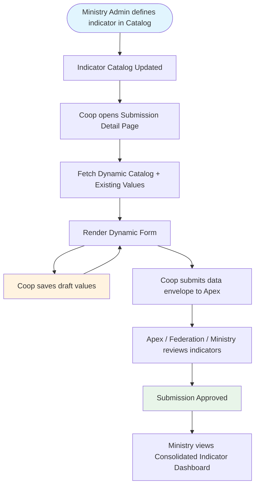

# Design Document: Non-Financial Information Ledger (US2.4)

> **CRITICAL INSTRUCTION FOR ANY DEVELOPER OR AI**  
> You **MUST** fill this entire document with the user/client before writing a single line of code.  
> If any section is empty or says "[FILL ME]", **STOP** and ask the user for the missing information.  
> This file is the contract. Nothing gets built until this is signed off.

## 1. Project Name & One-Line Description

**Project Name:** Non-Financial Information Ledger (US2.4)  
**Tagline:** Dynamic catalog-driven periodic indicators for cooperative governance and operational tracking.

## 2. Target Users & Roles

- **Ministry Admin** — Platforms super-admin. Fully manages the Indicator Catalog (create, update, delete indicators). Views consolidated reports and analytics across all cooperatives.
- **Cooperative Manager** — Cooperative user. Fills in the periodic indicators dynamic form scoped to their annual submission, saves drafts, and submits them to reviewers.
- **Apex / Federation Reviewer** — Organization reviewer. Reviews the filled indicators as part of the 4-tier submission review process.
a
## 3. Core User Stories (MVP)

```
As a Ministry Admin, I want to define indicators in a catalog (name, display name, description, data type, required status, scope by cooperative type) so that they dynamically appear for the relevant cooperatives in Eswatini.
As a Cooperative Manager, I want to see the dynamic indicators form on my Submission Detail Page so that I can report our yearly periodic indicators (e.g. board size, women on board, meetings held, training hours).
As a Cooperative Manager, I want to save my periodic indicators as drafts so that I can complete and verify them before final submission.
As a Ministry Admin, I want to select a dynamic indicator from a dropdown and view its consolidated metrics (sum, average, count) across all reporting cooperatives, broken down by region and cooperative type.
As an Apex / Federation reviewer, I want to view a cooperative's periodic indicator submission so that I can verify their operational compliance before approving the submission.
```

## 4. Full App Flow (Mermaid)



## 5. Complete Routes & Pages Table

No new page routes are required. Instead, the forms and widgets will be integrated into the existing pages:

| Route / Component | Description | Access | Notes |
| :--- | :--- | :--- | :--- |
| `SubmissionDetailPage.tsx` | Integrated dynamic form card showing dynamic indicators. | Private (Cooperative, Reviewers) | Read-write for cooperative in Draft status; read-only for reviewers or when submitted. |
| `AnalyticsPage.tsx` | Dynamic Indicator consolidation widget (dropdown + metric cards + Recharts bar chart). | Private (Ministry, Federation, Apex) | |
| `SettingsPage.tsx` | Admin settings interface for managing the indicator catalog. | Private (Ministry only) | Standard CRUD table for dynamic catalog. |

## 6. Data Models (TypeScript / Database)

### 6.1 Database Schema (PostgreSQL)

```sql
CREATE TYPE indicator_data_type AS ENUM ('number', 'text', 'boolean');

CREATE TABLE IF NOT EXISTS non_financial_indicator_catalog (
  id              UUID PRIMARY KEY DEFAULT gen_random_uuid(),
  indicator_name  VARCHAR(100) NOT NULL UNIQUE,
  display_name    VARCHAR(255) NOT NULL,
  description     TEXT,
  data_type       indicator_data_type NOT NULL,
  coop_type       VARCHAR(50), -- Scopes to a cooperative type (sacco, farm, transport, etc.), or NULL for all
  is_required     BOOLEAN NOT NULL DEFAULT false,
  created_at      TIMESTAMPTZ NOT NULL DEFAULT now(),
  updated_at      TIMESTAMPTZ NOT NULL DEFAULT now()
);

CREATE TABLE IF NOT EXISTS non_financial_indicator_entries (
  id                          UUID PRIMARY KEY DEFAULT gen_random_uuid(),
  submission_id               UUID NOT NULL REFERENCES submissions(id) ON DELETE CASCADE,
  catalog_id                  UUID NOT NULL REFERENCES non_financial_indicator_catalog(id) ON DELETE RESTRICT,
  value_numeric               NUMERIC(15,2),
  value_text                  TEXT,
  value_boolean               BOOLEAN,
  created_at                  TIMESTAMPTZ NOT NULL DEFAULT now(),
  updated_at                  TIMESTAMPTZ NOT NULL DEFAULT now(),
  UNIQUE (submission_id, catalog_id)
);
```

### 6.2 TypeScript Interfaces

```typescript
export type IndicatorDataType = "number" | "text" | "boolean";

export interface IndicatorCatalogItem {
  id: string;
  indicator_name: string;
  display_name: string;
  description: string | null;
  data_type: IndicatorDataType;
  coop_type: string | null;
  is_required: boolean;
  created_at: string;
  updated_at: string;
}

export interface IndicatorEntry {
  id?: string;
  submission_id: string;
  catalog_id: string;
  value_numeric?: number | null;
  value_text?: string | null;
  value_boolean?: boolean | null;
  created_at?: string;
  updated_at?: string;
}

export interface ConsolidatedMetrics {
  indicator_name: string;
  display_name: string;
  data_type: IndicatorDataType;
  unit: string;
  total_sum?: number;
  average?: number;
  count: number;
  by_region: { region: string; sum?: number; average?: number; count: number }[];
  by_coop_type: { coop_type: string; sum?: number; average?: number; count: number }[];
}
```

## 7. API Endpoints (Backend contract)

| Method | Endpoint | Purpose | Auth Required | Access |
| :--- | :--- | :--- | :--- | :--- |
| **GET** | `/api/v1/non-financial-indicators/catalog` | List all available indicators. | Yes | All roles |
| **POST** | `/api/v1/non-financial-indicators/catalog` | Create an indicator. | Yes | Ministry only |
| **PUT** | `/api/v1/non-financial-indicators/catalog/{id}`| Update an indicator. | Yes | Ministry only |
| **DELETE**| `/api/v1/non-financial-indicators/catalog/{id}`| Delete an indicator. | Yes | Ministry only |
| **GET** | `/api/v1/submissions/{id}/non-financial-indicators` | Get saved values. | Yes | All roles |
| **POST** | `/api/v1/submissions/{id}/non-financial-indicators` | Save entries (batch). | Yes | Cooperative only |
| **GET** | `/api/v1/analytics/consolidate` | Fetch aggregates for consolidation. | Yes | Ministry, Federation, Apex |

## 8. Tech Stack & Libraries (final decision)

- **Backend**: Rust (Axum + SeaORM + utoipa)
- **Frontend**: React + Vite (TanStack Router + TanStack Query)
- **Styling**: Tailwind CSS + shadcn/ui
- **Forms**: React Hook Form + Zod
- **Visuals**: Recharts (for analytics widgets)

## 9. Non-Functional Requirements

- **Validation**: Strict client-side and server-side validation based on catalog `data_type` and `is_required`.
- **Integrity**: Deletion of catalog item is blocked (ON DELETE RESTRICT) if it already has entries.
- **Audit Logging**: Any CRUD actions on the catalog or submissions are logged via the established `AuditService`.

## 10. Open Questions / Decisions Needed

- **Q: What default indicators should we seed the database with?**  
  *A: We will seed the database with standard indicators from the Excel sheets (e.g. `board_size_total`, `women_on_board_count`, `youth_on_board_count`, `training_hours_annual`, `agm_held_flag`).*
- **Q: Can the coop update indicators after submitting?**  
  *A: No, when the submission is in review tiers (Apex, Federation, Ministry), the form becomes read-only, matching the Financial Statement review rules.*
- **Q: Are indicators scoped by cooperative type?**  
  *A: Yes, the catalog allows specifying `coop_type` (e.g. sacco, farm). If `coop_type` is null, it applies to all cooperatives.*
