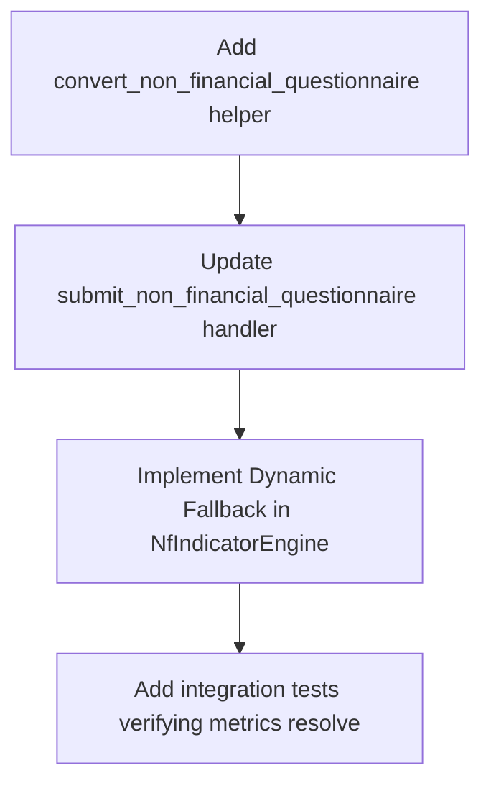

# Manual Entry Mapping Analysis & Way Forward

This document provides a deep analysis of how the **Financial** and **Non-Financial Questionnaires** map to the database schema of the CoopData system. It outlines a detailed mapping plan and proposes a robust way forward to handle the structural mismatch between aggregate manual entry data and granular database structures.

---

## 1. Context & Architectural Overview

The CoopData system supports two methods of data ingestion for annual submissions:
1. **File Uploads (Extraction):** Uploading raw member lists, Excel sheets, and financial statements. This populates granular tables (`members`, `savings_accounts`, `loans`, `fixed_deposits`) and generates financial ledger line items.
2. **Manual Questionnaire Entry:** For cooperatives without digital systems, they manually enter their data via a questionnaire.

### The Structural Mismatch
* **Financial Data:** The manual questionnaire enters summary data (Assets, Liabilities, Equity) and portfolio values. This is already successfully handled by `convert_financial_questionnaire` in [questionnaire_converter.rs](file:///home/ariel/Desktop/CoopData/backend/src/services/questionnaire_converter.rs), which translates these inputs into standardized balance sheet line items (e.g. Account Code `1999` for Total Assets, `2101` for Member Savings). Thus, **the financial manual entry maps perfectly into the KPI engine**.
* **Non-Financial Data:** The database tables (`members`, `loans`, `savings_accounts`, `fixed_deposits`) are designed for **granular, row-by-row records** (e.g., one row per member with age, gender, agm attendance). The `NfIndicatorEngine` aggregates these tables to compute dashboard metrics. However, the manual questionnaire only collects **aggregated summaries** (e.g., "Total active members: 250 male, 150 female"). If a cooperative uses manual entry, these granular tables remain empty, causing the `NfIndicatorEngine` to return zero for all non-financial statistics.

---

## 2. Core Proposal: Dynamic JSON Fallback & Indicator Mapping

To solve the structural mismatch without bloating the database with thousands of fake member/account rows, we propose a two-pronged approach:

### A. Dynamic Fallback in `NfIndicatorEngine`
Update the [NfIndicatorEngine](file:///home/ariel/Desktop/CoopData/backend/src/services/nf_indicator_engine.rs) to detect the source of data for a submission:
1. Check if granular records exist in the database for the submission ID (e.g., count of members > 0).
2. **If granular data exists:** Execute the existing SQL aggregation logic.
3. **If NO granular data exists:** Load the submission's `metadata` JSON field, extract the `non_financial_questionnaire` or `financial_questionnaire` object, and directly populate the `NfStatisticsResponse` structs using the questionnaire values.

### B. Automated Catalog Indicator Synchronization
When a user saves/submits a questionnaire (either financial or non-financial), the backend will automatically parse the JSON payload, extract key governance, compliance, and demographic metrics, and upsert them as entries in the `non_financial_indicator_entries` table. This maps questionnaire answers directly to catalog-driven indicators for system-wide analytics.

---

## 3. Questionnaire Mapping Specifications

### 3.1 Demographic & Basic Data Mapping (Non-Financial Stats)

These questionnaire fields are used to populate the `NfStatisticsResponse` structure inside the `NfIndicatorEngine` when no granular records are present.

| Questionnaire Section & Field | JSON Path in Questionnaire Request | Target DB Model Field (Aggregated) | Notes / Translation |
| :--- | :--- | :--- | :--- |
| **Membership (Registered)** | `basic_data.registered_members_male` / `_female` | `MembershipStats.total` | Sum of Male + Female |
| **Membership (Active)** | `basic_data.active_members_male` / `_female` | `MembershipStats.active` | Sum of Male + Female |
| **Dormancy** | `basic_data.dormant_members_male` / `_female` | `MembershipStats.dormant` | Sum of Male + Female |
| **Gender Splits** | `basic_data.registered_members_male` / `_female` | `MembershipStats.male` / `female` | Populates gender counts directly |
| **Age Groups (Active)** | `basic_data.active_members_17_under_...` | `MembershipStats.under_18` | Sum of Male + Female |
| | `basic_data.active_members_18_25_...` | `MembershipStats.age_18_35` | Sum of 18-25 Male + Female |
| | `basic_data.active_members_26_35_...` | `MembershipStats.age_18_35` | Sum of 26-35 Male + Female (Aggregated to Youth) |
| | `basic_data.active_members_36_60_...` | `MembershipStats.age_36_50` | Sum of 36-60 Male + Female |
| | `basic_data.active_members_61_plus_...` | `MembershipStats.over_50` | Sum of 61+ Male + Female |
| **AGM Attendance** | `basic_data.agm_attendance_male` / `_female` | `MembershipStats.agm_attendance` | Sum of Male + Female |
| **Savings Balance** | `savings_portfolio.total_savings_male` / `_female` | `SavingsStats.total_balance` | Sum of Male + Female |
| **Savings Accounts** | `savings_portfolio.depositors_male` / `_female` | `SavingsStats.total_accounts` | Sum of Male + Female |
| **Loans Count** | `loan_portfolio.outstanding_accounts_male` / `_female` | `LoanStats.total_loans` | Sum of Male + Female + Coops |
| **Loans Balance** | `loan_portfolio.outstanding_value_male` / `_female` | `LoanStats.total_balance` | Sum of Male + Female + Coops |
| **Arrears Count** | `loan_portfolio.delinquent_accounts_male` / `_female` | `LoanStats.arrears` | Sum of Male + Female + Coops |
| **Arrears Balance** | `loan_portfolio.delinquent_value_0_30_days` / `_31_365_days` | `LoanStats.total_loan_amount` | Delinquent value totals |
| **Written Off** | `loan_portfolio.written_off_value` | `LoanStats.written_off` | Numeric value |

---

### 3.2 Dynamic Indicator Catalog Mapping

Upon submission, the following fields are extracted and written directly to the `non_financial_indicator_entries` table.

| Catalog Indicator Name | Data Type | Source Questionnaire Field (Financial / Non-Financial) | Mapping Logic / Default Translation |
| :--- | :--- | :--- | :--- |
| `board_meetings_held` | `Number` | `basic_data.committee_meeting_frequency` | Map: `"Once a Month"` -> `12`, `"Twice a Month"` -> `24`, `"Quarterly"` -> `4`, `"Other"` -> `6` |
| `agm_held` | `Boolean` | `basic_data.agm_last_held_date` / `agm_up_to_date` | `true` if date is present or up-to-date is true |
| `female_board_members` | `Number` | `basic_data.board_members_female` | Direct mapping |
| `total_board_members` | `Number` | `basic_data.board_members_male` + `_female` | Sum of male + female board members |
| `new_members_joined` | `Number` | `basic_data.registered_members_male` / `_female` | Custom calculation (or defaults to `0` if new submission) |
| `members_exited` | `Number` | `basic_data.dormant_members_male` + `_female` | Used as a proxy for exited/dormant members |
| `youth_members_count` | `Number` | `active_members_18_25` + `26_35` | Sum of youth age cohorts |
| `women_members_count` | `Number` | `basic_data.registered_members_female` | Direct mapping |
| `loan_products_offered` | `Number` | `basic_data.financial_products` | Length of products array |
| `trainings_conducted` | `Number` | `member_empowerment.trainings_conducted` | Direct mapping |
| `members_trained` | `Number` | `member_empowerment.members_trained_last_year` | Direct mapping |
| `audited_accounts_submitted` | `Boolean`| `basic_data.last_audit_date` | `true` if `last_audit_date` is present |
| `ceo_or_manager_appointed` | `Boolean`| `basic_data.staff_manager_male` / `_female` | `true` if manager count > 0 |
| `core_banking_system` | `Boolean`| `basic_data.management_tools` | `true` if array contains `"core_banking"` or similar |
| `it_staff_count` | `Number` | `basic_data.staff_support_male` + `_female` | Sum of support/IT staff |

---

## 4. Execution Step-by-Step Plan



### Step 1: Add Non-Financial Questionnaire Syncing Helper
Create a helper function in `questionnaire_converter.rs` to extract catalog indicators from the non-financial request and format them as `non_financial_indicator_entries::ActiveModel`s. 

### Step 2: Update submit handlers
Modify `submit_non_financial_questionnaire` and `submit_financial_questionnaire` to:
1. Call the sync helper.
2. Upsert the entries into the `non_financial_indicator_entries` table.

### Step 3: Implement JSON Fallback inside `NfIndicatorEngine`
Modify [nf_indicator_engine.rs](file:///home/ariel/Desktop/CoopData/backend/src/services/nf_indicator_engine.rs):
```rust
// Pseudocode concept for compute_membership fallback
let member_count = member::Entity::find().filter(C::SubmissionId.eq(submission_id)).count(db).await?;
if member_count > 0 {
    // Execute SQL aggregation query...
} else if let Some(sub) = submission {
    if let Some(q_val) = sub.metadata.get("non_financial_questionnaire") {
        let q: NonFinancialQuestionnaireRequest = serde_json::from_value(q_val.clone())?;
        // Directly map q.basic_data fields to MembershipStats...
    }
}
```

---

## 5. Verification & Testing

### Automated Tests
1. **Questionnaire Persistency Test:** Verify that submitting a manual questionnaire updates `non_financial_indicator_entries` with appropriate indicator mappings (e.g. `female_board_members`).
2. **Dashboard Fallback Test:** Submit a manual questionnaire, query `/api/v1/cooperative/nf-statistics`, and assert that the returned membership, savings, and loan statistics match the questionnaire totals despite the granular tables being empty.
