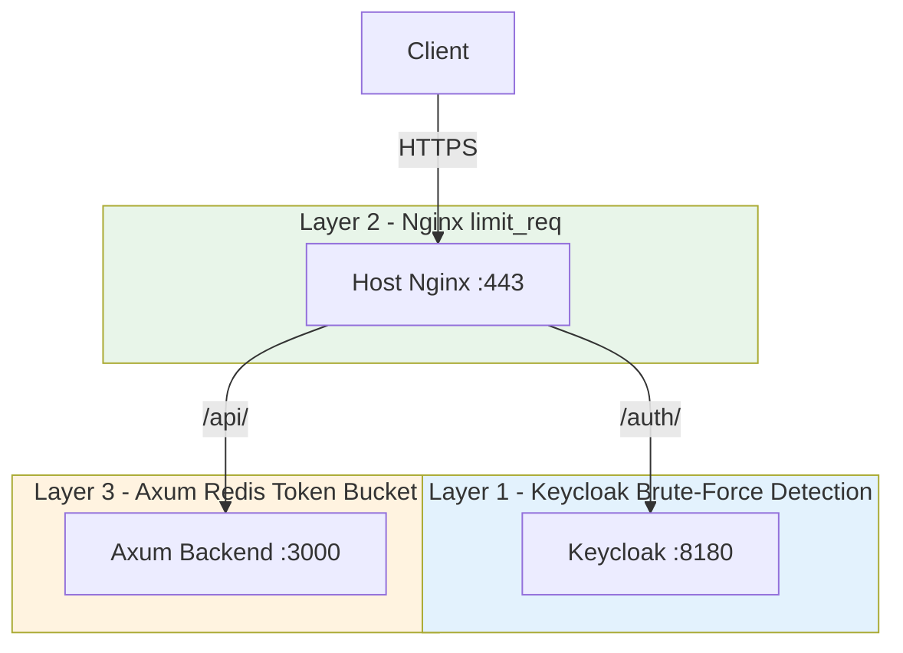

# Design Document: Rate Limiting & Abuse Prevention

> **CRITICAL INSTRUCTION FOR ANY DEVELOPER OR AI**
> This is the source of truth for the rate-limiting epic (T6 / #134).
> All implementation must follow this document.

## 1. Feature Name & One-Line Description

**Feature Name:** Rate Limiting & Abuse Prevention
**Tagline:** Protect sensitive auth endpoints against brute-force and abuse via layered, configurable rate limiting.

## 2. Scope Decision (important)

The original ticket referenced two endpoints that **do not exist** in this codebase:

- `/api/v1/auth/login` — **does not exist.** Login is delegated to **Keycloak OIDC** (frontend `keycloak-js` redirects to Keycloak's `/protocol/openid-connect/token`). There is no backend login route.
- `/api/v1/sync/push` — **does not exist.** The frontend offline queue (`syncQueueService.ts` + Dexie) replays the real API calls; there is no dedicated sync endpoint.

**Decision (confirmed with stakeholder):**
- **Drop `/api/v1/sync/push` entirely** — it was a mistake; no sync rate limit is implemented.
- **Login brute-force protection** is delivered as a **3-layer defense** (see §4), because the real login happens at Keycloak, not in Axum.

## 3. Target Users & Roles

- **All authenticated users** — subject to Axum rate limits on sensitive auth endpoints.
- **All unauthenticated visitors** — subject to nginx + Keycloak login throttling.

## 4. Architecture — 3-Layer Defense



| Layer | Where | What it protects | Key | Limit (default) |
| ----- | ----- | ---------------- | --- | --------------- |
| 1. Keycloak brute-force detection | Keycloak realm config | Real login (`/auth/realms/*/protocol/openid-connect/token`) | user + IP | Keycloak defaults |
| 2. Nginx `limit_req` | `nginx-host.conf` `/auth/` location | Real login token endpoint | `$binary_remote_addr` | 5 req/min burst 10 |
| 3. Axum Redis token bucket | Backend middleware | Backend auth-adjacent endpoints | client IP | 5 req/min |

## 5. Endpoints Protected (Axum layer)

All are in `shared_routes()` (`src/api/routes/shared.rs`), authenticated, keyed by **client IP**:

| Method | Endpoint | Why |
| ------ | -------- | --- |
| POST | `/api/v1/me/verify-identity` | Verifies current password (brute-force surface) |
| POST | `/api/v1/me/password` | Password change |
| GET | `/api/v1/me/security` | Security settings |
| POST | `/api/v1/me/security/mfa/setup` | MFA setup |
| POST | `/api/v1/me/security/mfa/enable` | MFA enable |
| POST | `/api/v1/me/security/mfa/reset` | MFA reset |
| DELETE | `/api/v1/me/security/mfa` | MFA disable |

## 6. Implementation Plan

### 6.1 Backend — Redis token bucket middleware

- New module `src/api/rate_limit.rs` (or extend `src/api/middleware.rs`).
- Middleware `from_fn_with_state` using the existing `CacheService` (`src/services/cache.rs`):
  - **Redis backend:** atomic `INCR` + `EXPIRE` (or `INCRBY`/`PEXPIRE`) on key `rl:{scope}:{key}`.
  - **Memory backend:** reuse `CacheService` memory map for dev/tests.
- Key derivation:
  - Auth endpoints → client IP via `AuditContext` (already extracted by `audit_context_layer`).
- On limit exceeded → **429** with **`Retry-After`** header (remaining TTL of the key).
- **Configurable** via `AppConfig` env vars (see §7).
- Wire into `create_app` (`src/api/routes/api.rs`) — apply the layer to the auth-adjacent routes only (not the whole app).

### 6.2 Nginx `limit_req` (login)

- In `nginx-host.conf`, add a `limit_req_zone` keyed by `$binary_remote_addr` and a `limit_req` directive on the `/auth/` location (Keycloak token path).
- Return `429` with `Retry-After` via `limit_req_status 429;` + `limit_req_log_level`.

### 6.3 Keycloak brute-force detection

- Enable brute-force detection in the realm import JSON (`keycloak/realm-coopdata.json`): `bruteForceProtected: true`, `failureFactor: 5`, `maxFailureWaitSeconds`, `minimumQuickLoginWaitSeconds`, `waitIncrementSeconds`, `quickLoginCheckMilliSeconds`, `permanentLockout`.
- **Field-name caveat:** use `failureFactor` (the failure threshold) and `maxFailureWaitSeconds` — NOT `maxLoginFailures` or `maxWaitSeconds`, which are **not** valid fields in Keycloak 26.4 and cause the realm import to fail.
- **Import caveat (important):** Keycloak's `--import-realm` **skips realms that already exist** in the DB. So editing the JSON only takes effect on a **fresh** deployment. On an **existing** deployment you must apply the change via the admin API (PUT `/admin/realms/{realm}`), delete the realm, or force re-import. Verify with:
  ```
  GET /admin/realms/coop-data  →  bruteForceProtected, failureFactor
  ```

## 7. Configuration (Twelve-Factor — env vars only)

| Env var | Default | Purpose |
| ------- | ------- | ------- |
| `RATE_LIMIT_AUTH_MAX` | `5` | Max requests per window |
| `RATE_LIMIT_AUTH_WINDOW_SECS` | `60` | Window length (seconds) |

The rate limiter reuses the existing `CacheService` backend, which is already
selected by `REDIS_URL` (`redis://` = Redis token bucket, `memory://` = in-memory
for dev/tests). No separate backend switch is needed.

- Add to `backend/.env.example`, root `.env.example`, and `docker-compose*.yml` as needed.
- No secrets; all values are non-sensitive tuning knobs.

## 8. Non-Functional Requirements

- **Configurable** — all limits via env vars.
- **429 + Retry-After** — required on every limited response.
- **Horizontal scaling** — Redis-backed bucket works across replicas.
- **Low overhead** — single Redis round-trip per request; memory backend for dev.
- **Graceful degradation** — if Redis is down, fail-open (log + allow) to avoid locking out all users.

## 9. Verification

- Send >5 rapid requests to `/api/v1/me/verify-identity` → expect `429` with `Retry-After`.
- Confirm limits are configurable (change env, restart, re-test).
- Confirm normal traffic (< limit) is unaffected.
- Confirm Redis-backed bucket works across two app instances (shared counter).
- `cargo clippy` + `cargo test` clean.

## 10. Open Questions / Decisions

- [x] Drop `/api/v1/sync/push` (stakeholder confirmed — mistake).
- [x] Login handled via 3-layer defense (Keycloak + nginx + Axum).
- [x] Redis token bucket over `tower_governor` (horizontal scaling).
- [x] Auth endpoints keyed by IP.
- [ ] Confirm exact Keycloak brute-force thresholds for realm config.
- [ ] Confirm whether nginx `limit_req` should also apply to `/api/` generally (out of scope for now).
