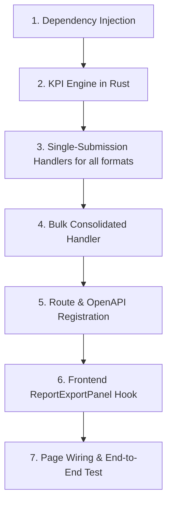

# Design Document — Report Export Structures & Formats

This document defines the data content, layout structure, and implementation roadmap for the multi-tiered report export system.

---

## 1. Report Data Contents by Tier

### A. Cooperative Level (Individual Submission Report)
For a single cooperative submission, the export generates a detailed record of the financial statement and operational KPIs in XLSX, CSV, DOCX, or PDF. All formats are generated server-side.

#### XLSX Format (Excel)
- **Sheet 1: Balance Sheet**:
  - Metadata Header: Cooperative Name, Submission Reference (UUID), Reporting Year/Month, Status, Verification/AI Extraction confidence.
  - Table Data:
    - `Account Code` (e.g. 1101, 1201, 2101)
    - `Account Name` (e.g. Cash on Hand, performing loan portfolio)
    - `Category` (Assets, Liabilities, Equity, Income, Expenses)
    - `Value (SZL)` (Numerical value formatted as currency)
    - `AI Confidence` (Confidence percentage if extracted, otherwise blank or 100% for manual inputs)
- **Sheet 2: Key Performance Indicators (KPIs)**:
  - Table Data:
    - `Category` (e.g., Financial Performance, Portfolio Quality, Profitability, Membership)
    - `KPI Name` (e.g., Capital Adequacy Ratio, PAR 30, ROA)
    - `Description` (Plain text explaining the metric formula/meaning)
    - `Value` (Formatted appropriately based on unit: currency, percent, ratio, or count)
    - `Benchmark` (Standard regulatory/industry targets)
    - `Status` (Color-coded cell: Green, Amber, Red)

#### CSV Format
- A flat CSV dump containing:
  - Column 1: Item Type (e.g., "Balance Sheet Line Item" or "KPI")
  - Column 2: Account Code / KPI ID
  - Column 3: Name / Description
  - Column 4: Value (numeric/formatted)
  - Column 5: Status / Confidence

#### DOCX Format (Word)
- Generates a styled Word document using `docx-rs`:
  - **Cover Header**: Cooperative Report, generated date, submission period.
  - **Balance Sheet Section**: Formatted Word table with bordered cells, bold category headers, and aligned values.
  - **KPI Dashboard Section**: Formatted Word table listing all computed metrics grouped by category, with benchmarks.

#### PDF Format
- Generates a professional, print-ready PDF document using `printpdf` (with built-in Helvetica font):
  - Clean page layouts with margins (20mm).
  - Page titles and cooperative details.
  - Tabular layout for Balance Sheet and KPI metrics.

---

### B. Apex Level (Apex Consolidated Report)
Consolidates data for all cooperatives operating under a single Apex entity.

- **Sheet 1: Summary Dashboard**:
  - Key aggregated metrics: Total consolidated assets, total loans outstanding, total member savings, total members.
  - List of member cooperatives with their submission status and compliance score.
- **Sheet 2: KPI Aggregates**:
  - Mean/median KPI values across all member cooperatives compared to national benchmarks.
- **Subsequent Sheets**: One tab per member cooperative containing their individual KPI breakdown.

---

### C. Federation Level (Federation Consolidated Report)
Aggregated performance data across all Apexes and member cooperatives under a Federation.

- **Sheet 1: Federation Overview**:
  - Summary of registered cooperatives and active submissions by Apex group.
  - Total consolidated asset base and loan/savings metrics.
- **Sheet 2: Apex Comparison**:
  - Side-by-side performance comparison of Apexes under the Federation.

---

### D. Ministry Level (National Consolidated Report)
A comprehensive nationwide master sheet with access to all datasets for oversight and policy formulation.

- **Sheet 1: National Analytics**:
  - Filing rates (compliance tracker) by region and cooperative sector.
  - Total national savings, credit volume, and cooperative member count.
  - Frequency analysis of risk flags (e.g., how many SACCOs breached CAR threshold).
- **Sheet 2: Full Directory**:
  - Flat table containing all submissions, financial statements, and regional indicators for easy pivot-table analysis.

---

## 2. Report Generation Lifecycle & Cascading Updates

Because the reports are computationally heavy (involving AI generation and headless browser PDF rendering), the system uses a background task queue (the "Minion") to pre-warm the cache rather than generating PDFs on-the-fly when a user clicks download.

### Cascading Regeneration on Approval
The moment a submission is approved (e.g., by the Ministry), the data across all higher-level reports instantly changes. To ensure that Apex, Federation, and Ministry users always download perfectly up-to-date reports, the system automatically triggers a cascading regeneration:

1. **Individual Cooperative Export**: Generated immediately upon approval.
2. **Apex Consolidated Export**: Regenerated immediately after the individual export.
3. **Federation Consolidated Export**: Regenerated immediately after the Apex export.
4. **Ministry Consolidated Export**: Regenerated immediately after the Federation report.

All tiers launch back-to-back; concurrency is paced by the backend's AI and Gotenberg semaphores, and the LLM client's 429-aware retry logic absorbs any provider rate limits.

### Report Generation Optimizations
To ensure the export generation scales and performs efficiently, we have implemented one major optimization and planned two future optimizations:

1. **Exact-Millisecond Capture via `window.isReady` (COMPLETED):**
   - **Previous State:** Gotenberg was hardcoded to wait exactly 15 seconds (`waitDelay: "15s"`) before capturing the PDF, leading to massive wasted time or capturing loading spinners if the network was slow.
   - **Optimization:** We added a `useEffect` in the React frontend that signals `window.isReady = true` the exact millisecond the charts finish drawing. Gotenberg now uses `waitForExpression: "window.isReady === true"`, acting as a sniper to capture the PDF instantly, drastically reducing generation latency.

2. **Removing Artificial Timers (LLM Rate Limits):**
   - **Current State:** To avoid free-tier Gemini API limits, the system manually pauses for 65 seconds between triggering each tier (Cooperative -> Apex -> Federation -> Ministry), leading to a ~4-5 minute total generation time.
   - **Optimization:** By upgrading to a paid LLM tier with higher limits, we can completely delete the `tokio::time::sleep(65)` calls. Instead of forcing parallelization, we will simply rely on the system's already-built safety rails (`ai_semaphore`, `gotenberg_semaphore`, and 429 retries) to throttle requests naturally. This will reduce the total background processing time to roughly 1-2 minutes (bottlenecked primarily by Gotenberg's rendering speed).

3. **Headless Mode for React (Planned - Skipping Animations):**
   - **Current State:** The React app plays 1-second CSS and Framer Motion animations when mounting the charts, forcing Gotenberg to delay its snapshot to avoid capturing half-rendered graphs.
   - **Optimization:** Pass a `?headless=true` parameter in the Gotenberg URL. The React app will detect this flag, disable all chart animations (`isAnimationActive={false}`), and instantly snap the charts to the screen, allowing Gotenberg to capture the PDF a full second faster for every single report.

---

## 3. Implementation Roadmap

1. **Step 1: Dependency Injection** — Add `rust_xlsxwriter`, `csv`, `docx-rs`, and `printpdf` to the backend workspace.
2. **Step 2: KPI Engine in Rust** — Port the formula logic from `kpi-calculations.ts` to `kpi_engine.rs` to compute financial/non-financial metrics from the database models.
3. **Step 3: Single-Submission Handlers for all formats** — Implement individual export handlers for XLSX, CSV, DOCX, and PDF formats.
4. **Step 4: Bulk Consolidated Handler** — Implement tier-based endpoint for Apex/Federation/Ministry to generate multi-sheet Excel files.
5. **Step 5: Route & OpenAPI Registration** — Map routes to Axum and run the OpenAPI generator to sync TypeScript client types.
6. **Step 6: Frontend ReportExportPanel Hook** — Update UI to trigger backend downloads using blobs and authenticating via Keycloak JWT token.
7. **Step 7: Page Wiring & End-to-End Test** — Verify the export triggers seamlessly across Cooperative, Apex, and Ministry views.
