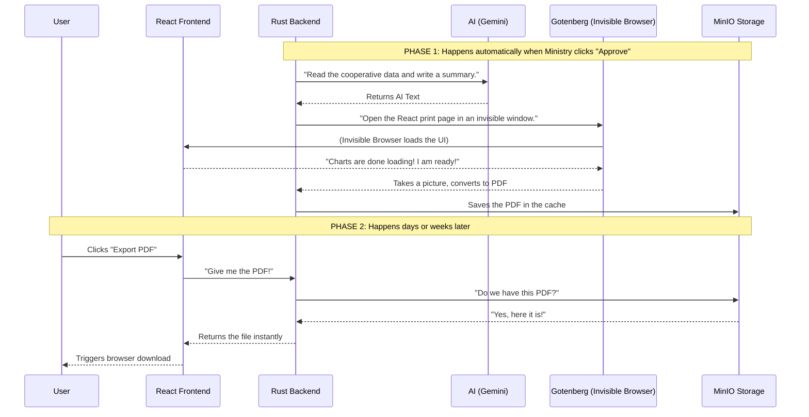

# Report Export Simplified Flow

Here is a visual representation of how the PDF export works. It happens in two completely separate phases. 

The first phase is the "Heavy Lifting" which happens automatically in the background when the Ministry approves a report. The second phase is the "Fast Download" which happens instantly when a user clicks the export button.

---

### Phase 1: The Heavy Lifting (Happens in the background)
When a submission is **approved**, the backend immediately starts doing all the hard work in the background so the user never has to wait for it later.

1. **AI Generation**: The Backend reads all the financial numbers and asks the AI (Gemini) to write the text paragraphs for the report.
2. **The "Invisible Browser"**: The Backend sends a special URL to a service called **Gotenberg**. Think of Gotenberg as a ghost sitting at a computer. It opens a hidden Google Chrome window, navigates to a secret page on our React frontend, and waits.
3. **Taking the Picture**: Our React frontend loads the page, draws all the charts and tables, and then yells, *"I am ready!"* Gotenberg immediately takes a "snapshot" of the webpage, turns it into a PDF file, and gives it to the Backend.
4. **Saving it for later**: The Backend takes that PDF and puts it in a storage box (MinIO/S3).

### Phase 2: The Fast Download (When you click Export)
Because of the heavy lifting done in Phase 1, downloading the report is incredibly fast.

1. You click **"Export PDF"** on the website.
2. The website asks the Backend for the PDF.
3. The Backend checks its storage box, finds the PDF already sitting there, and gives it back to the website instantly.
4. The website triggers the "Save File" dialog on your computer.

## 8. Report Generation Optimizations
To ensure the export generation scales and performs efficiently, we have implemented one major optimization and planned two future optimizations:
1. **Exact-Millisecond Capture via `window.isReady` (COMPLETED):**
   - **Previous State:** Gotenberg was hardcoded to wait exactly 15 seconds (`waitDelay: "15s"`) before capturing the PDF, leading to massive wasted time or capturing loading spinners if the network was slow.
   - **Optimization:** We added a `useEffect` in the React frontend that signals `window.isReady = true` the exact millisecond the charts finish drawing. Gotenberg now uses `waitForExpression: "window.isReady === true"`, acting as a sniper to capture the PDF instantly, drastically reducing generation latency.
2. **Removing Artificial Timers (LLM Rate Limits) (COMPLETED):**
   - **Previous State:** To avoid free-tier Gemini API limits, the system manually paused for 65 seconds between triggering each tier (Cooperative -> Apex -> Federation -> Ministry) via an `ExportQueue`, leading to a ~4-5 minute total generation time.
   - **Optimization:** We completely removed the `ExportQueue` and `tokio::time::sleep(65)` calls. Approvals now instantly spawn background threads for all 4 tiers simultaneously (`tokio::spawn`). The system relies entirely on the `ai_semaphore` (18 permits) and `gotenberg_semaphore` (2 permits) to safely throttle the 1,800+ concurrent requests under heavy load.
3. **Headless Mode for React (Planned - Skipping Animations):**
   - **Current State:** The React app plays 1-second CSS and Framer Motion animations when mounting the charts, forcing Gotenberg to delay its snapshot to avoid capturing half-rendered graphs.
   - **Optimization:** Pass a `?headless=true` parameter in the Gotenberg URL. The React app will detect this flag, disable all chart animations (`isAnimationActive={false}`), and instantly snap the charts to the screen, allowing Gotenberg to capture the PDF a full second faster for every single report.
## 9. Performance & Benchmarking

With the 65-second artificial queue removed, the PDF generation pipeline achieves the following benchmarks under load (generating Cooperative, Apex, Federation, and Ministry exports simultaneously):

| Scenario | Generation Time | Bottleneck |
| :--- | :--- | :--- |
| **Before Optimization** | **~4-5 minutes** | Artificial `tokio::time::sleep(65)` between each tier |
| **From Scratch (Fresh AI)** | **~46.6 seconds** | LLM Provider response time for 20 parallel prompts |
| **Cached Narratives** | **~20.5 seconds** | Gotenberg rendering speed (React Chart animations) |

*Note: You can benchmark this live at any time by watching the backend logs (`docker compose logs backend -f`). Trigger an approval and check the `[export] ✅ Export complete | total=...ms` output log.*

## 10. Hardware Scaling & Semaphore Tuning
The backend relies on two critical semaphores (defined in `backend/src/main.rs`) to prevent the server from crashing under heavy concurrency:
1. **`ai_semaphore`**: Controls how many isolated HTTP requests are actively sent to the AI API (Gemini) at any given time.
2. **`gotenberg_semaphore`**: Controls how many concurrent Headless Chromium instances Gotenberg is allowed to spawn.
**Gotenberg Resource Guidelines:**
Headless Chromium is highly resource-intensive. A single concurrent PDF render of a heavy React page (with Recharts) generally consumes **~1 CPU Core** and **~400MB to 600MB of RAM**. 
Before increasing the `gotenberg_semaphore` limit beyond its default of `2`, you should evaluate your server's true capacity using `docker stats gotenberg` during a live export. Divide your server's dedicated free RAM by the observed spike (e.g., 4000MB Free RAM / 500MB per render = Max Semaphore of 8) to find your safe hardware limit.
