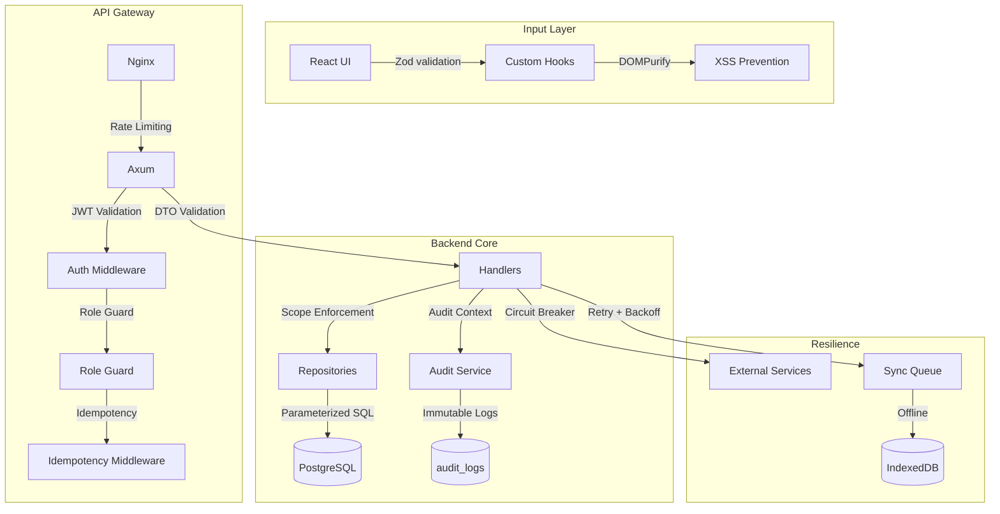

# Design Document: Security, Reliability, and Testing Lifecycle Hardening

> **Epic:** [Issue #107](https://github.com/ADORSYS-GIS/CoopData/issues/107)
> **Epic ID:** EPIC-SEC-RELIABILITY-01
> **Status:** In Progress (T1+T2 Complete)
> **Priority:** High
> **Parent Initiative:** System Hardening & Compliance
> **Last Updated:** September 7, 2026

## 1. Project Name & One-Line Description

**Project Name:** CoopData Security & Reliability Hardening
**Tagline:** Comprehensive security, fault tolerance, and testing lifecycle for the cooperative data platform.

## 2. Target Users & Roles

All existing roles (Ministry, Federation, Apex, Cooperative) benefit from:
- **Data isolation**: No cross-tenant data leakage
- **Input protection**: SQL injection, XSS, command injection prevention
- **Reliability**: Graceful degradation during network partitions
- **Auditability**: Tamper-evident logging of sensitive actions
- **Testing**: Automated verification of security and reliability claims

## 3. Core User Stories (MVP)

```
As a security auditor, I want all user input validated and sanitized so that injection attacks are impossible.
As a cooperative user, I want my data isolated from other cooperatives so that privacy is guaranteed.
As a system administrator, I want audit logs of all mutations so that compliance can be verified.
As a developer, I want automated tests for security properties so that regressions are caught in CI.
As a user, I want the app to work offline so that field data collection is uninterrupted.
As a user, I want clear error messages so that I can recover from failures without exposing system internals.
```

## 4. Full Security Architecture Flow



## 5. Ticket Breakdown & Implementation Order

### Focus Area A: Application Security & Identity Management (T1-T8)

| # | Ticket | Scope | Dependencies | Status |
|---|--------|-------|--------------|--------|
| T1 | Input Sanitization & Injection Prevention | Backend + Frontend DTOs | None | ✅ Complete |
| T2 | Auth & Authorization (Double-Gatekeeper) | Backend middleware + Frontend guards | T1 | ✅ Complete |
| T3 | Session Management & Token Expiry | Frontend AuthContext + Keycloak config | T2 |
| T4 | Password Complexity Rules | Keycloak realm config | None |
| T5 | Secrets Management | Pre-commit hooks + Config | None |
| T6 | Rate Limiting (Axum) | Backend middleware | None |
| T7 | IP Rate Limiting & DDoS | Nginx config | None |
| T8 | Multi-Tenancy & Data Isolation | Backend repositories | T1 |

### Focus Area B: Reliability & Fault Tolerance (T9-T14)

| # | Ticket | Scope | Dependencies |
|---|--------|-------|--------------|
| T9 | Audit Trails & Tamper-Evident Logging | Backend audit service | T8 |
| T10 | Error Handling & Safe Messages | Backend error.rs + Frontend ErrorBoundary | None |
| T11 | Graceful Degradation (Offline) | Frontend offline layer | None |
| T12 | Retry with Backoff + Idempotency | Backend middleware + Frontend sync | T11 |
| T13 | Circuit Breakers & Fallbacks | Backend services | None |
| T14 | Concurrency & Race Conditions | Backend entities + DB constraints | None |

### Focus Area C: Quality Assurance & CI/CD (T15-T21)

| # | Ticket | Scope | Dependencies |
|---|--------|-------|--------------|
| T15 | Unit, Integration & E2E Tests | All layers | All above |
| T16 | Regression Tests | CI pipeline | T15 |
| T17 | Load & Stress Testing | k6 scripts | T15 |
| T18 | Chaos & Resilience Testing | Docker + test scripts | T13 |
| T19 | Test Coverage Thresholds | CI config | T15 |
| T20 | Code Review Process | GitHub templates | None |
| T21 | Dependency Scanning | Trivy/Dependabot | None |

## 5.1 T1 Implementation Details

### Frontend XSS Prevention
- Installed `dompurify` v3.x + `@types/dompurify`
- Sanitized 2 `dangerouslySetInnerHTML` usages:
  - `chart.tsx`: CSS-in-JS styles with `USE_PROFILES: { html: false }`
  - `QuestionnaireAnalyticsPage.tsx`: i18n translations with `USE_PROFILES: { html: true }`

### Backend DTO Validation
- Installed `validator = { version = "0.18", features = ["derive"] }`
- Added `#[derive(Validate)]` to 7 DTO files:
  - `federation.rs`: Name (1-200 chars), Email (valid format), Description (max 1000)
  - `apex.rs`: Name (1-200 chars), Description (max 1000)
  - `cooperative.rs`: Name (1-200), RegNo (1-50), TIN (max 20), Phone (max 30)
  - `user.rs`: Email (valid format), Role (1-50), Password (8-128 chars)
  - `invitation.rs`: Email (valid format), Names (1-100), Role (1-50), URL (valid)
  - `submission.rs`: ReportingYear (2000-2100), PeriodType (max 20), Status (1-50)
  - `organization.rs`: Name (1-200), Email (valid format), Phone (max 30)

### File Upload Path Traversal Prevention
- Sanitized `file_name` in `non_financial.rs` and `upload.rs`
- Strips `/`, `\`, `\0`, control characters
- Falls back to default filename if empty after sanitization

### Verification
- ✅ `cargo clippy`: 0 errors
- ✅ `npm run lint`: 0 errors (35 pre-existing warnings)

**Full details:** `docs/features/t1-input-sanitization.md`

## 6. Data Models (New/Modified)

### Audit Log Entity (already exists)
```rust
// backend/src/entities/audit_log.rs
pub struct Model {
    pub id: Uuid,
    pub actor_keycloak_id: String,
    pub action: String,
    pub resource_type: String,
    pub resource_keycloak_id: String,
    pub old_state: Option<String>,
    pub new_state: Option<String>,
    pub ip_address: Option<String>,
    pub user_agent: Option<String>,
    pub created_at: DateTime,
}
```

### Submission Version Column (new for T14)
```rust
// Add to submission entity
pub version: i32,  // Optimistic locking
```

## 7. API Endpoints (New/Modified)

| Method | Endpoint | Purpose | Ticket |
|--------|----------|---------|--------|
| POST | `/api/v1/auth/login` | Rate-limited auth | T6 |
| POST | `/api/v1/sync/push` | Rate-limited sync | T6 |
| GET | `/api/v1/ministry/audit-logs` | Audit log query | T9 |
| GET | `/{resource}/{id}/delete-preview` | Cascade preview | T8 |

## 8. Tech Stack & Libraries

- **Input Validation (Backend):** `validator` crate macros on DTO structs
- **Input Validation (Frontend):** Zod schemas (already in use)
- **XSS Prevention:** `DOMPurify` (new dependency)
- **Rate Limiting:** `tower-limit` or Redis-backed token bucket
- **Circuit Breaker:** `fail-safe` crate or native timeout
- **Dependency Scanning:** Trivy (container) + Dependabot (packages)
- **Test Coverage:** `tarpaulin` (Rust) + `vitest --coverage` (TypeScript)

## 9. Non-Functional Requirements

- **Security:** OWASP Top 10 compliance, zero hard-coded secrets
- **Reliability:** 99.9% availability, graceful degradation during outages
- **Testing:** 80% minimum code coverage, automated security scans in CI
- **Auditability:** All mutations logged with actor, action, timestamp, old/new state
- **Data Isolation:** Zero cross-tenant data leakage (enforced at DB level)

## 10. Open Questions / Decisions Needed

- [x] Rate limiting strategy: Axum middleware vs Nginx vs both
- [x] Circuit breaker library: `fail-safe` vs native timeout
- [ ] Keycloak password policy: Exact rules (min length, complexity)
- [ ] Audit log retention: How long to keep in DB vs archive
- [ ] Load testing targets: Expected concurrent users, response time SLAs

## 11. Acceptance Criteria (Per Ticket)

Each ticket (T1-T21) has specific acceptance criteria defined in Issue #107. Key verification methods:

| Requirement | Verification Tool | Command |
|-------------|------------------|---------|
| Input Sanitization | ESLint + cargo-audit | `npm run lint` + `cargo clippy` |
| Auth & Scoping | Integration tests | `cargo test --test auth_integration` |
| Rate Limiting | k6 load test | `k6 run scripts/rate_limit_test.js` |
| Data Isolation | Multi-tenant tests | `cargo test --test isolation` |
| Audit Trails | DB verification | `psql -c "SELECT * FROM audit_logs;"` |
| Idempotency | Concurrency test | `python scripts/test_idempotency.py` |
| Dependency Security | Trivy scan | `trivy fs --severity HIGH,CRITICAL .` |

---

**Reference:** Full architecture in `docs/architecture/architecture.md`
**Progress:** Tracked in `docs/architecture/progress.md` (Phase 23+)
