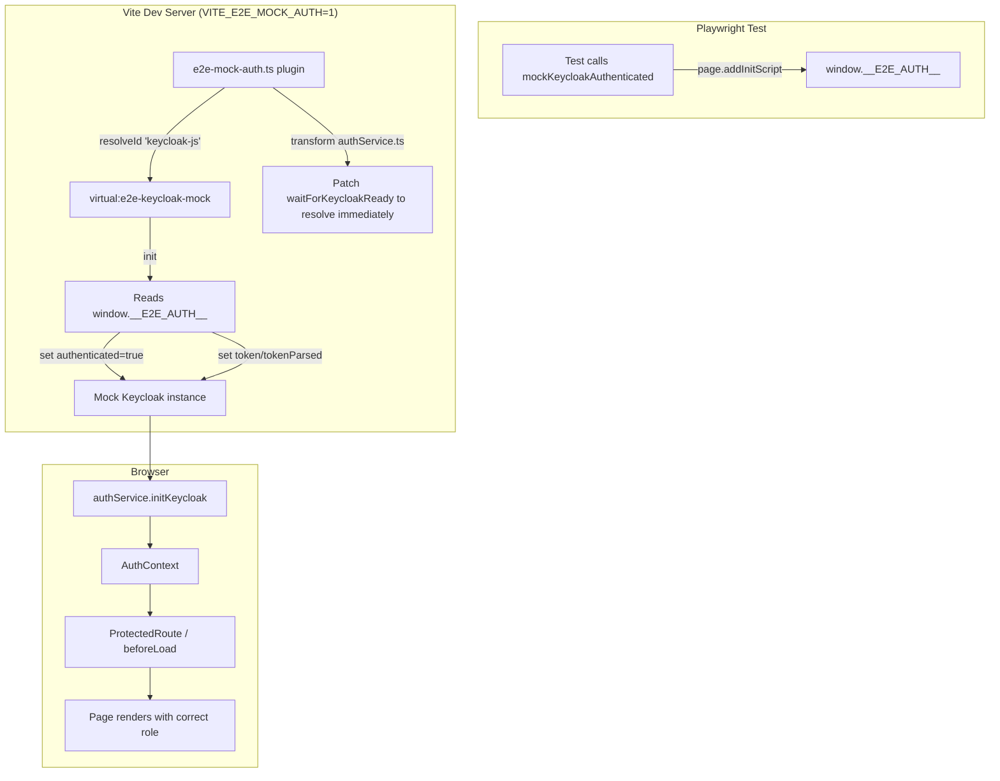

# E2E Mock Auth Architecture

> **Goal**: Mock Keycloak authentication for Playwright E2E tests without a running Keycloak instance.
> **Approach**: Vite plugin that replaces `keycloak-js` with a mock module when `VITE_E2E_MOCK_AUTH=1`.

---

## Architecture Overview



---

## File: `frontend/e2e-mock-auth.ts`

The Vite plugin does three things:

### 1. Replace `keycloak-js` Module

When `VITE_E2E_MOCK_AUTH=1`, the plugin intercepts `import "keycloak-js"` and returns a virtual mock module instead.

```typescript
resolveId(source, importer) {
  if (!enabled) return null;
  if (source === "keycloak-js") return "\0virtual:e2e-keycloak-mock";
  return null;
}
```

### 2. Mock Keycloak Instance

The mock module exports a `KeycloakMock` constructor that returns a shared `mockInstance`. On construction, it reads `window.__E2E_AUTH__` (set by Playwright's `addInitScript`) and pre-populates `authenticated`, `token`, and `tokenParsed`.

```javascript
const mockInstance = {
  authenticated: false,
  token: undefined,
  tokenParsed: undefined,
  init: async function(opts) {
    const e2eAuth = window.__E2E_AUTH__;
    if (e2eAuth) {
      this.authenticated = true;
      this.token = e2eAuth.token;
      this.tokenParsed = e2eAuth.tokenParsed;
    }
    return this.authenticated;
  },
  login: async function(opts) {
    if (window.__E2E_AUTH__) {
      // Already authenticated — redirect to dashboard
      window.location.href = opts?.redirectUri || window.location.origin + "/app/dashboard";
      return;
    }
    // Unauthenticated — set flag for test verification
    window.__E2E_LOGIN_CALLED__ = true;
  },
  logout: async function(opts) {
    this.authenticated = false;
    window.location.href = opts?.redirectUri || window.location.origin + "/";
  },
  updateToken: async function() { return false; },
  // ... other no-op methods
};

export default function KeycloakMock(config) {
  // Pre-populate from window.__E2E_AUTH__ at construction time
  const e2eAuth = window.__E2E_AUTH__;
  if (e2eAuth) {
    mockInstance.authenticated = true;
    mockInstance.token = e2eAuth.token;
    mockInstance.tokenParsed = e2eAuth.tokenParsed;
  }
  return mockInstance;
}
```

### 3. Patch `waitForKeycloakReady`

The `beforeLoad` route guards call `waitForKeycloakReady()` which normally waits for `initKeycloak()` to complete. In E2E tests, `initKeycloak()` runs in a `useEffect` which may not have fired yet when `beforeLoad` executes. The plugin patches this function to resolve immediately:

```typescript
transform(code, id) {
  if (!enabled) return null;
  if (id.includes("authService") && id.endsWith(".ts")) {
    return code.replace(
      /export function waitForKeycloakReady[\s\S]*?^\}/m,
      `export function waitForKeycloakReady(timeoutMs = 8000) { return Promise.resolve(true); }`
    );
  }
  return null;
}
```

**Why this is needed**: Without this patch, `beforeLoad` guards on `/app/invitations` and `/app/members` would time out (8s) waiting for Keycloak init, causing the page to redirect to `/app/dashboard` instead of `/unauthorized`.

---

## File: `frontend/e2e/fixtures/auth.ts`

### Test Users

```typescript
export const TEST_USERS: Record<TestRole, TestUser> = {
  ministry: {
    email: "ministry@test.coopdata",
    name: "Ministry Officer",
    firstName: "Ministry",
    lastName: "Officer",
    realmRoles: ["ministry"],
  },
  federation: {
    email: "federation@test.coopdata",
    name: "Federation Officer",
    firstName: "Federation",
    lastName: "Officer",
    realmRoles: ["federation"],
    organization: { "Test Federation": { id: "fed-123" } },
    organization_id: "fed-123",
  },
  apex: {
    email: "apex@test.coopdata",
    name: "Apex Officer",
    firstName: "Apex",
    lastName: "Officer",
    realmRoles: ["regional_officer"],  // maps to "apex" via KEYCLOAK_ROLE_MAP
    cooperation: ["/apex-456/coop-789"],
    cooperation_id: "coop-789",
  },
  cooperative: {
    email: "cooperative@test.coopdata",
    name: "Cooperative Manager",
    firstName: "Cooperative",
    lastName: "Manager",
    realmRoles: ["default-roles-coop-data"],  // maps to "cooperative"
    cooperation: ["/apex-456/coop-789"],
    cooperation_id: "coop-789",
  },
};
```

### Fake JWT Generation

```typescript
function createFakeJWT(user: TestUser): string {
  const header = base64url({ alg: "none", typ: "JWT", kid: "test-kid" });
  const now = Math.floor(Date.now() / 1000);
  const payload = {
    sub: `user-${user.email}`,
    email: user.email,
    name: user.name,
    given_name: user.firstName,
    family_name: user.lastName,
    realm_access: { roles: user.realmRoles },
    organization: user.organization,
    cooperation: user.cooperation,
    organization_id: user.organization_id,
    cooperation_id: user.cooperation_id,
    assigned_dimensions: [],
    is_member_of: [],
    iss: "http://localhost:8180/realms/coop-data",
    aud: "coopdata-frontend",
    exp: now + 86400,
    iat: now,
  };
  const body = base64url(payload);
  return `${header}.${body}.`;  // alg=none, no signature
}
```

### Mock Functions

#### `mockKeycloakAuthenticated(page, role)`

Sets up the page so that the mock Keycloak instance is pre-authenticated with the given role's JWT.

```typescript
export async function mockKeycloakAuthenticated(page: Page, role: TestRole) {
  const user = TEST_USERS[role];
  const token = createFakeJWT(user);

  // 1. Mock Keycloak HTTP routes (silent SSO returns success)
  await page.route(`${KEYCLOAK_BASE}/**`, async (route) => {
    await mockKeycloakRoute(route, user, token, true);  // silentSsoSuccess=true
  });

  // 2. Set window.__E2E_AUTH__ before page loads
  await page.addInitScript(
    ({ token, user }) => {
      const tokenParts = token.split(".");
      const payload = JSON.parse(atob(tokenParts[1]));
      window.__E2E_AUTH__ = { token, tokenParsed: payload, user };
    },
    { token, user },
  );
}
```

#### `mockKeycloak(page, role)`

Sets up the page so that the mock Keycloak instance is **not** authenticated (silent SSO fails).

```typescript
export async function mockKeycloak(page: Page, role: TestRole) {
  const user = TEST_USERS[role];
  const token = createFakeJWT(user);

  await page.route(`${KEYCLOAK_BASE}/**`, async (route) => {
    await mockKeycloakRoute(route, user, token, false);  // silentSsoSuccess=false
  });
  // NOTE: Does NOT set window.__E2E_AUTH__, so mock Keycloak stays unauthenticated
}
```

#### `mockBackendApi(page)`

Mocks all backend API calls with generic 200 responses.

```typescript
export async function mockBackendApi(page: Page) {
  await page.route("http://localhost:3000/api/**", async (route) => {
    const url = route.request().url();
    if (url.includes("/api/v1/health")) {
      await route.fulfill({ status: 200, body: JSON.stringify({ status: "ok" }) });
      return;
    }
    if (url.includes("/api/v1/me")) {
      await route.fulfill({ status: 200, body: JSON.stringify({ id: "test-user", ... }) });
      return;
    }
    await route.fulfill({ status: 200, body: JSON.stringify({ data: [] }) });
  });
}
```

---

## How the Mock Auth Flow Works

### Authenticated User Flow

1. Playwright test calls `mockKeycloakAuthenticated(page, "ministry")`
2. `page.addInitScript` sets `window.__E2E_AUTH__ = { token, tokenParsed, user }` before page loads
3. Vite plugin's mock `KeycloakMock` constructor reads `window.__E2E_AUTH__` and sets `authenticated=true`, `token`, `tokenParsed`
4. `authService.initKeycloak()` calls `keycloak.init()` which returns `true` (authenticated)
5. `getUserProfile()` decodes `tokenParsed`, extracts realm roles, maps to app Role
6. `AuthContext` sets `isAuthenticated=true`, `user=UserProfile`, `isLoading=false`
7. `ProtectedRoute` or `beforeLoad` guard checks role → allows or denies access

### Unauthenticated User Flow

1. Playwright test calls `mockKeycloak(page, "ministry")` (no `addInitScript`)
2. `window.__E2E_AUTH__` is not set
3. Mock `KeycloakMock` constructor sees no `__E2E_AUTH__`, leaves `authenticated=false`
4. `authService.initKeycloak()` calls `keycloak.init()` which returns `false`
5. `AuthContext` sets `isAuthenticated=false`, `isLoading=false`
6. `ProtectedRoute` renders `<Navigate to="/auth/login" />`
7. `auth.login.tsx` calls `login()` which sets `window.__E2E_LOGIN_CALLED__ = true`

---

## Playwright Configuration

```typescript
// playwright.config.ts
webServer: {
  command: "VITE_E2E_MOCK_AUTH=1 npm run dev",  // Enable mock auth plugin
  url: "http://localhost:5173",
  reuseExistingServer: !process.env.CI,
  timeout: 60_000,
},
```

The `VITE_E2E_MOCK_AUTH=1` environment variable activates the mock auth Vite plugin. Without it, the app uses the real `keycloak-js` module and requires a running Keycloak instance.

---

## Known Limitations

1. **No real Keycloak token exchange**: The mock bypasses the OAuth2 authorization code flow. Tests that need the full login flow (code exchange) should use `mockKeycloak` + verify `__E2E_LOGIN_CALLED__` instead of checking final URL.

2. **Single mock instance**: All tests share the same `mockInstance` object. Since Playwright runs each test in a fresh browser context, this is not an issue in practice.

3. **No token refresh**: `updateToken()` always returns `false` (no refresh needed). This is fine for E2E tests which run in seconds.

4. **`hasRealmRole` / `hasResourceRole` always return false**: Role checks are done via `getUserProfile()` → `mapKeycloakRolesToRole()`, not via Keycloak's built-in methods.

5. **Backend API is also mocked**: `mockBackendApi()` returns generic 200 responses. For testing real API integration, start the backend and skip `mockBackendApi()`.