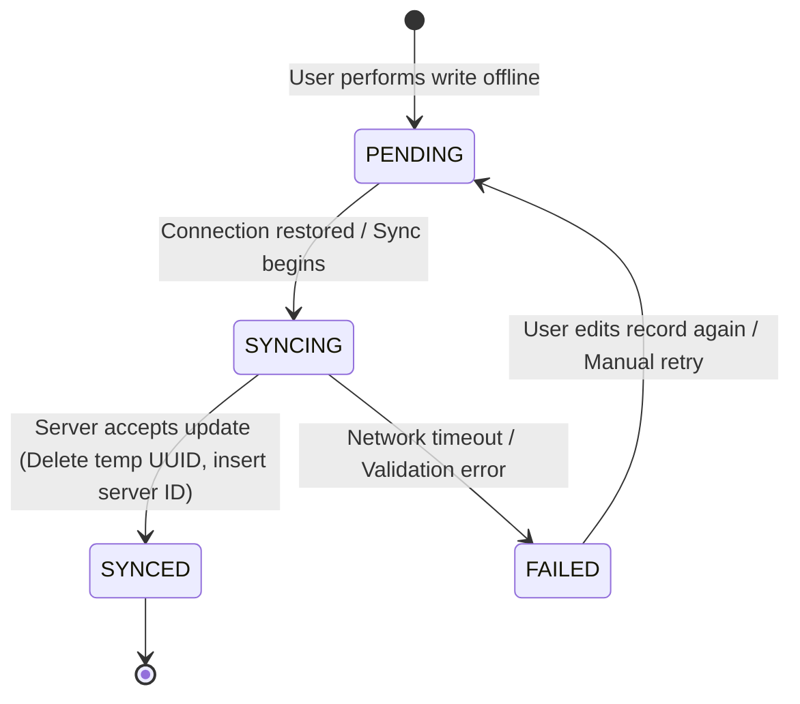

# Offline Sync & Conflict Resolution Guide

> **Core Philosophy**: Synchronization must execute sequentially to preserve database integrity and avoid race conditions. When the database updates a record that was changed on both the client and the server, the app must apply a clear, pre-defined **Conflict Resolution Strategy**.

---

## 1. Synchronization Lifecycle & States

Every locally modified record transitions through explicit sync states:



### Sync Status Definitions:
- **`SYNCED`**: The local record matches the server exactly. This is the default stable state.
- **`PENDING`**: Modified locally, waiting to be sent to the server.
- **`FAILED`**: The sync attempt encountered an error. The error message is stored in `lastError` on the entity.

---

## 2. Sync Queue Execution Flow

The sync queue (`db.sync_queue`) is a FIFO (First-In, First-Out) ledger. Transactions must execute **sequentially** to ensure database actions (e.g., creating a parent row, then attaching a child row) do not run out of order.

```typescript
// File: frontend/src/services/sync/syncManager.ts
import { db } from "../db";
import { SyncStatus } from "@/types/sync";

export const syncManager = {
  isSyncing: false,

  async syncAll(organizationId: string) {
    if (this.isSyncing || !navigator.onLine) return;
    this.isSyncing = true;

    try {
      // 1. Load pending transactions sorted by chronological order
      const queue = await db.sync_queue.orderBy("timestamp").toArray();

      for (const task of queue) {
        try {
          await this.processSyncTask(task);
          // 2. Remove successfully processed tasks
          await db.sync_queue.delete(task.id);
        } catch (error) {
          console.error(`Sync task ${task.id} failed:`, error);
          
          // 3. Mark row as failed locally to show warning badges
          await db.table(task.entityType).update(task.entityId, {
            syncStatus: SyncStatus.FAILED,
            lastError: error instanceof Error ? error.message : "Sync error",
          });
          
          // Stop execution if there is a blocking parent failure
          break;
        }
      }
    } finally {
      this.isSyncing = false;
    }
  }
};
```

---

## 3. Conflict Resolution Strategies

When synchronization resolves online, the remote service may inform the repository that a record was modified by another client during the offline interval. The frontend must apply one of the following strategies:

### Strategy A: Last-Write-Wins (LWW)
The record with the most recent timestamp (`updated_at`) overrides the older one.

```typescript
export const resolveLastWriteWins = (local: any, remote: any) => {
  const localTime = new Date(local.updated_at).getTime();
  const remoteTime = new Date(remote.updated_at).getTime();

  return localTime >= remoteTime ? local : remote;
};
```

### Strategy B: Client-Wins (Force)
Local changes are forced, overwriting whatever is stored on the server. Useful for personal dashboard preferences.

```typescript
export const resolveClientWins = (local: any, remote: any) => {
  return { ...remote, ...local, syncStatus: SyncStatus.SYNCED };
};
```

### Strategy C: Server-Wins (Overwrite)
The server's record is pulled, and the local edit is discarded. Useful for read-only metadata updates.

```typescript
export const resolveServerWins = (local: any, remote: any) => {
  return { ...remote, syncStatus: SyncStatus.SYNCED };
};
```

### Strategy D: Interactive Merge Resolver
If fields do not overlap, merge them. If they overlap (e.g. different maturity answers for the same category), trigger a UI conflict state forcing the user to select which version to preserve.

```typescript
export const resolveMerge = (local: any, remote: any) => {
  // If different fields modified, merge automatically
  return {
    ...remote,
    ...local,
    // Combine answers
    answers: {
      ...remote.answers,
      ...local.answers
    }
  };
};
```

---

## 4. Conflict Resolution UI Blueprint

If a merge conflict occurs, store the remote conflict data locally and set a conflict flag on the row. The UI must render a notification banner allowing manual resolution.

```tsx
// File: frontend/src/components/shared/ConflictResolver.tsx
import React from "react";
import { Button } from "@/components/ui/button";

interface ConflictResolverProps {
  localData: any;
  remoteData: any;
  onResolve: (chosenData: any) => void;
}

export const ConflictResolver: React.FC<ConflictResolverProps> = ({
  localData,
  remoteData,
  onResolve
}) => {
  return (
    <div className="border border-red-200 bg-red-50/50 rounded-xl p-6 space-y-4">
      <h3 className="text-base font-semibold text-red-950">Data Sync Conflict Detected</h3>
      <p className="text-sm text-red-800">
        This record was updated by another administrator while you were offline.
      </p>
      
      <div className="grid grid-cols-1 md:grid-cols-2 gap-4">
        {/* Local edit */}
        <div className="bg-white border rounded-lg p-4">
          <h4 className="font-semibold text-sm mb-2">Your Local Version</h4>
          <p className="text-xs text-slate-500 mb-4">Saved: {localData.updated_at}</p>
          <Button onClick={() => onResolve(localData)} className="w-full">
            Keep Mine
          </Button>
        </div>

        {/* Server edit */}
        <div className="bg-white border rounded-lg p-4">
          <h4 className="font-semibold text-sm mb-2">Remote Server Version</h4>
          <p className="text-xs text-slate-500 mb-4">Saved: {remoteData.updated_at}</p>
          <Button onClick={() => onResolve(remoteData)} variant="outline" className="w-full">
            Keep Server
          </Button>
        </div>
      </div>
    </div>
  );
};
```

---

## Checklist

- [ ] Sync status states are declared as `SYNCED`, `PENDING`, and `FAILED` constants.
- [ ] Sync queue execution loads records chronologically (`timestamp` ascending) to prevent logic errors.
- [ ] Processing errors catch gracefully, update the local element's `syncStatus` to `FAILED`, and halt execution.
- [ ] All shared endpoints define clear Conflict Resolution strategies (LWW, Client-Wins, Server-Wins, or Merge).
- [ ] Overlapping record edits default to Last-Write-Wins or show manual selection dialog banners.
- [ ] Successful syncs remove tasks from `db.sync_queue` and update elements in local storage.
