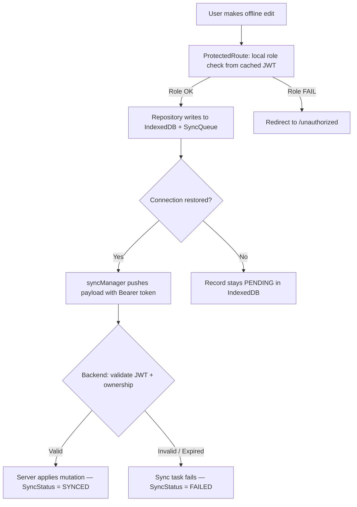

# Security Guide

> **Core Philosophy**: The frontend is a **trusted UI layer, never a security boundary**. Role enforcement in the UI provides a good user experience — but the backend re-validates every token and permission on sync. In our offline-first architecture, we apply a **Double-Gatekeeper Pattern**: client-side RBAC protects navigation and surfaces, and server-side validation protects data integrity during sync.
>
> **Stop-and-Ask Rule**: If you are adding a route, button, or action that involves privileged data, always check both:
>
> 1. Is `ProtectedRoute` configured with the correct `allowedRoles`?
> 2. Does the corresponding backend endpoint validate the JWT?

---

## 1. The Double-Gatekeeper Security Pattern

Because offline clients cannot make real-time calls to Keycloak, role validation happens in two stages:



**Why this matters for offline-first**: The client cannot call Keycloak while offline, so all local role decisions are made from the `UserProfile` that was extracted from the JWT and stored in `idb-keyval` under `"auth_profile"`. When the user reconnects, the server is the final arbiter.

---

## 2. Keycloak Lifecycle & Token Management

All Keycloak event handlers are registered inside `AuthContext.tsx`. The key security behaviors are:

### 2A. Token Refresh on Expiry (Online Only)

When a token expires and the user **is online**, we attempt a silent refresh. If the refresh fails, we clear tokens and force logout to prevent stale sessions.

```typescript
// File: frontend/src/context/AuthContext.tsx

keycloak.onTokenExpired = () => {
  if (!navigator.onLine) {
    // CRITICAL: Do NOT logout or clear tokens while offline.
    // The user is mid-session and cannot re-authenticate without connectivity.
    console.warn("AuthProvider: Token expired while offline — keeping current session.");
    return;
  }
  // Online: attempt a 30-second minimum validity refresh
  keycloak.updateToken(30).catch(() => {
    console.error("AuthProvider: Token update failed while online — logging out.");
    authService.clearStoredTokens();
    keycloak.clearToken();
    updateAuthState();
  });
};
```

### 2B. Token Refresh Error (Online Only)

If the refresh token itself is invalid (e.g. server-side session revoked), we only clear tokens and update state when the client **is online**. Offline users keep their cached session.

```typescript
keycloak.onAuthRefreshError = () => {
  console.warn("AuthProvider: Refresh failed — clearing tokens if online.");
  if (navigator.onLine) {
    authService.clearStoredTokens();
    updateAuthState();
  }
  // If offline: silently retain the existing cached session.
};
```

### 2C. Successful Auth & Refresh — Store Tokens

Every time authentication or a token refresh succeeds, we call `authService.storeTokens()` to persist the latest tokens to `idb-keyval`. This ensures the offline cache is always up-to-date with the most recent valid tokens.

```typescript
keycloak.onAuthSuccess = () => {
  authService.storeTokens(); // Persists accessToken, refreshToken, idToken to IndexedDB
  updateAuthState();
};

keycloak.onAuthRefreshSuccess = () => {
  authService.storeTokens(); // Update cache with new tokens after successful refresh
  updateAuthState();
};
```

---

## 3. Offline Session Rehydration (idb-keyval)

On every page load, `AuthContext` runs a `rehydrate()` function **before** Keycloak finishes initializing. This prevents the "logout on refresh" problem when the user is offline.

### Rehydration Flow

```
Page Load
    │
    ▼
rehydrate() runs immediately (async)
    │
    ├── get("auth_profile") from idb-keyval
    ├── get("auth_tokens")  from idb-keyval
    │
    ├── If ONLINE and Keycloak token present:
    │     → Normal Keycloak flow takes over
    │
    └── If OFFLINE and cached tokens exist:
          → Manually set keycloak.token, keycloak.refreshToken, keycloak.idToken
          → Parse JWT payload: atob(token.split('.')[1])
          → Set keycloak.tokenParsed = parsed payload
          → Set authState with cached user profile
          → AuthContext is now functional without network
```

```typescript
// File: frontend/src/context/AuthContext.tsx

const rehydrate = async () => {
  try {
    const { get } = await import("idb-keyval");
    const cachedProfile = await get("auth_profile");
    const cachedTokens = await get("auth_tokens");

    if (cachedProfile && (cachedTokens?.accessToken || !!keycloak.token)) {
      // When offline and Keycloak hasn't initialized its own token:
      if (!navigator.onLine && cachedTokens?.accessToken && !keycloak.token) {
        // Restore token so organization/cooperation claim helpers work
        keycloak.token = cachedTokens.accessToken;
        keycloak.refreshToken = cachedTokens.refreshToken;
        keycloak.idToken = cachedTokens.idToken;
        keycloak.authenticated = true;

        // Parse the token manually to restore tokenParsed claims
        const tokenPayload = JSON.parse(atob(cachedTokens.accessToken.split(".")[1]));
        keycloak.tokenParsed = tokenPayload;
      }

      // Restore auth state from the cached profile
      setAuthState({
        isAuthenticated: true,
        user: cachedProfile,
        roles: cachedProfile.roles || [],
        loading: false,
      });

      return; // Skip the rest of initialization
    }
  } catch (err) {
    console.warn("AuthProvider: Failed to re-hydrate from cache:", err);
  }

  // No cache found — stop loading spinner so login page renders
  if (!keycloak.authenticated && !keycloak.token) {
    setAuthState((prev) => ({ ...prev, loading: false }));
  }
};
```

> **Security Note**: The parsed JWT is trusted for _display and UX decisions only_. The server re-verifies the real token signature on every API call during sync.

---

## 4. Inactivity Auto-Logout

After **10 minutes** of inactivity, the user is automatically logged out. This is enforced via a debounced timer reset on user interaction events.

```typescript
// File: frontend/src/context/AuthContext.tsx

const INACTIVITY_LOGOUT_MS = 10 * 60 * 1000; // 10 minutes

const ACTIVITY_EVENTS = ["mousemove", "mousedown", "keydown", "touchstart", "scroll"] as const;

// Only active when the user is authenticated
useEffect(() => {
  if (!authState.isAuthenticated) return;

  let timeoutId: ReturnType<typeof window.setTimeout>;

  const resetInactivityTimer = () => {
    window.clearTimeout(timeoutId);
    timeoutId = window.setTimeout(() => {
      void logout();
    }, INACTIVITY_LOGOUT_MS);
  };

  ACTIVITY_EVENTS.forEach((event) => {
    window.addEventListener(event, resetInactivityTimer, { passive: true });
  });

  resetInactivityTimer(); // Start timer immediately on mount

  return () => {
    window.clearTimeout(timeoutId);
    ACTIVITY_EVENTS.forEach((event) => {
      window.removeEventListener(event, resetInactivityTimer);
    });
  };
}, [authState.isAuthenticated, logout]);
```

---

## 5. Role-Based Route Protection (`ProtectedRoute`)

Every protected route is wrapped with `<ProtectedRoute allowedRoles={[ROLES.ADMIN]}>`. The component:

1. Reads cached tokens from `idb-keyval` to detect offline sessions.
2. Waits up to **3 seconds** for Keycloak to initialize before assuming offline mode.
3. Merges roles from both `user.roles` and `user.realm_access.roles` for comprehensive RBAC.
4. Redirects to `/unauthorized` if the user's roles don't include any of the `allowedRoles`.

```typescript
// File: frontend/src/router/ProtectedRoute.tsx

export const ProtectedRoute: React.FC<ProtectedRouteProps> = ({
  allowedRoles,
  children,
}) => {
  const { isAuthenticated, user, loading } = useAuth();
  const location = useLocation();
  const [hasCachedTokens, setHasCachedTokens] = React.useState<boolean | null>(null);
  const [offlineTimeout, setOfflineTimeout] = React.useState(false);

  // Step 1: Check IndexedDB for cached tokens immediately on mount
  React.useEffect(() => {
    get("auth_tokens")
      .then((tokens: any) => setHasCachedTokens(!!(tokens?.accessToken)))
      .catch(() => setHasCachedTokens(false));
  }, []);

  // Step 2: If cached tokens exist but Keycloak hasn't resolved in 3s → assume offline
  React.useEffect(() => {
    if (hasCachedTokens && !isAuthenticated) {
      const timer = setTimeout(() => setOfflineTimeout(true), 3000);
      return () => clearTimeout(timer);
    }
    return undefined;
  }, [hasCachedTokens, isAuthenticated]);

  // Step 3: Merge roles from both claims locations
  const userRoles = React.useMemo(() => {
    if (!user) return [];
    return [...(user.roles || []), ...(user.realm_access?.roles || [])]
      .map((r) => r.toLowerCase());
  }, [user]);

  // Step 4: Role check (case-insensitive)
  const hasRequiredRole = React.useMemo(() => {
    if (!allowedRoles || allowedRoles.length === 0) return true;
    return allowedRoles.some((role) => userRoles.includes(role.toLowerCase()));
  }, [userRoles, allowedRoles]);

  // Show spinner while resolving (but not indefinitely)
  if ((loading || hasCachedTokens === null) && !offlineTimeout) {
    return <LoadingSpinner />;
  }

  // No auth AND no cache → redirect to landing
  if (!isAuthenticated && !hasCachedTokens) {
    return <Navigate to="/" replace state={{ from: location }} />;
  }

  // Waiting with cached tokens (pre-timeout)
  if (!isAuthenticated && hasCachedTokens && !offlineTimeout) {
    return <LoadingSpinner />;
  }

  // Admin auto-redirect from generic /dashboard
  const isAdmin = userRoles.includes(ROLES.ADMIN.toLowerCase());
  if (isAdmin && location.pathname === "/dashboard") {
    return <Navigate to="/admin/dashboard" replace />;
  }

  // Role enforcement
  if (allowedRoles && allowedRoles.length > 0 && !hasRequiredRole) {
    return <Navigate to="/unauthorized" replace />;
  }

  // org_admin must have an organization claim (only enforce when online)
  const isOrgAdminRoute = allowedRoles?.some(
    (r) => r.toLowerCase() === ROLES.ORG_ADMIN.toLowerCase(),
  );
  if (isOrgAdminRoute && userRoles.includes(ROLES.ORG_ADMIN.toLowerCase())) {
    if (!user?.organization && navigator.onLine) {
      return <NoOrganizationMessage />;
    }
  }

  return children ? <>{children}</> : <Outlet />;
};
```

### Offline Organization Check Rule

For `org_admin` routes, we check `user.organization`. **This check is skipped when offline** (`!navigator.onLine`) because the user may have a valid organization in their cached token that hasn't been fully parsed yet. Blocking offline org admins would be an unnecessarily bad experience.

---

## 6. IndexedDB Cache Security

IndexedDB is visible in browser developer tools. Follow these rules:

| Rule                                                   | Reason                                                |
| ------------------------------------------------------ | ----------------------------------------------------- |
| Never store raw passwords in IndexedDB                 | Plain text is readable by anyone with devtools access |
| Store tokens in `idb-keyval` only, not in Dexie tables | Separates auth data from domain data                  |
| Minimize PII in cached entities                        | Only cache what is needed for offline functionality   |
| Disable verbose logging in production                  | `console.log(tokens)` leaks sensitive data            |

```typescript
// BAD — leaks token data in production
console.log("Cached tokens:", tokens);

// GOOD — development-only logging
if (import.meta.env.DEV) {
  console.log("AuthProvider: Session rehydrated.");
}
```

---

## 7. Input Validation & XSS Prevention

- **Zod on all forms**: Every form submission is validated through a Zod schema before writing to IndexedDB or the sync queue. This prevents malformed or injected data from entering the local database.
- **React JSX auto-escaping**: React escapes all `{}` interpolations by default. Never use `dangerouslySetInnerHTML` without explicit sanitization.

```typescript
import DOMPurify from "dompurify";

// Only use when you must render HTML (e.g., rich text descriptions from server)
const SafeContent = ({ rawHtml }: { rawHtml: string }) => {
  const clean = DOMPurify.sanitize(rawHtml);
  return <div dangerouslySetInnerHTML={{ __html: clean }} />;
};
```

---

## Checklist

- [ ] All protected routes use `<ProtectedRoute allowedRoles={[ROLES.X]}>` with constants from `@/constants/roles`.
- [ ] `ProtectedRoute` reads `idb-keyval("auth_tokens")` on mount to support offline session detection.
- [ ] The 3-second `offlineTimeout` is present to prevent infinite loading when Keycloak is unreachable.
- [ ] `keycloak.onTokenExpired` does **not** log out or clear tokens when `navigator.onLine === false`.
- [ ] `keycloak.onAuthRefreshError` does **not** clear tokens when `navigator.onLine === false`.
- [ ] `authService.storeTokens()` is called after every `onAuthSuccess` and `onAuthRefreshSuccess`.
- [ ] Rehydration correctly restores `keycloak.tokenParsed` from `atob(token.split('.')[1])` for offline organization ID extraction.
- [ ] Inactivity timer resets on all 5 activity events: `mousemove`, `mousedown`, `keydown`, `touchstart`, `scroll`.
- [ ] No raw passwords, secrets, or API keys exist in frontend source code or `.env` files committed to git.
- [ ] `dangerouslySetInnerHTML` usage is wrapped with `DOMPurify.sanitize()`.
- [ ] `console.log` calls that output token or profile data are gated behind `import.meta.env.DEV`.
- [ ] `org_admin` organization check is only enforced when `navigator.onLine === true`.
