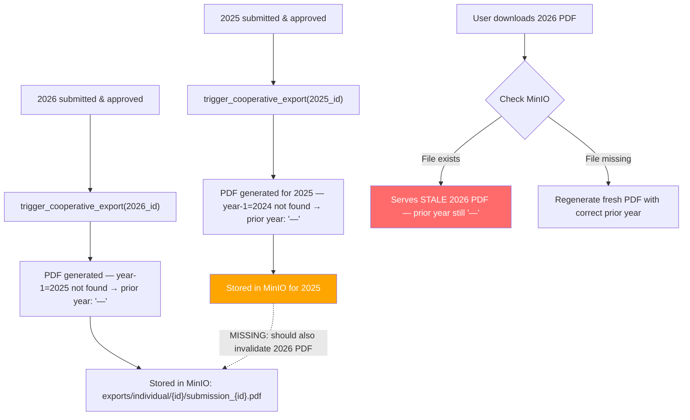

# P1 — Prior Year Data Staleness in PDF Exports

> Date: 2026-07-27
> Severity: **P1 — Data Integrity Bug**

## Problem Statement

When a cooperative submits reports out of chronological order (e.g., 2026 first, then 2025 later), the cached PDF for 2026 becomes **stale** — it was generated before 2025 data existed, so all prior-year comparison columns show "—". The system never regenerates it.

## Scenario

```
Timeline:
  1. User submits 2026 → approved → PDF pre-baked → cached in MinIO (prior year: "—")
  2. User submits 2025 → approved → PDF pre-baked → cached in MinIO (prior year: "—")
  3. Problem: The 2026 PDF is now STALE — 2025 data exists but isn't shown
```

## Root Cause Analysis

**Three independent failures combine to create the bug:**

### Failure 1: No cache invalidation on new submission

When 2025 is approved, the handler at `submission.rs:1116` only triggers export for the current submission:

```rust
// submission.rs:1116
ExportGenerator::trigger_cooperative_export(state.clone(), id);  // only the 2025 submission
```

It does NOT check if there are future-year submissions for the same cooperative that now have new prior-year data available.

### Failure 2: Export handler serves from cache unconditionally

At `export.rs:541-551`:

```rust
let bytes = match state.storage.get_object(&storage_key).await {
    Ok(b) => b,         // ← STALE PDF served immediately — never checks freshness
    Err(_) => {
        // Only regenerates if cache MISS (file doesn't exist)
        let generated_bytes = ...generate_cooperative_pdf(...)?;
        state.storage.store(&storage_key, &generated_bytes, "application/pdf").await?;
        generated_bytes
    }
};
```

The MinIO cache has no TTL, no version hash, and no staleness check. Once written, a PDF is served forever until manually deleted.

### Failure 3: Prior year lookup is correct but the PDF is baked at a fixed point in time

The `include_prior_year=true` logic at `financial_statement.rs:296-322` correctly does:

```rust
.find_by_cooperative_and_year(submission.cooperative_id, submission.reporting_year - 1)
```

But this lookup runs at **PDF generation time**, not at **PDF serve time**. If 2025 didn't exist when 2026's PDF was baked, the lookup returned `None` and the prior year columns show "—".

## Flow Diagram



## Affected Reports

| Report Level | Cache Key Pattern | Staleness Risk |
|---|---|---|
| **Cooperative PDF** | `exports/individual/{sub_id}/submission_{sub_id}.pdf` | HIGH — each submission has its own year |
| **Apex Excel** | `exports/apex/{apex_id}/apex_{apex_id}_{year}.xlsx` | MEDIUM — consolidated, but still per-year |
| **Federation Excel** | `exports/federation/{fed_id}/federation_{fed_id}_{year}.xlsx` | MEDIUM — same issue |
| **Ministry Excel** | `exports/ministry/ministry_{year}.xlsx` | LOW — only one per year |

## Recommended Fix: Cache Invalidation on Approval (Phase F)

When **any** submission is approved, find all **future-year** submissions for the same cooperative and regenerate their exports.

### Implementation

In `backend/src/api/handlers/submission.rs`, function `ministry_approve_submission`, after the Phase E ministry export trigger (line 1146), add:

```rust
// Phase F: Invalidate stale exports for future-year submissions of the same cooperative.
// When a submission for year Y is approved, any cached PDF/Excel for year Y+1, Y+2, etc.
// is now stale because it was generated without year Y data in the "prior year" columns.
let future_subs: Vec<_> = state
    .submission_repo
    .find_by_cooperative(updated.cooperative_id)
    .await?
    .into_iter()
    .filter(|s| s.reporting_year > updated.reporting_year && s.id != id)
    .collect();

if !future_subs.is_empty() {
    tracing::info!(
        cooperative_id = %updated.cooperative_id,
        current_year = updated.reporting_year,
        stale_count = future_subs.len(),
        "Invalidating stale exports for future-year submissions"
    );

    for sub in future_subs {
        // Delete stale cached files from object storage (best-effort)
        let pdf_key = format!("exports/individual/{}/submission_{}.pdf", sub.id, sub.id);
        let xlsx_key = format!("exports/individual/{}/submission_{}.xlsx", sub.id, sub.id);
        let docx_key = format!("exports/individual/{}/submission_{}.docx", sub.id, sub.id);
        let _ = state.storage.delete_object(&pdf_key).await;
        let _ = state.storage.delete_object(&xlsx_key).await;
        let _ = state.storage.delete_object(&docx_key).await;

        // Trigger background regeneration so the next download gets fresh data
        crate::services::export_generator::ExportGenerator::trigger_cooperative_export(
            state.clone(),
            sub.id,
        );

        tracing::info!(
            stale_submission_id = %sub.id,
            stale_year = sub.reporting_year,
            "Queued re-generation of stale export"
        );
    }
}
```

### No New Methods Required

All dependencies already exist:
- `delete_object(key)` → `object_storage.rs:201`
- `find_by_cooperative(coop_id)` → `repositories/submission.rs:27`
- `trigger_cooperative_export(state, sub_id)` → `export_generator.rs:10`

## Alternative Approaches

| Approach | Pros | Cons |
|---|---|---|
| **A. Invalidate on approval** (implemented) | Proactive, always fresh, no request-time latency | Extra work on approval, may regenerate PDFs that nobody downloads |
| **B. Never cache PDFs** | Always fresh, simplest code | Slow (Gotenberg call on every request), doesn't scale |
| **C. Versioned cache keys** | Automatic invalidation via hash change | Requires hashing all prior-year data on every write, complex |
| **D. TTL-based expiry** | Simple to implement | Arbitrary — can't know when data actually changed |

## Implementation Priority

This should be implemented **before Phase 2** of the rich PDF rollout, because:
1. The PDF already has prior-year columns (YoY Change, YoY %, Trend)
2. Phase 2 will add more prior-year-dependent charts (e.g., multi-year trend lines)
3. Every stale PDF is a **data integrity violation** — users see "—" where real data exists
